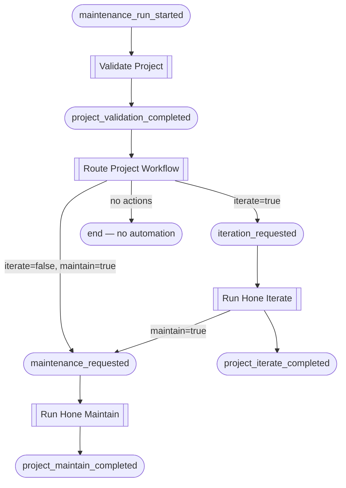

# Task Block Library

Task blocks are the reusable processing units of Foundry. Each block is
defined once and can participate in multiple workflows.

## Implementing the TaskBlock Trait

Every task block implements `foundry_core::task_block::TaskBlock`:

```rust
pub trait TaskBlock: Send + Sync {
    fn name(&self) -> &'static str;
    fn kind(&self) -> BlockKind;
    fn sinks_on(&self) -> &[EventType];
    fn execute(
        &self,
        trigger: &Event,
    ) -> Pin<Box<dyn Future<Output = anyhow::Result<TaskBlockResult>> + Send + '_>>;
}
```

The trait provides default implementations for `should_emit()` and
`should_execute()` based on `kind()` and the throttle level.

## Current Blocks

### Hello-World (validates engine mechanics)

| Block | Kind | Sinks On | Emits |
|-------|------|----------|-------|
| Compose Greeting | Observer | `greet_requested` | `greeting_composed` |
| Deliver Greeting | Mutator | `greeting_composed` | `greeting_delivered` |

### Vulnerability Remediation

These blocks form two paths through the vulnerability remediation workflow.
Both `Remediate Vulnerability` and `Cut Release` sink on `main_branch_audited`
and self-filter based on the `dirty` flag in the payload — only one path fires
per event.

| Block | Kind | Sinks On | Emits | Self-filters |
|-------|------|----------|-------|--------------|
| Audit Release Tag | Observer | `vulnerability_detected` | `release_tag_audited` | — |
| Audit Main Branch | Observer | `release_tag_audited` | `main_branch_audited` | Skips when `vulnerable=false` |
| Remediate Vulnerability | Mutator | `main_branch_audited` | `remediation_completed` | Only when `dirty=true` |
| Commit and Push | Mutator | `remediation_completed` | `project_changes_committed`, `project_changes_pushed` | — |
| Cut Release | Mutator | `main_branch_audited` | `auto_release_completed` | Only when `dirty=false` |
| Watch Pipeline | Mutator | `auto_release_completed` | `release_pipeline_completed` | — |
| Install Locally | Mutator | `project_changes_pushed`, `release_pipeline_completed` | `local_install_completed` | — |

> **Note:** `Audit Release Tag` will also sink on `project_changes_pushed` in
> future once real vulnerability scanning is implemented. This enables
> re-audit after a fix is pushed, confirming the vulnerability is resolved
> before cutting a release.

### Maintenance

The maintenance workflow uses an explicit routing Observer (`Route Project
Workflow`) to delineate which sub-workflow runs.  This keeps each downstream
block focused on a single responsibility.

| Block | Kind | Sinks On | Emits |
|-------|------|----------|-------|
| Validate Project | Observer | `maintenance_run_started` | `project_validation_completed` |
| Route Project Workflow | Observer | `project_validation_completed` | `iteration_requested` or `maintenance_requested` |
| Run Hone Iterate | Mutator | `iteration_requested` | `project_iterate_completed`, optionally `maintenance_requested` |
| Run Hone Maintain | Mutator | `maintenance_requested` | `project_maintain_completed` |

#### Maintenance Workflow Chain



The `actions.maintain` flag is forwarded inside the `iteration_requested`
payload so that `Run Hone Iterate` can chain directly to `maintenance_requested`
after a successful iteration without re-querying the project configuration.
