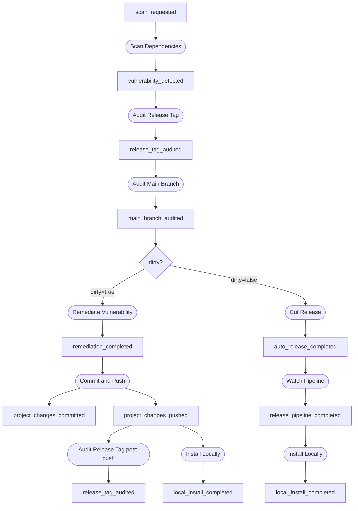
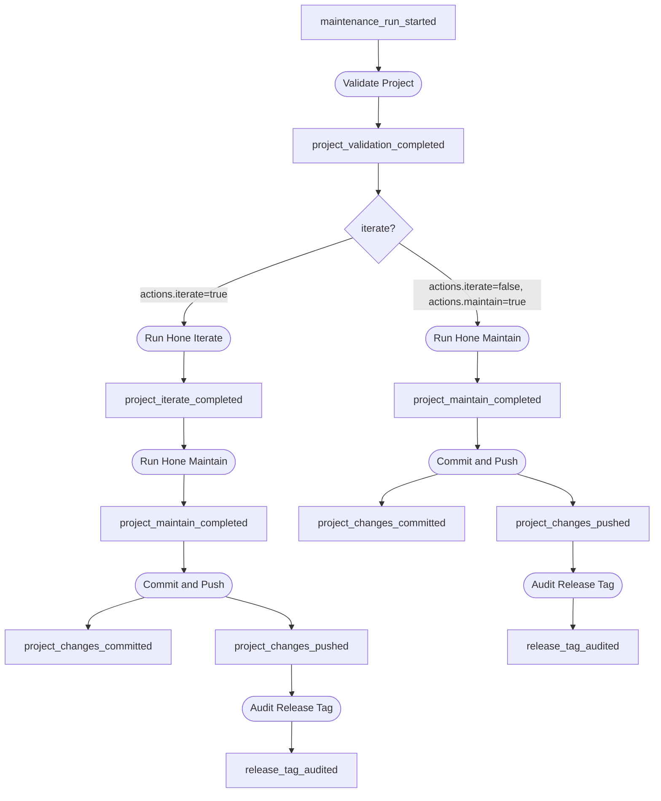

# Task Block Library

Task blocks are the reusable processing units of Foundry. Each block is
defined once and can participate in multiple workflows.

## Implementing the TaskBlock Trait

Every task block implements `foundry_core::task_block::TaskBlock`:

```rust
pub trait TaskBlock: Send + Sync {
    fn name(&self) -> &'static str;
    fn kind(&self) -> BlockKind;
    fn sinks_on(&self) -> &[EventType];
    fn execute(
        &self,
        trigger: &Event,
    ) -> Pin<Box<dyn Future<Output = anyhow::Result<TaskBlockResult>> + Send + '_>>;

    // Optional — defaults to no retries
    fn retry_policy(&self) -> RetryPolicy {
        RetryPolicy::default()
    }
}
```

The trait provides default implementations for `should_emit()` and
`should_execute()` based on `kind()` and the throttle level. Override
`retry_policy()` to enable automatic retry of transient failures.

See the [Writing Task Blocks](../guide/writing-task-blocks.md) guide for
step-by-step instructions and a full example including `RetryPolicy`.

## Current Blocks

### Hello-World (validates engine mechanics)

| Block | Kind | Sinks On | Emits |
|-------|------|----------|-------|
| Compose Greeting | Observer | `greet_requested` | `greeting_composed` |
| Deliver Greeting | Mutator | `greeting_composed` | `greeting_delivered` |

### Vulnerability Remediation

These blocks form two paths through the vulnerability remediation workflow.
Both `Remediate Vulnerability` and `Cut Release` sink on `main_branch_audited`
and self-filter based on the `dirty` flag in the payload — only one path fires
per event.

`Audit Release Tag` also sinks on `project_changes_pushed` to perform a
post-push re-audit, confirming the fix is clean before anything downstream acts.

| Block | Kind | Sinks On | Emits | Self-filters |
|-------|------|----------|-------|--------------|
| Scan Dependencies | Observer | `scan_requested` | `vulnerability_detected` | — |
| Audit Release Tag | Observer | `vulnerability_detected`, `project_changes_pushed` | `release_tag_audited` | Skips post-push when project not in registry |
| Audit Main Branch | Observer | `release_tag_audited` | `main_branch_audited` | Skips when `vulnerable=false` |
| Remediate Vulnerability | Mutator | `main_branch_audited` | `remediation_completed` | Only when `dirty=true` |
| Commit and Push | Mutator | `remediation_completed`, `project_iterate_completed`, `project_maintain_completed` | `project_changes_committed`, `project_changes_pushed` | Skips when tree is clean or `changes=false` |
| Cut Release | Mutator | `main_branch_audited` | `auto_release_completed` | Only when `dirty=false` |
| Watch Pipeline | Mutator | `auto_release_completed` | `release_pipeline_completed` | — |
| Install Locally | Mutator | `project_changes_pushed`, `release_pipeline_completed` | `local_install_completed` | — |

### Maintenance

These blocks form the maintenance workflow triggered by `MaintenanceRunStarted`.

`RunHoneMaintain` has dual-sink routing: when `iterate` is enabled it waits for
`ProjectIterateCompleted`; when `iterate` is disabled it fires directly from
`ProjectValidationCompleted`.

| Block | Kind | Sinks On | Emits | Self-filters |
|-------|------|----------|-------|--------------|
| Validate Project | Observer | `maintenance_run_started` | `project_validation_completed` | Skips projects not in active registry |
| Run Hone Iterate | Mutator | `project_validation_completed` | `project_iterate_completed` | Only when `status=ok` and `actions.iterate=true` |
| Run Hone Maintain | Mutator | `project_validation_completed`, `project_iterate_completed` | `project_maintain_completed` | Routing logic described above |
| Commit and Push | Mutator | `project_iterate_completed`, `project_maintain_completed` | `project_changes_committed`, `project_changes_pushed` | Skips when tree is clean |
| Audit Release Tag | Observer | `project_changes_pushed` | `release_tag_audited` | Skips when project not in registry |

## Vulnerability Workflow Chain



## Maintenance Workflow Chain



## RetryPolicy

Blocks can declare automatic retry behaviour by overriding `retry_policy()`:

```rust
use std::time::Duration;
use foundry_core::task_block::RetryPolicy;

fn retry_policy(&self) -> RetryPolicy {
    RetryPolicy {
        max_retries: 3,
        backoff: Duration::from_secs(5),
    }
}
```

`max_retries: 0` (the default) means the block runs exactly once. With
`max_retries: N`, the engine retries up to N times after any failure (either a
returned `Err` or a `TaskBlockResult { success: false, .. }`), sleeping
`backoff` between each attempt. The final result (success or failure) is what
the engine records in the `BlockExecution` trace.
