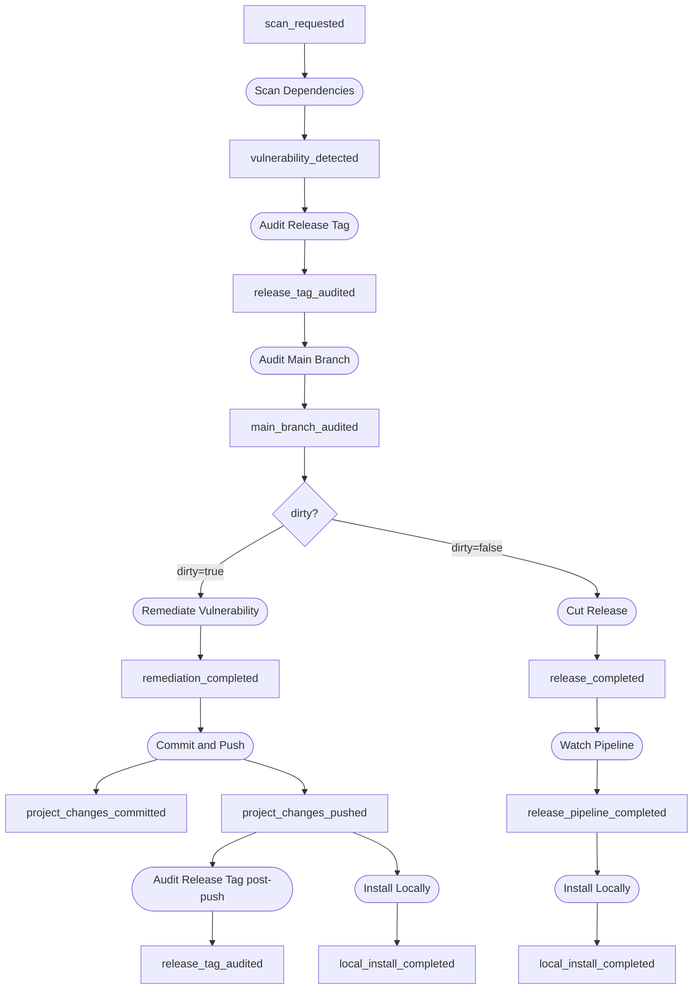
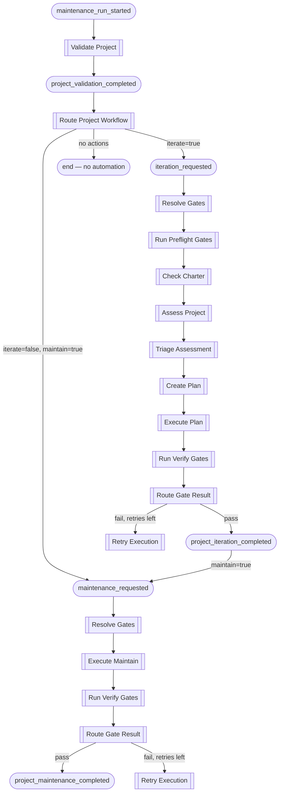

# Task Block Library

Task blocks are the reusable processing units of Foundry. Each block is
defined once and can participate in multiple workflows.

## Implementing the TaskBlock Trait

Every task block implements `foundry_core::task_block::TaskBlock`:

```rust
pub trait TaskBlock: Send + Sync {
    fn name(&self) -> &'static str;
    fn kind(&self) -> BlockKind;
    fn sinks_on(&self) -> &[EventType];
    fn execute(
        &self,
        trigger: &Event,
    ) -> Pin<Box<dyn Future<Output = anyhow::Result<TaskBlockResult>> + Send + '_>>;

    // Optional — defaults to no retries
    fn retry_policy(&self) -> RetryPolicy {
        RetryPolicy::default()
    }
}
```

The trait provides default implementations for `should_emit()` and
`should_execute()` based on `kind()` and the throttle level. Override
`retry_policy()` to enable automatic retry of transient failures.

See the [Writing Task Blocks](../guide/writing-task-blocks.md) guide for
step-by-step instructions and a full example including `RetryPolicy`.

## Current Blocks

### Hello-World (validates engine mechanics)

| Block | Kind | Sinks On | Emits |
|-------|------|----------|-------|
| Compose Greeting | Observer | `greet_requested` | `greeting_composed` |
| Deliver Greeting | Mutator | `greeting_composed` | `greeting_delivered` |

### Vulnerability Remediation

These blocks form two paths through the vulnerability remediation workflow.
Both `Remediate Vulnerability` and `Cut Release` sink on `main_branch_audited`
and self-filter based on the `dirty` flag in the payload — only one path fires
per event.

`Audit Release Tag` also sinks on `project_changes_pushed` to perform a
post-push re-audit, confirming the fix is clean before anything downstream acts.

| Block | Kind | Sinks On | Emits | Self-filters |
|-------|------|----------|-------|--------------|
| Scan Dependencies | Observer | `scan_requested` | `vulnerability_detected` | — |
| Audit Release Tag | Observer | `vulnerability_detected`, `project_changes_pushed` | `release_tag_audited` | Skips post-push when project not in registry |
| Audit Main Branch | Observer | `release_tag_audited` | `main_branch_audited` | Skips when `vulnerable=false` |
| Remediate Vulnerability | Mutator | `main_branch_audited` | `remediation_completed` | Only when `dirty=true` |
| Commit and Push | Mutator | `remediation_completed`, `project_iteration_completed`, `project_maintenance_completed` | `project_changes_committed`, `project_changes_pushed` | Skips when tree is clean or `changes=false` |
| Cut Release | Mutator | `main_branch_audited` | `release_completed` | Only when `dirty=false` |
| Watch Pipeline | Mutator | `release_completed` | `release_pipeline_completed` | — |
| Install Locally | Mutator | `project_changes_pushed`, `release_pipeline_completed` | `local_install_completed` | — |

### Maintenance

The maintenance workflow uses an explicit routing Observer (`Route Project
Workflow`) to delineate which sub-workflow runs. This keeps each downstream
block focused on a single responsibility.

| Block | Kind | Sinks On | Emits | Self-filters |
|-------|------|----------|-------|--------------|
| Validate Project | Observer | `maintenance_run_started` | `project_validation_completed` | Skips projects not in active registry |
| Route Project Workflow | Observer | `project_validation_completed` | `iteration_requested` or `maintenance_requested` | Stops when `status != "ok"` or no actions enabled |
| Commit and Push | Mutator | `project_iteration_completed`, `project_maintenance_completed` | `project_changes_committed`, `project_changes_pushed` | Skips when tree is clean |
| Audit Release Tag | Observer | `project_changes_pushed` | `release_tag_audited` | Skips when project not in registry |

The `actions.maintain` flag is forwarded inside the `iteration_requested`
payload so that the gate routing can chain directly to `maintenance_requested`
after a successful iteration without re-querying the project configuration.

### Gate Orchestration

These blocks provide native gate resolution, execution, and routing for
iterate, maintain, and validation workflows.

| Block | Kind | Sinks On | Emits | Self-filters |
|-------|------|----------|-------|--------------|
| Resolve Gates | Observer | `iteration_requested`, `maintenance_requested`, `validation_requested` | `gate_resolution_completed` | — |
| Run Preflight Gates | Observer | `gate_resolution_completed` | `preflight_completed` | Skips `maintain` workflow |
| Run Verify Gates | Observer | `execution_completed` | `gate_verification_completed` | — |
| Route Gate Result | Observer | `gate_verification_completed` | `project_iteration_completed` / `project_maintenance_completed` / `retry_requested` | Routes based on pass/fail and retry count |
| Route Validation Result | Observer | `preflight_completed` | `validation_completed` | Only handles `validate` workflow |

### Iterate Workflow

These blocks form the native iterate chain, running inside the gate
orchestration lifecycle.

| Block | Kind | Sinks On | Emits | Self-filters |
|-------|------|----------|-------|--------------|
| Check Charter | Observer | `preflight_completed` | `charter_validated` | Only handles `iterate` workflow |
| Assess Project | Mutator | `charter_validated` | `project_assessed` | — |
| Triage Assessment | Mutator | `project_assessed` | `assessment_triaged` | — |
| Create Plan | Mutator | `assessment_triaged` | `plan_created` | — |
| Execute Plan | Mutator | `plan_created` | `execution_completed` | — |

### Maintain Workflow

| Block | Kind | Sinks On | Emits | Self-filters |
|-------|------|----------|-------|--------------|
| Execute Maintain | Mutator | `gate_resolution_completed` | `execution_completed` | Only handles `maintain` workflow |
| Retry Execution | Mutator | `retry_requested` | `execution_completed` | — |
| Summarize Result | Observer | `project_iteration_completed`, `project_maintenance_completed` | `generate_summary` | — |

### Validation Workflow

A dedicated read-only workflow for checking project gate health. No Mutator
blocks are involved — validation never modifies code.

```text
validation_requested
  → Resolve Gates → gate_resolution_completed
    → Run Preflight Gates → preflight_completed
      → Route Validation Result → validation_completed
```

## Vulnerability Workflow Chain



## Maintenance Workflow Chain



## Gateway Pattern

Every block that executes an external process (a shell command or an audit tool)
receives its I/O capability through a *gateway trait* rather than calling the
implementation module directly.  Two gateway traits live in `gateway.rs`:

- **`ShellGateway`** — wraps `crate::shell::run` for arbitrary command execution.
- **`ScannerGateway`** — wraps `crate::scanner::run_audit` for vulnerability scanning.

Production blocks hold an `Arc<dyn ShellGateway>` (and/or `Arc<dyn ScannerGateway>`)
which is initialised to the real implementation in `new()`.  A `#[cfg(test)]`
constructor accepts a fake instead, enabling hermetic unit tests for every block.

This separation means:
- The happy path and every failure/edge-case branch can be tested without
  spawning real processes.
- `shell.rs` and `scanner.rs` stay untouched; the gateway is a thin adapter.
- No `async_trait` macro is required — the return type uses an explicit
  `Pin<Box<dyn Future + Send + '_>>` (the same pattern as `TaskBlock::execute`).

See [Testing with Fakes](../guide/writing-task-blocks.md#testing-with-fakes) for
usage examples.

## RetryPolicy

Blocks can declare automatic retry behaviour by overriding `retry_policy()`:

```rust
use std::time::Duration;
use foundry_core::task_block::RetryPolicy;

fn retry_policy(&self) -> RetryPolicy {
    RetryPolicy {
        max_retries: 3,
        backoff: Duration::from_secs(5),
    }
}
```

`max_retries: 0` (the default) means the block runs exactly once. With
`max_retries: N`, the engine retries up to N times after any failure (either a
returned `Err` or a `TaskBlockResult { success: false, .. }`), sleeping
`backoff` between each attempt. The final result (success or failure) is what
the engine records in the `BlockExecution` trace.
