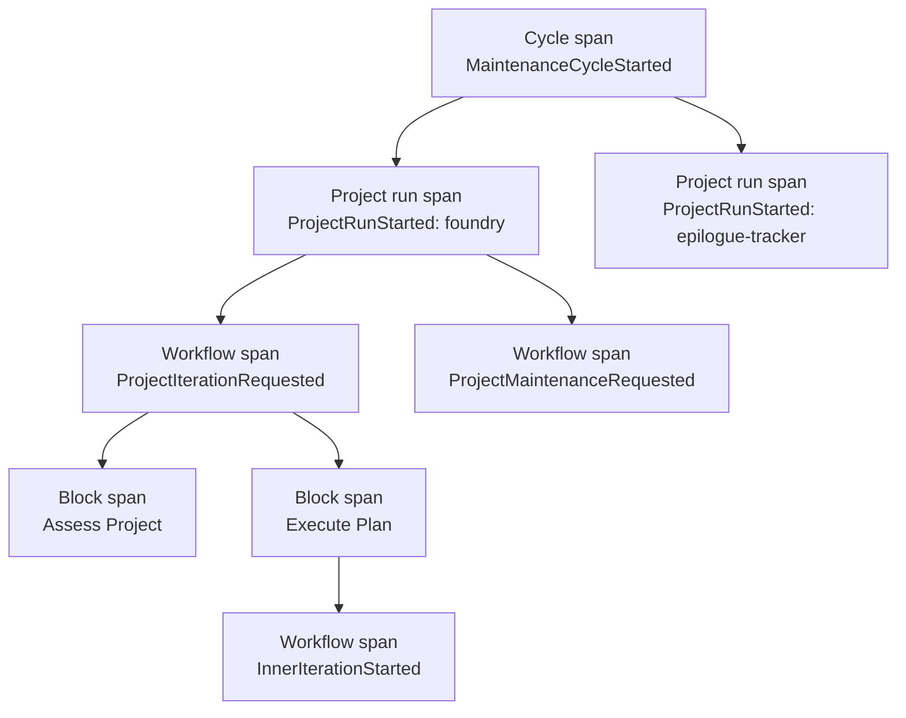
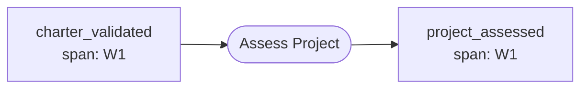
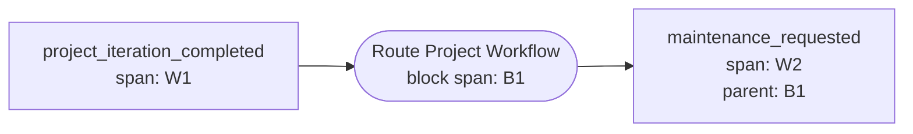
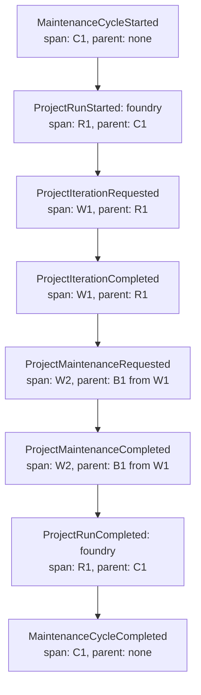

# Tracing

Foundry's tracing system gives every event in the system a place inside a nested
causal tree. When a maintenance cycle kicks off, every workflow it spawns, every
block those workflows dispatch, and every subprocess those blocks launch can be
reconstructed as a hierarchy — not just a flat list of events that share a trace
ID.

The model is borrowed directly from OpenTelemetry. If you have read OTel's spec
on traces, spans, and context propagation, the shapes will feel familiar. The
Foundry-specific parts are which events open new spans and how the engine stamps
that lineage onto every emitted event.

## Why Nested Tracing

Earlier versions of Foundry tagged events with a single `trace_id`. That worked
when each invocation produced one linear chain, but it broke down the moment a
cycle fanned out across multiple projects or a workflow launched sub-workflows.

The flat model could answer "what happened in this run?" but not:

- Which project run owns this block execution?
- What sub-workflows did this iteration spawn?
- If a remediation failed three levels deep, what triggered it?

The nested model adds two more identifiers — `span_id` and `parent_span_id` — on
top of the existing trace ID. The same trace can now be rendered as a tree, with
each branch corresponding to a logical scope of work.

## The Four Span Levels

Foundry recognizes four levels of span nesting. Every event carries the
identifiers of the deepest span active when it was emitted.

| Level       | Span opens at                             | Span closes at                    |
| ----------- | ----------------------------------------- | --------------------------------- |
| Cycle       | `MaintenanceCycleStarted` event           | `MaintenanceCycleCompleted` event |
| Project run | `ProjectRunStarted` event                 | `ProjectRunCompleted` event       |
| Workflow    | A `*Requested` or `*Started` opener event | Matching completion event         |
| Block       | Engine dispatches a block                 | Block returns                     |

A typical maintenance run produces a tree shaped roughly like this:



Not every Foundry invocation uses all four levels. A bare
`foundry emit greet_requested` only produces a workflow span and the block spans
beneath it — no cycle or project run wraps it.

Campaigns use the same structure with a different boundary. Each manual or
automatic `CampaignAdvanceRequested` is a span opener and mints a fresh cycle
span under the campaign run's trace. Task-side events carry a separate
`campaign_cycle` domain field in addition to tracing context. The field makes
the cycle directly queryable from persisted events even when concurrent
campaigns target the same project or events arrive out of timestamp order.

## Identifiers

Every event carries up to five optional identifiers that locate it in the trace
tree and any fan-out coordination:

- **`trace_id`** — 32-character lowercase hex string (OTel format). Identifies
  the entire causal tree. All events under one cycle share the same `trace_id`.
- **`span_id`** — 16-character lowercase hex string. Identifies one specific
  span. Multiple events under the same workflow share a `span_id`.
- **`parent_span_id`** — 16-character lowercase hex string, or `None` for the
  root span of a trace. Points at the span that contains this one.
- **`causation_id`** — the `id` of the event that triggered the block which
  emitted this one, or `None` for a root event. Points at the direct causal
  parent in the event graph.
- **`gather_id`** — identifies the fan-out (scatter/gather) group an event
  belongs to, or `None` when the event is not part of a fan-out. Propagates
  verbatim like `trace_id` (see below).

A canonical event therefore carries something like:

```text
trace_id        4bf92f3577b34da6a3ce929d0e0e4736
span_id         00f067aa0ba902b7
parent_span_id  b9c7c989f97918e1
causation_id    evt_a1b2c3d4e5f6
gather_id       gth_9f8e7d6c5b4a
```

### Spans Versus Causation

`trace_id`, `span_id`, and `parent_span_id` describe **observability** structure
— how work nests for the purpose of rendering trace trees. `causation_id`
describes **domain causality** — precisely which event caused which. The two
often parallel each other, but they are distinct: a span groups many peer events
under one workflow, whereas `causation_id` records the single edge from a
trigger to each event a block emits in response. Coordination logic
(fan-out/fan-in) relies on causation, not spans.

### Legacy Trace IDs

Events emitted by Foundry prior to OTel-shaped tracing carry IDs in the
`trc_<uuid>` form. These remain valid and queryable — Foundry continues to
recognize them via `foundry_sdk::is_legacy_trace_id`, which returns true for any
ID starting with `trc_`. Tooling that renders trace trees falls back to a flat
chronological view when it detects a legacy trace.

## The Two Stamping Rules

The engine stamps tracing fields onto every emitted event using two rules.
Together they preserve the parent/child relationship without requiring task
blocks to think about it.

### Default rule — peers under the same workflow span

When a block emits an event whose type is **not** a registered span opener, the
new event inherits the trigger event's `(trace_id, span_id, parent_span_id)`
triple verbatim. Every event emitted inside one workflow is a peer under the
same workflow span.



The block runs inside its own block span, but the event it emits is stamped with
the **workflow** span (W1) so siblings stay flat under the workflow rather than
burrowing into per-block sub-spans.

### Span-opener rule — mint a new child workflow

When a block emits an event whose type **is** a registered span opener, the
engine mints a fresh `span_id` and stamps the new event with:

- `trace_id` = unchanged from the trigger
- `span_id` = newly minted
- `parent_span_id` = the **emitting block's** own span ID

The result is a new workflow span hanging off the emitting block. The parent
linkage points at the block, not at the trigger event, because the block is what
caused the new workflow to exist.



This is the only place fresh span IDs appear during execution. Trace IDs are
minted only at the very top — when a brand new top-level event enters the
system.

### Causation stamping

Alongside the two span rules, the engine stamps `causation_id` on every emitted
event, setting it to the `id` of the triggering event. This is unconditional —
it does not depend on whether the emitted event is a span opener — because
causation tracks the domain edge from trigger to emitted event regardless of how
spans nest. Like the span fields, stamping is "set if unset": a block that emits
an event with an explicit `causation_id` keeps it. Root events entering the
engine directly carry no `causation_id`.

### Gather-ID propagation

The engine also propagates `gather_id` onto every emitted event, inheriting it
verbatim from the trigger — the same rule as `trace_id`, and deliberately
_unlike_ `causation_id`. A scattered child workflow may run many causal hops
deep, crossing span-opener boundaries; carrying the `gather_id` unchanged all
the way down means the child's terminal `*Completed` event still identifies the
fan-out group it belongs to, so the engine can count it toward the gather.
Stamping is "set if unset", and an event outside any fan-out simply carries
`None`.

## Span-Opener Registry

The span-opener registry is implemented as `EventType::is_span_opener` in
`foundry-sdk`. The current openers are:

- **Cycle and project-run openers**
  - `MaintenanceCycleStarted`
  - `ProjectRunStarted`
- **Workflow request openers**
  - `ProjectIterationRequested`
  - `ProjectMaintenanceRequested`
  - `ExecutionRequested`
  - `CampaignAdvanceRequested`
  - `ValidationRequested`
  - `DriftAssessmentRequested`
  - `ReleaseRequested`
  - `PipelineCheckRequested`
  - `GreetingRequested`
  - `MaintenanceSummaryRequested`
- **Explicit lifecycle openers**
  - `RemediationStarted`
  - `StrategicCycleStarted`
  - `InnerIterationStarted`
  - `CommitDigestStarted`
  - `OpsDigestStarted`
  - `SupplyChainScanStarted`

### Compiler-enforced exhaustiveness

`is_span_opener` is an exhaustive `match` with **no wildcard arm**. Every
`EventType` variant is classified as opener (`true`) or non-opener (`false`) at
this single authoritative site. Adding a new `EventType` variant without
classifying it here is a **compile error** — the compiler, not discipline, keeps
the classification complete.

To add a new opener, edit the `match` in `is_span_opener` and move the new
variant from the `false` arm group to the `true` arm group. No other tracing
code needs to change — the engine reads the result at emit time.

[`EventType::Custom`] is always `false` here; third-party workflows that need a
custom root event to open a span can register it at runtime via
`Engine::with_span_openers`.

To decide whether a new event type belongs in the opener set, ask: _does this
event represent the start of a logically distinct unit of work whose internal
events should be grouped together?_ If yes, add it to the `true` arm. If the
event is just one step in an existing workflow, leave it in the `false` arm.

## Subprocess Propagation

Workflows often launch external processes — shell commands and AI agent streams.
To keep their work attached to the right span, Foundry injects a
[W3C Trace Context](https://www.w3.org/TR/trace-context/) `traceparent` header
as a `TRACEPARENT` environment variable on every spawned process.

The format is:

```text
00-<trace_id>-<span_id>-01
```

- `00` — version byte
- `<trace_id>` — the current trace's 32-hex-char ID
- `<span_id>` — the **currently active block span's** 16-hex-char ID
- `01` — trace flags (sampled)

Injection happens transparently:

- `foundryd::shell::run` injects `TRACEPARENT` into every spawned command if a
  span context is active.
- `foundryd::agent_stream` injects the same variable when streaming an AI agent.

When a subprocess turns around and runs `foundry emit`, the CLI reads
`TRACEPARENT` from its environment, parses it, and stamps the emitted event with
`parent_span_id` set to the block's span. The new event arrives back at the
daemon already correctly parented — no manual plumbing required from inside the
subprocess.

If no span context is active (for example, the daemon is starting up), no
`TRACEPARENT` is injected and no value leaks into spawned processes.

## Querying Spans

Two gRPC RPCs on `foundryd` give clients access to trace data:

- **`Trace`** — returns every event sharing a given `trace_id`. The whole tree,
  in one response.
- **`Span`** — returns events and block executions belonging to a single
  `span_id`. Just that subtree.

### `foundry trace`

The CLI command for inspecting a trace is `foundry trace <event-id>`. Given any
event ID, it resolves the trace that event belongs to and renders it.

By default the output is the nested span tree — cycle at the root, project runs
underneath, workflows nested inside, and block executions at the leaves. Each
event is rendered under the span it belongs to.

For legacy traces, or when explicit chronology is more useful than hierarchy,
pass `--flat`:

```bash
foundry trace <event-id> --flat
```

Flat mode renders events in chronological order without any span nesting, which
matches the original behaviour of the command before nested tracing existed.

### `foundry status --span`

`foundry status` lists active workflows. To narrow that listing to a specific
span — for example, "what's currently running inside this project run?" — pass
`--span`:

```bash
foundry status --span <span-id>
```

This is the fastest way to drill down from a known span without fetching the
whole trace tree. If the span belongs only to a block execution and has no
events of its own, the daemon still returns the owning `trace_id`, so
`foundry status --span` narrows the active workflow list to that trace instead
of falling back to an unfiltered listing.

## Legacy Traces

Foundry retains read-side compatibility with traces emitted before the nested
model existed. Specifically:

- Events with `trc_*` IDs (the pre-OTel format) are still queryable.
  `foundry_sdk::is_legacy_trace_id` identifies them, and both the `Trace` and
  `Span` RPCs accept them.
- `foundry trace` detects legacy traces — events that carry a `trace_id` but no
  `span_id` — and automatically falls back to the `--flat` chronological view,
  since there is no span structure to render.

A migration script lives at `scripts/migrate-event-names.sh`. It renames event
types in older event logs to match the current taxonomy but does **not**
backfill `span_id` or `parent_span_id` onto historical events. The information
needed to reconstruct the nested structure after the fact simply is not present
in old logs, and any inferred reconstruction would be guesswork.

The practical effect is that history is preserved and queryable, but only events
emitted after the upgrade carry full span structure. New runs render as trees;
older runs render as flat chronologies.

## Worked Example

Consider a maintenance run for a single project. The cycle starts, a project run
is opened, iteration is requested, the iteration completes, and the engine
routes through to a maintenance request that also completes. The resulting span
tree is:



Notice that `ProjectIterationCompleted` sits inside the same span (W1) as
`ProjectIterationRequested` — the default stamping rule — while
`ProjectMaintenanceRequested` mints a new workflow span (W2) parented to
whichever block emitted it, because `ProjectMaintenanceRequested` is a
registered span opener.

That hierarchy is what `foundry trace` renders, and it is what makes "who
triggered this?" answerable from a single command.
