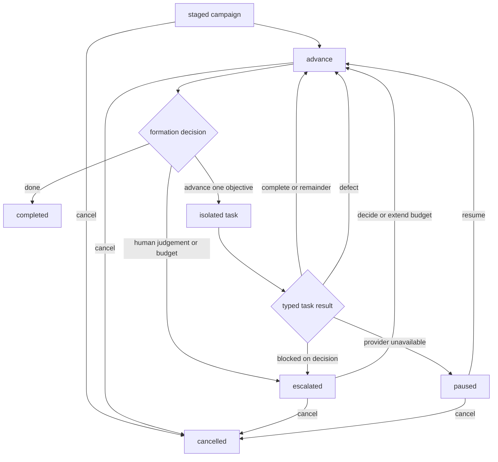

# Tasks and Campaigns

Foundry has two engineering dispatch primitives:

- A **task** executes one concrete objective immediately.
- A **campaign** holds a broader mission and derives one task at a time from
  current repository state until evidence proves the mission complete.

Campaigns do not contain a pre-cut queue. The next objective is created only
when the preceding task has a typed result, so stale downstream inventory and
per-item retry loops are unnecessary.

## Choosing a Task or Campaign

Use a task when you can state one objective whose acceptance evidence is
available now:

```bash
foundry task parite-cli \
  "Add a --quiet flag and prove it suppresses progress output"
```

Use a campaign when any of these are true:

- the mission spans several independently reviewable changes;
- later work depends on what the repository reveals after earlier work lands;
- the work may require an explicit owner decision;
- production or other external evidence is part of completion;
- a bounded cycle budget is needed to limit autonomous work.

A campaign is deliberately not a substitute for a backlog. If the work is
already a known sequence of unrelated tasks, dispatch those tasks directly.
Campaign formation is valuable when each next objective should be derived from
mission minus current evidence.

## Lifecycle at a Glance



`cancelled` is terminal and has no edge back: it records that the mission was
abandoned, not achieved. Use `paused` for a campaign meant to resume.

Each dispatched task consumes one cycle. Formation, retries caused by a
transient decision-provider transport failure, and an automatic provider pause
do not consume cycles. A final budgeted task always receives one completion
evaluation; only an attempted dispatch beyond the authorized budget escalates.

## Durable Ownership

The daemon owns the durable campaign inventory. Online
`foundry campaign add/list/show/advance/pause/resume/decide/complete/cancel` all
go through typed gRPC and do not read, create, or mutate `FOUNDRY_CAMPAIGNS_PATH`.
Successful online reads and mutations render the daemon's typed response
directly, so stale client-side campaign files cannot mask the live daemon-owned
state. Pass `--offline` only for direct-file recovery while the daemon is
stopped. If the daemon is unreachable, the online command fails and leaves any
absent or pre-existing client-side `FOUNDRY_CAMPAIGNS_PATH` byte-identical.

The read-only inventory surface starts with two gRPC queries:

- **`ListCampaigns`** — returns summary/status records sorted by campaign name,
  with an optional exact `project` filter. Missing or empty stores return an
  empty list; malformed or unreadable stores return a gRPC error rather than an
  implicit empty inventory.
- **`GetCampaign`** — retrieves the complete definition of one campaign by exact
  name, including `intent_refs`, `context_paths`, all `done_evidence` entries
  with the `Gate`/`Review` type distinction preserved, and escalation rules.
  Returns `NOT_FOUND` (not an implicit empty) when the name is absent from the
  store.

## One-Shot Tasks

```bash
foundry task parite-cli "Add a --quiet flag and prove it suppresses progress output"
foundry task parite-cli "Fix the parser regression" --agent codex
```

The task formation:

1. Creates a disposable Git worktree under `~/.foundry/worktrees/`.
2. Runs the coding agent and quality gates inside that worktree.
3. Performs a read-only skeptical review against the objective and evidence.
4. Emits one typed verdict: `complete`, `remainder`, `defect`,
   `blocked_on_decision`, or `runner_error`.
5. Commits all task work before returning a terminal result.

Two verdicts may fast-forward the registered trunk branch. A `complete` verdict
with passing required gates lands, as does a `remainder` — the reviewer's term
for a finite list of missing work on a _converging_ implementation — provided at
least one required gate ran and every required gate passed. Converging work
integrates rather than accumulating a long-lived divergent branch, and the green
required gates are what keep trunk from going red; a `remainder` with no
required gate to vouch for it does not land. Its reviewer gaps travel forward in
the typed result and become the campaign's next objective.

`defect`, `blocked_on_decision`, and `runner_error` never land. Every result
that does not land is pushed to a named preservation branch; if no remote push
is possible, Foundry writes a Git bundle under `~/.foundry/preserved/`. Either
way the next cycle resumes from the preserved work; a bundle also carries
`HEAD`, so you can fetch or clone it by hand to recover the work yourself. Tasks
do not retry. A campaign decides whether the preserved result should seed
another objective.

## Campaign Definitions

Create a JSON definition file:

```json
{
  "name": "parite-phase-2d",
  "project": "parite-cli",
  "mission": "Prove both retrieval entrypoints preserve raw response identity.",
  "intent_refs": ["parite.intent.raw-retrieval-evidence"],
  "context_paths": [".alloy/projections/AGENTS.generated.md"],
  "done_evidence": [
    {
      "kind": "gate",
      "command": "cargo test -p parite-core retrieval_parity",
      "required": true,
      "artifacts": ["crates/parite-core/tests/retrieval_parity.rs"]
    },
    {
      "kind": "review",
      "statement": "The parity suite compares unmasked response IDs across both real entrypoints."
    }
  ],
  "budget": { "max_cycles": 12 },
  "escalation": ["A behavior choice requires an owner decision."],
  "authorized_by": "Stacey",
  "agent_provider": "codex"
}
```

### Definition fields

| Field               | Required      | Meaning                                                       |
| ------------------- | ------------- | ------------------------------------------------------------- |
| `name`              | Yes           | Stable campaign identifier, unique in the campaign store      |
| `project`           | Yes           | Exact registered project name                                 |
| `mission`           | Yes           | Durable outcome the formation evaluates                       |
| `intent_refs`       | No            | Opaque identifiers connecting the mission to source intent    |
| `context_paths`     | No            | Existing repository-relative neutral artifacts                |
| `done_evidence`     | Yes           | At least one mechanical gate or review statement              |
| `budget.max_cycles` | No            | Maximum dispatched tasks; defaults to 20                      |
| `escalation`        | No            | Conditions that require the formation to stop for an owner    |
| `authorized_by`     | Operationally | Owner identity required for decisions, completion, and resume |
| `agent_provider`    | No            | Campaign-specific provider override                           |

`context_paths` must be existing repository-relative files under the registered
checkout. Absolute paths, parent traversal, missing files, and symlink escapes
are rejected before the definition is saved. Foundry reads these neutral
artifacts but never invokes the tool that produced them.

### Designing done evidence

Use a `gate` for a deterministic command that can run against the delivered
repository checkout:

```json
{
  "kind": "gate",
  "command": "cargo test -p parite-core retrieval_parity",
  "required": true,
  "artifacts": ["crates/parite-core/tests/retrieval_parity.rs"]
}
```

Every declared artifact must exist before the command is eligible to pass. This
prevents a test runner that silently ignores a missing path from producing
false-green evidence.

Use a `review` for a semantic or externally verified claim:

```json
{
  "kind": "review",
  "statement": "Production preserves raw identity across both entrypoints."
}
```

Required gates are re-run by formation against delivered trunk and block `done`.
A required command that asserts another host's state through `ssh`, `rsync`,
`systemctl`, `launchctl`, or similar tooling is rejected when the campaign is
added: code in a disposable task worktree cannot make such a gate pass reliably.
Express deployment evidence as a review statement that the owner verifies, or
mark a remote probe as optional.

Campaign gates are not task acceptance criteria. A dispatched task runs the
project gates resolved from its own checkout. Formation must state acceptance
evidence the task can actually produce inside that worktree; it does not copy
campaign gate commands into the objective.

## Managing a Campaign

```bash
foundry campaign add ./parite-phase-2d.json
foundry campaign list
foundry campaign show parite-phase-2d
foundry campaign advance parite-phase-2d
foundry campaign pause parite-phase-2d
foundry campaign decide parite-phase-2d --decision "Use the generated tonic client path."
foundry campaign resume parite-phase-2d
# When the cycle budget was exhausted, explicitly authorize more work:
foundry campaign resume parite-phase-2d --add-cycles 1
```

New definitions start as `staged`. An authorized staged campaign becomes
`active` on its first advance. Each advance re-runs mechanical done-evidence,
reviews the repository and context artifacts, then makes exactly one decision:

- `done` — all required gate and review evidence is satisfied.
- `advance` — dispatch exactly one next objective from mission minus current
  state.
- `escalate` — stop because the budget, an escalation rule, runner failure, or
  owner judgment requires attention.

| Status      | Meaning                                                | Valid next control             |
| ----------- | ------------------------------------------------------ | ------------------------------ |
| `staged`    | Definition exists; no cycle has started                | `advance`, `pause`, `cancel`           |
| `active`    | Formation or a task may advance the mission            | `advance`, `pause`, `cancel`           |
| `paused`    | Advancement is intentionally stopped                   | `resume`, `complete`, `cancel`         |
| `escalated` | Budget, policy, or human judgement stopped the mission | `decide`, `resume`, `complete`, `cancel` |
| `completed` | Evidence or owner authorization closed the mission     | None                                   |
| `cancelled` | An owner abandoned the mission before its evidence     | None                                   |

A `done` decision made while a required done-evidence gate is red is rewritten
into an `advance`. The synthesized objective carries the campaign mission and
each failing gate's own output, not just the command that failed, and forbids
reverting or shrinking landed mission work — or broadening a lint allowance — to
turn the gate green.

Task results auto-request the next advance. A result that did not land carries
its preserved branch into the next task, so the campaign resumes warm. A
`blocked_on_decision` escalates immediately, and so does a `runner_error` that
describes a fault in the run. `cycles_completed` counts dispatched tasks, while
`cycles_landed` counts only task results whose work actually landed on trunk.

A provider failure is not treated as a campaign failure. If the decision agent
cannot be reached, Foundry re-asks it up to three times with a widening backoff
before giving up, and the resulting escalation names every attempt — a single
transport blip no longer ends a healthy campaign. A malformed decision is not
retried: the agent answered, so re-asking would only repeat it.

When the provider itself is unusable — an exhausted account, revoked
authentication, or an open circuit breaker — the campaign moves to `paused`
rather than `escalated`, whether that surfaces during formation or as the
executor's `runner_error` verdict. Nothing about the campaign's own work is
wrong, so no cycle is consumed and the pending run result is preserved. Once the
provider is usable again, `foundry campaign resume` continues from exactly where
it stopped.

The stop emits a `campaign_paused` event carrying the reason. It is deliberately
not a terminal event — it neither ends the campaign nor requires resurrection —
but it is emitted because an automatic pause is the one kind nobody is watching:
an operator who runs `foundry campaign pause` already knows, whereas a campaign
that quietly stops itself is otherwise indistinguishable from one still working.
The reason also appears in the advance block's summary in the run trace.

Formation reasons about two trees, because they can differ. The live repository
snapshot is the delivered trunk state and is what a `done` decision is judged
against. Separately, when the previous cycle did not land, its preserved branch
becomes the next execution's base ref — so formation is also shown an
`ACCUMULATED UNMERGED WORK` section listing the commits and changed files
reachable from that ref but absent from trunk. An `advance` objective is cut
from mission minus trunk-plus-accumulated. Without this the agent inspects only
trunk and re-cuts objectives the preserved branch already satisfied. When the
final budgeted task lands, Foundry still evaluates the repository for
completion. Only a decision to dispatch another task is converted to a budget
escalation.

Formation is also shown an `OBJECTIVE HISTORY` section: the objectives this
campaign has already cut, oldest first, each with the typed verdict its
execution returned and whether that work landed. The campaign retains the eight
most recent — the full text of every objective is already durable in the
`campaign_advance_completed` event stream, so the stored history is formation's
working memory rather than an archive, and stays bounded on a long mission.

The prompt forbids restating an entry from that history. When the objective
being cut substantially repeats an earlier one, exactly two readings are
available. Either the earlier work exists on the preserved branch and the
inspection missed it, in which case the accumulated section applies and the
objective becomes reconcile-and-land. Or the earlier cycle returned `remainder`
and its gaps are genuinely open, in which case re-dispatching the same request
has already failed once: the agent must name the blocking sub-gap, change the
approach, or escalate for an owner decision.

## Observing and Reconstructing a Cycle

`foundry campaign advance` prints the root event ID, streams block progress, and
renders the completed trace. The same run remains available through:

```bash
foundry history --project parite-cli
foundry trace <campaign-advance-event-id> --verbose
```

A campaign run mints a trace ID, and every advance mints a fresh cycle span
within it. Task-side events carry both `campaign` and `campaign_cycle`, so
concurrent campaigns in the same project cannot make cycle boundaries ambiguous.

`CampaignAdvanceCompleted` records the formation inputs that matter for audit:

- the exact prompt shown to the decision agent;
- the selected agent provider;
- the formation decision and reason;
- the objective, when one was dispatched; and
- the gate results produced by done-evidence commands.

Forced decisions that do not consult an agent record no prompt or provider. This
is intentional evidence that formation was bypassed, not missing telemetry.

`cycles_completed` counts dispatched tasks. `cycles_landed` counts task results
whose changes reached trunk. The bounded `objective_history` stored with the
campaign is working memory for formation; the append-only event stream is the
complete historical record.

## Pausing and Resuming

Pausing prevents automatic or manual advancement. If an already-running task
finishes after the pause, Foundry records its result without changing the paused
state. The typed result and preservation ref remain pending in the campaign
store; the next manual advance after resume consumes them, so formation sees the
exact reviewer gaps and the task continues from preserved work.

Resume is valid for both `paused` and `escalated` campaigns. When an escalation
is budget-only (the engine stopped because the cycle limit was reached but no
human judgment question was recorded), `resume` is the right command — it
returns the campaign to `active` without requiring an owner-decision record:

```bash
foundry campaign resume parite-phase-2d
```

`resume` requires `authorized_by` to be set and will not silently reactivate an
exhausted campaign. When `cycles_completed >= max_cycles`, pass `--add-cycles N`
to explicitly authorize more work; the engine rejects `resume` without an
extension on an exhausted budget:

```bash
foundry campaign resume parite-phase-2d --add-cycles 1
```

## Recording an Owner Decision

Completion and escalation are terminal events and are forced into the next ops
digest as an anomaly. Campaign-store mutations are serialized across the CLI and
daemon, so a control command cannot overwrite an in-flight formation decision.
If a daemon-side save fails during `pause`, `resume`, `decide`, or `complete`,
the RPC returns `INTERNAL`, leaves the persisted daemon-owned store
byte-identical, and `complete` does not emit `CampaignCompleted`.

When a task escalates with a human judgment question, record the owner's policy
before the next advance:

```bash
foundry campaign decide parite-phase-2d \
  --decision "Keep the generated tonic client boundary; do not add raw JSON shims."
```

`decide` is valid only for an `escalated` campaign. It appends an owner decision
record with the decision text, the campaign's `authorized_by` value, and a
timestamp, then returns the campaign to `active`. Subsequent formation prompts
include every recorded owner decision as binding context, so the next advance
can continue under explicit policy instead of re-escalating on the same
question.

By default, `foundry campaign decide` is an online mutation: it requires a
reachable `foundryd` daemon and sends the decision through the `DecideCampaign`
RPC. If the daemon is unreachable, the command fails and does not touch the
client-side `FOUNDRY_CAMPAIGNS_PATH`.

If you need to update the file while the daemon is stopped, opt into the direct
store path explicitly:

```bash
foundry campaign decide parite-phase-2d \
  --decision "Keep the generated tonic client boundary; do not add raw JSON shims." \
  --offline
```

## External Completion

When production or other owner-reviewed evidence proves the mission shipped
without another formation cycle, close the campaign explicitly:

```bash
foundry campaign complete parite-phase-2d \
  --reason "Production verification confirms every required outcome shipped."
```

This is an owner-authorized terminal transition. Foundry retains the reason and
timestamp, clears any stale pending result, and emits the same completion event
used by an internally completed campaign. Use `--offline` only while the daemon
is stopped; the direct-file path cannot emit the terminal event.

## Cancelling a Campaign

When a mission is abandoned rather than achieved — superseded by a different
approach, overtaken by events, or simply wrong — cancel it:

```bash
foundry campaign cancel parite-phase-2d \
  --reason "Superseded by the streaming rewrite."
```

Cancellation is a distinct `cancelled` status, not a flavour of `completed`.
Completion in Foundry is an evidence claim, so recording an abandoned campaign
as complete would put a false assertion into the audit trail and the ops digest.
It is terminal and not resumable; if the campaign should come back later, use
`pause` instead.

Unlike `complete`, cancellation does not require `authorized_by` — an
unauthorized campaign cannot be advanced to completion either, so requiring an
owner would leave it stranded with no reachable terminal state. The `--reason`
is always mandatory and always reaches the `campaign_cancelled` event; it is
additionally recorded as an owner decision when the campaign has an owner.

By default the cancellation is **graceful**: the in-flight cycle runs to
completion, its work is committed and preserved exactly as usual, and no
successor cycle is dispatched. To stop immediately instead:

```bash
# Kill the running agent, keep its work (committed and pushed or bundled)
foundry campaign cancel parite-phase-2d --reason "Wrong approach." --now

# Kill the running agent and throw its uncommitted work away
foundry campaign cancel parite-phase-2d --reason "Wrong approach." --now --discard-work
```

A whole campaign runs inside a single daemon task, so `--now` aborts that task:
the running agent process is killed, and the cycle's worktree is left orphaned
because normal finalization never ran. Foundry then disposes of that worktree
according to `--discard-work` — preserving the work to a branch or bundle by
default, or deleting the worktree and its local branch when asked. A remote
branch pushed by an earlier cycle is never deleted; it is the audit trail for
work that did reach a durable ref.

`--discard-work` requires `--now`, because a graceful cancellation has already
committed and preserved the cycle's work by the time it stops — there would be
nothing uncommitted left to discard.

Two limits worth knowing. `--now` kills the agent process itself, but not the
tool subprocesses that agent spawned; those are reparented and run to their own
completion. And the aborted run produces no trace file, so reconstruct it from
the `aborted_event_id` recorded on the `campaign_cancelled` event rather than
from `foundry trace`.

`--offline` cancellation is graceful-only and emits no terminal event, matching
offline `complete`. `--offline --now` is refused rather than quietly downgraded:
with no daemon there is no workflow to abort, and reporting a kill that never
happened would be worse than failing.

## Online and Offline Control

By default, every campaign control command is daemon-authoritative:

- `add` sends the JSON definition through `AddCampaign`; the daemon validates
  the referenced project and context paths against daemon-owned registry state,
  persists atomically, and returns the durable `CampaignDetail` that the CLI
  renders directly.
- `list` renders `ListCampaigns` directly.
- `show` renders `GetCampaign` directly.
- `advance` dispatches `AdvanceCampaign`, prints the returned root event ID,
  watches the workflow, and then renders the trace from that daemon-owned event.
- `pause`, `resume`, `decide`, and `complete` render the typed `CampaignDetail`
  returned by their respective RPCs.

Without `--offline`, an unreachable daemon is always an error. The CLI does not
warn and fall back to direct file mutation automatically.

If `foundryd` is not running, pass `--offline` to opt into direct-file recovery:

```bash
foundry campaign add ./parite-phase-2d.json --offline
foundry campaign list --offline
foundry campaign show parite-phase-2d --offline
foundry campaign pause parite-phase-2d --offline
foundry campaign resume parite-phase-2d --offline
foundry campaign resume parite-phase-2d --add-cycles 1 --offline
foundry campaign decide parite-phase-2d --decision "Keep the daemon boundary." --offline
foundry campaign complete parite-phase-2d --reason "Production verification confirms every required outcome shipped." --offline
```

The offline path reads or mutates the file directly and cannot emit workflow
events. Restart `foundryd` afterward so its in-memory state is refreshed from
disk before you resume normal online control.

`advance` has no offline execution path because formation requires the daemon's
engine, registered blocks, live project state, and event persistence.

## Recovery and Preservation

Task execution never retries inside a single formation. When work does not land,
`FinalizeTask` commits it before returning:

- it first pushes a named task branch to the project's remote;
- if the push is unavailable, it writes a Git bundle under
  `~/.foundry/preserved/`;
- the next campaign cycle uses that preservation reference as its base;
- bundle recovery discovers the branch ref directly, and new bundles also
  include `HEAD` for ordinary `git clone` or `git fetch` recovery.

Formation judges `done` only against delivered trunk. It uses the accumulated
preserved branch to decide what the next task should do. This prevents a
campaign from declaring success for unintegrated work without forgetting work
that has not landed yet.

## Dry Run

Campaign advancement honors event throttle. A dry-run
`campaign_advance_requested` simulates the next objective without mutating the
campaign store or repository. It executes exactly one simulated task through
review and terminal result, then stops without recursively auto-advancing:

```bash
foundry emit campaign_advance_requested \
  --project parite-cli \
  --throttle dry_run \
  --payload '{"campaign":"parite-phase-2d"}' \
  --wait
```
