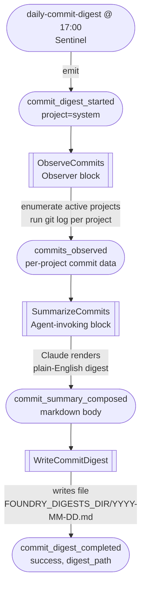

# Commit Digest

Every day at 17:00 local time, Foundry walks every active project in the
registry, asks the agent to summarise the day's commits, and drops a
markdown digest at a stable path — ready to read with your evening coffee.
This is the second proactive formation Foundry ships, alongside the nightly
maintenance run.

The digest exists to answer one question reliably each day: **what shipped
across my work today?** It is intentionally lightweight — no code review,
no opinion on quality, just a clear roll-up grouped by project with a
heads-up section for anything that looks risky.

## How it fires



The chain is linear — no fan-out, no scatter/gather. Each block sinks on
its trigger event and emits the next. `CommitDigestStarted` is a span
opener, so every digest run gets its own `trace_id`.

## Where the digest lands

```
{FOUNDRY_DIGESTS_DIR}/YYYY-MM-DD.md
```

The default `digests_dir` is `~/.foundry/digests/`. Set
`FOUNDRY_DIGESTS_DIR` in the daemon's launchd plist to put it wherever you
prefer. The typical Operations-side override is the same pattern that
already maps `~/.foundry/audits` to
`~/Work/Operations/Automation/maintenance-audits`:

```xml
<key>EnvironmentVariables</key>
<dict>
  <key>FOUNDRY_DIGESTS_DIR</key>
  <string>/Users/svetzal/Work/Operations/Automation/commit-digests</string>
</dict>
```

The date in the filename is the **firing date in local time**. Rerunning
the digest the same day overwrites — last one wins.

## What's in the file

Each day's digest looks roughly like this:

```markdown
# Commit Digest — 2026-05-28

_17 commits across 14 projects._

## ⚠ Heads-up

- `foundry` touched the release workflow — verify the changelog wiring.

## foundry

- `c80d68a` — feat(daemon): add and wire the commit-digest formation
- `b597878` — feat(core): seed-merge default sentinels on daemon startup
- `1503580` — feat(core): add CommitDigest event variants

Shipped Slice 2 of the Sentinel work end-to-end today.

## context-mixer2

- `4f2e891` — fix(parser): handle empty preludes

Single fix to the prelude parser; ready for the next release.
```

The agent renders this from the raw evidence the observer collected. It is
explicitly told **not** to invent commits or facts not in the source data.
If the agent is unavailable the digest is still written, but as a "raw
evidence" fallback — a flat list of every commit grouped by project, with
a warning line at the top noting the agent was unreachable.

## Defaults you should know about

- **Time window is rolling 24 hours.** `git log --since="24 hours ago"`
  evaluated at firing time. If the daemon was down at 17:00 yesterday,
  today's window misses that day's commits — same skip-missed catch-up
  policy as the nightly maintenance run.
- **Active projects only.** Projects with a `skip` reason in the registry
  are excluded — their commits will not appear in the digest. Use
  `foundry registry show <name>` to see why.
- **Merge commits are excluded** (`--no-merges`). The digest reports
  what was authored, not how it landed.
- **Empty days produce a file too.** "No commits across N projects in the
  last 24 hours." Absence is a fact — the file is your daily proof the
  sentinel ran.
- **A failing `git log` for one project does not abort the digest.** The
  error is captured inline under that project's section so you can fix
  the local repo without losing visibility on the others.
- **Throttle gating.** A dry-run firing
  (`foundry emit commit_digest_started --throttle dry_run`) runs the full
  chain — observer queries, agent composes — but does **not** write the
  file. Useful for previewing the digest before letting it land.

## Triggering it manually

The schedule is the primary path. To trigger immediately:

```bash
foundry emit commit_digest_started --project system
foundry watch         # observe the chain
cat ~/.foundry/digests/$(date +%Y-%m-%d).md
```

To pause the daily run:

```bash
foundry sentinel disable daily-commit-digest
```

And to re-enable:

```bash
foundry sentinel enable daily-commit-digest
```

## Event taxonomy

| Event | Payload | Notes |
|---|---|---|
| `CommitDigestStarted` | `{ project_count }` | Span opener. Sentinel emits with an empty payload; observer fills the count once the active registry is known. |
| `CommitsObserved` | `{ window_hours, projects: [{ name, branch, commits, error? }] }` | Raw evidence. Carries the full SHA per commit so the agent can render the 7-char prefix without truncation ambiguity. |
| `CommitSummaryComposed` | `{ markdown, project_count, total_commits }` | The agent-rendered body, before the file header is prepended. |
| `CommitDigestCompleted` | `{ success, digest_path?, project_count, total_commits }` | Terminal. `digest_path` is `None` on a dry-run firing and on persistence failure. |

## Adding more sentinels later

The `daily-commit-digest` entry was added to the canonical default seed
when Slice 2 shipped. Existing installs from Slice 1 picked it up
automatically on the next daemon restart via the additive seed-merge —
see [Sentinels](sentinels.md#adding-a-new-sentinel) for how the merge
works.
