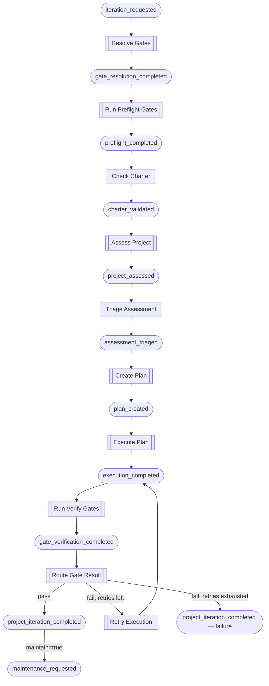

# Iteration Workflow

The iteration workflow is Foundry's code quality improvement engine. It
identifies the most-violated engineering principle in a project, creates a
targeted fix plan, executes it, and verifies the result against quality
gates — with automatic retries on failure.

## The Chain



## Phase by Phase

### 1. Gate Resolution

`Resolve Gates` reads `.hone-gates.json` from the project directory and
emits the gate definitions with `workflow: "iterate"`. The `actions` object
from the trigger event is forwarded through the chain so that gate routing
can chain into the maintenance workflow afterwards.

### 2. Preflight Gates

`Run Preflight Gates` executes every gate against the unmodified codebase.
If any required gate fails, `all_passed` is `false` and the chain stops —
`Assess Project` self-filters on preflight success.

This establishes a baseline: the iterate workflow only attempts improvements
when the project is already in a passing state.

### 3. Charter Validation

`Check Charter` verifies that the project has intent documentation
(e.g. `CHARTER.md`). If the charter is missing, `passed` is `false` and
the chain stops at this point — there is no assessment without context.

### 4. Assessment

`Assess Project` invokes an AI agent with reasoning capability and
read-only access to analyse the codebase. It identifies the single
most-violated engineering principle, returning a severity score (1–10),
the principle name, category, and a detailed assessment.

A second quick agent call generates a kebab-case audit filename for
traceability.

### 5. Triage

`Triage Assessment` uses a quick agent call to decide whether the finding
is worth acting on. It rejects issues with severity below 4 or findings
that amount to busy-work rather than substantive improvement. On agent
failure, triage defaults to accepted — it is better to attempt a fix than
to silently skip.

If triage rejects the finding, `Create Plan` self-filters on
`accepted=false` and the chain stops cleanly.

### 6. Plan Creation

`Create Plan` invokes an AI agent with reasoning capability and read-only
access to produce a step-by-step correction plan. The plan is concrete —
it names exact files and functions — minimal, and testable. Gate definitions
are forwarded so the execution phase knows what must pass.

### 7. Execution

`Execute Plan` is the only Mutator in the assessment-to-execution pipeline.
It invokes an AI agent with coding capability and full filesystem access.
The agent receives the plan plus gate context (the gates it must satisfy)
and applies the changes.

Under `audit_only` or `dry_run` throttle, this block returns a simulated
success without modifying any files.

### 8. Gate Verification

`Run Verify Gates` re-reads `.hone-gates.json` from disk (a fresh read,
not cached from phase 1) and runs every gate against the modified codebase.
The `retry_count` from the payload tracks which attempt this is.

### 9. Routing and Retry

`Route Gate Result` makes the terminal decision:

| Condition | Action |
|-----------|--------|
| All required gates pass | Emit `project_iteration_completed` (success) |
| Required gates fail, retry count < 3 | Emit `retry_requested` with failure context |
| Required gates fail, retry count ≥ 3 | Emit `project_iteration_completed` (failure) |

When retrying, `Retry Execution` receives the failure context (which gates
failed and their output) and invokes a coding agent to fix only the issues
causing those failures. The result loops back to `Run Verify Gates` for
another round.

The maximum is 3 retries (4 total attempts: 1 initial + 3 retries).

### 10. Chaining to Maintenance

On success, if `actions.maintain=true` was forwarded through the chain,
`Route Gate Result` also emits `maintenance_requested`. This triggers the
[Maintenance Workflow](maintenance-workflow.md) without re-querying the
project configuration.

## Self-Filtering

Several blocks use self-filtering to stop the chain gracefully without
errors:

- **Assess Project** — skips when `workflow != "iterate"` or preflight
  failed
- **Check Charter** — skips when `workflow != "iterate"`
- **Create Plan** — skips when `accepted != true` (triage rejected)
- **Summarize Result** — skips when `success != true`

The engine routes by event type only and cannot inspect payloads. Each
block checks the relevant payload fields and returns an empty result when
the condition does not match.

## Running the Workflow

### Direct trigger

To run the iterate workflow for a single project:

```bash
foundry emit iteration_requested my-project \
  --payload '{"actions":{"iterate":true,"maintain":false}}'
```

### With maintenance chaining

To iterate and then run maintenance:

```bash
foundry emit iteration_requested my-project \
  --payload '{"actions":{"iterate":true,"maintain":true}}'
```

### Via the maintenance run

The full maintenance lifecycle triggers iteration automatically when
`iterate=true` in the project's registry entry:

```bash
foundry emit maintenance_run_started my-project
```

### Audit only

Observers run and emit, but mutators suppress downstream events:

```bash
foundry emit iteration_requested my-project \
  --throttle audit_only \
  --payload '{"actions":{"iterate":true,"maintain":false}}'
```

This runs the assessment and triage phases but stops at execution —
useful for seeing what would be improved without modifying any files.

### Dry run

Only observers execute. Mutators are skipped entirely:

```bash
foundry emit iteration_requested my-project \
  --throttle dry_run \
  --payload '{"actions":{"iterate":true,"maintain":false}}'
```

## Agent Capabilities

Foundry delegates AI work to the Claude CLI, mapping each block's capability
hint to a concrete model:

| Capability | Model | Use Case |
|------------|-------|----------|
| Reasoning | `claude-opus-4-6` | Deep analysis and planning |
| Coding | `claude-sonnet-4-6` | Code generation and modification |
| Quick | `claude-haiku-4-5-20251001` | Fast, lightweight decisions |

Access levels control which CLI tools the agent may use:

| Access | Allowed Tools |
|--------|---------------|
| Read-only | `Read`, `Glob`, `Grep`, `WebFetch`, `WebSearch` |
| Full | All tools (no restrictions) |

Each phase in the iterate workflow maps to a specific capability and access
level:

| Phase | Capability | Model | Access | Purpose |
|-------|-----------|-------|--------|---------|
| Assessment | Reasoning | Opus | Read-only | Deep analysis of codebase |
| Audit naming | Quick | Haiku | Read-only | Generate kebab-case filename |
| Triage | Quick | Haiku | Read-only | Accept/reject decision |
| Plan creation | Reasoning | Opus | Read-only | Step-by-step correction plan |
| Execution | Coding | Sonnet | Full | Apply code changes |
| Retry | Coding | Sonnet | Full | Fix gate failures |
| Summarisation | Quick | Haiku | Read-only | Generate headline and summary |

All agent invocations use the `--print` flag (non-interactive output) and
`--dangerously-skip-permissions` (unattended execution). Blocks that
reference a project agent file pass it via `--agent`. Timeouts are set
per-project from the registry entry, except Triage and Summarisation which
use a fixed 120-second timeout for their lightweight Quick calls.

## Payload Fields

| Field | Carried By | Purpose |
|-------|-----------|---------|
| `actions` | All events | `{iterate, maintain}` flags for workflow routing |
| `gates` | Gates resolved through plan creation | Gate definitions for execution context |
| `audit_name` | Assessment through plan creation | Kebab-case audit filename for traceability |
| `severity` | Assessment through plan creation | Violation severity (1–10) |
| `principle` | Assessment through plan creation | Name of the violated principle |
| `category` | Assessment through plan creation | Category of the violation |
| `assessment` | Assessment through plan creation | Detailed assessment text |
| `retry_count` | Execution through gate routing | Current retry attempt (0-based) |
| `failure_context` | Retry requested | Gate output from failed verification |
