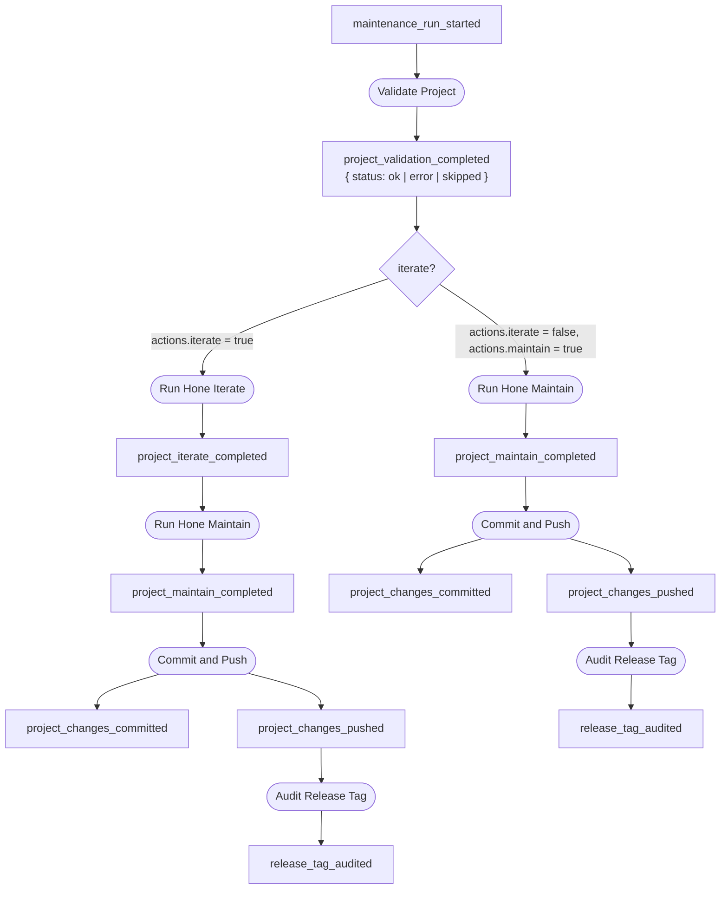

# Maintenance Workflow

The maintenance workflow performs routine upkeep on your projects: validating
their state, running iterative AI-assisted improvements, applying dependency
updates, and pushing the results. It is the complement to the
[vulnerability remediation workflow](vulnerability-remediation.md), which
responds to security events. Maintenance runs on a schedule or on demand.

## Triggering a Run

Use `foundry run` to start a maintenance run immediately:

```bash
# Run all active projects
foundry run

# Run a single project
foundry run --project my-tool

# Audit what would happen without making changes
foundry run --throttle dry_run
```

Under the hood, `foundry run` emits a `maintenance_run_started` event. The
engine routes that event to `Validate Project`, which starts the per-project
chain.

## The Per-Project Chain

Each active project in the registry gets its own `maintenance_run_started`
event. The blocks that follow are gated by the project's `actions` flags in the
registry.



### Step 1: Validate Project

`Validate Project` is an observer — it runs regardless of throttle. It checks:

1. The project directory exists on disk.
2. The current git branch matches `branch` from the registry. If the repo is in
   detached HEAD state, it attempts automatic recovery by checking out the
   expected branch.
3. Whether `.hone-gates.json` is present (a warning, not a hard failure).

Projects marked `skip: true` in the registry emit
`project_validation_completed` with `status: "skipped"` and the chain stops
there — no iterate, no maintain, no commit.

### Step 2: Run Hone Iterate (optional)

Enabled by `actions.iterate = true`. Runs:

```bash
hone iterate <agent> --json
```

This is an AI-assisted iteration step — the agent applies fixes, improvements,
or feature work defined in the project's `hone` configuration. The `--json`
flag makes `hone` emit a structured result that Foundry captures as the
`project_iterate_completed` payload.

If `hone` is not on the `PATH`, the block returns an error and the chain stops.
If `iterate` is disabled in `actions`, this block self-filters (returns an
empty result with `success: true`).

### Step 3: Run Hone Maintain (optional)

Enabled by `actions.maintain = true`.

`Run Hone Maintain` uses dual-sink routing to handle the two cases cleanly:

- **When `iterate` is also enabled**: `Run Hone Maintain` sinks on
  `project_iterate_completed` and runs after iterate finishes.
- **When only `maintain` is enabled**: `Run Hone Maintain` sinks on
  `project_validation_completed` and runs directly after validation.

This avoids running `hone maintain` twice and keeps the event chain linear.

### Step 4: Commit and Push

`Commit and Push` sinks on both `project_iterate_completed` and
`project_maintain_completed`. It:

1. Checks `git status --porcelain` — if the tree is clean, it emits nothing and
   stops (no spurious empty commits).
2. Stages all changes with `git add -A`.
3. Commits with a message that identifies the source step:
   - `chore(<project>): automated iterate` (from iterate)
   - `chore(<project>): automated maintenance` (from maintain)
4. Pushes with `git push` only when `actions.push = true`.

If `push` is disabled, only `project_changes_committed` is emitted (no
`project_changes_pushed`), and the downstream audit does not run.

### Step 5: Post-Push Audit (AuditReleaseTag)

After a successful push, `Audit Release Tag` performs a post-push re-audit to
confirm the latest release tag is clean. This closes the loop: if the
automated changes introduced or missed a vulnerability, it shows up here.

The result is a `release_tag_audited` event. Downstream blocks (like
`Audit Main Branch`) can act on it, though in the current maintenance path
they self-filter unless `vulnerable=true` is present.

## How Action Flags Gate Each Step

| Flag | Controls |
|------|----------|
| `iterate` | Whether `Run Hone Iterate` runs |
| `maintain` | Whether `Run Hone Maintain` runs |
| `push` | Whether `Commit and Push` pushes (commits happen regardless) |
| `audit` | Reserved — not yet wired into the chain |
| `release` | Reserved — not yet wired into the chain |

All flags default to `false`. A project with no `actions` key set makes no
changes — it only validates.

## Throttle Levels in Maintenance Context

The throttle level you pass to `foundry run` propagates through the entire
event chain for every project.

| Throttle | Effect |
|----------|--------|
| `full` (default) | All blocks run: validate, iterate, maintain, commit, push, audit |
| `audit_only` | Observers run (validate, post-push audit); mutators (iterate, maintain, commit, push) run but suppress their downstream events |
| `dry_run` | Only observers execute; all mutators are skipped entirely — no `hone` calls, no git operations |

Use `dry_run` to preview which projects would be processed without touching
any files or making any commits:

```bash
foundry run --throttle dry_run
foundry watch  # in another terminal to see the event stream
```

## Concurrency and Overlap Prevention

The orchestrator runs projects concurrently (controlled by `max_concurrent`
inside the daemon). If a project's previous run has not finished by the time
a new maintenance run is triggered, the second run skips that project rather
than running it concurrently — preventing git conflicts and data corruption.

A skipped project appears in the `maintenance_run_completed` payload under
`skipped`.

## Inspecting a Maintenance Run

After triggering a run, use `foundry watch` to see events in real time:

```bash
# Terminal 1
foundry watch --project my-tool

# Terminal 2
foundry run --project my-tool
```

Or inspect the trace after the run completes:

```bash
foundry run --project my-tool
# Event: evt_abc123...

foundry trace evt_abc123
```

The trace shows the full event chain with per-block results and timing, making
it easy to diagnose why a step was skipped or failed.

## The Aggregate `maintenance_run_completed` Event

After all per-project chains finish, the daemon emits a single
`maintenance_run_completed` event containing aggregate statistics:

```json
{
  "total": 3,
  "succeeded": 2,
  "failed": 1,
  "skipped": 0,
  "projects": [
    { "name": "api-server", "status": "success", "duration_secs": 45 },
    { "name": "frontend",   "status": "success", "duration_secs": 38 },
    { "name": "backend",    "status": "failed",  "duration_secs": 12 }
  ]
}
```

The `summary.rs` module also renders this as a Markdown report for
human-readable output.
