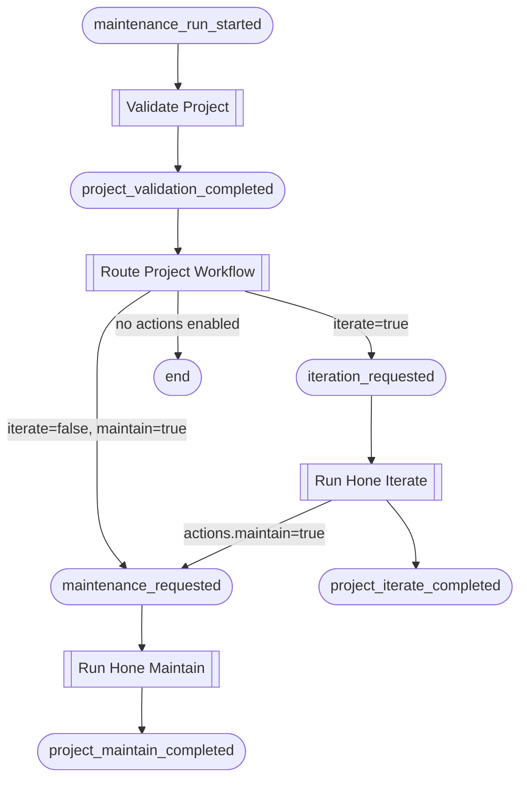

# Maintenance Workflow

The maintenance workflow runs `hone iterate` and `hone maintain` against each
registered project, committing and pushing any changes they produce.  It is
designed to be triggered nightly via launchd or manually via `foundry emit`.

## How It Works

Each project goes through its own independent chain.  The chain is driven
entirely by events — no mutable state is shared between projects.

### Per-Project Chain



### Routing Logic

`Route Project Workflow` reads the `actions` flags forwarded in the
`project_validation_completed` payload and makes a single decision:

| Condition | Emits |
|-----------|-------|
| `status != "ok"` | nothing — chain stops |
| `actions.iterate = true` | `iteration_requested` |
| `actions.iterate = false`, `actions.maintain = true` | `maintenance_requested` |
| both false | nothing — no automation enabled |

When `iterate = true`, the `actions.maintain` flag is forwarded inside the
`iteration_requested` payload.  After a successful iteration, `Run Hone
Iterate` emits `maintenance_requested` automatically when that flag is `true`,
so the maintain sub-workflow starts without an extra routing step.

## Triggering a Maintenance Run

To run maintenance for a single project:

```bash
foundry emit project_validation_completed my-project \
  --payload '{"status":"ok","actions":{"iterate":true,"maintain":true}}'
```

To trigger the full nightly cycle (once `ValidateProject` is implemented):

```bash
foundry emit maintenance_run_started my-project
```

## Throttle Behaviour

| Throttle | Effect |
|----------|--------|
| `full` | All blocks execute and emit events |
| `audit_only` | Observers (`Route Project Workflow`) emit; mutators (`Run Hone Iterate`, `Run Hone Maintain`) suppress output |
| `dry_run` | Observers emit; mutators are skipped entirely |

Under `dry_run`, only `iteration_requested` or `maintenance_requested` are
emitted (by the Observer router).  Neither hone command executes.
