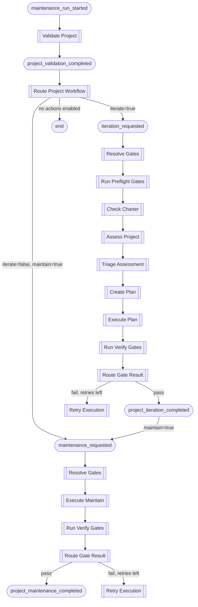

# Maintenance Workflow

The maintenance workflow runs iterate and maintain automation against each
registered project, committing and pushing any changes they produce. It is
triggered nightly by the in-daemon `nightly-maintenance` sentinel (see
[Sentinels](sentinels.md)) and can also be invoked manually via
`foundry run` or `foundry emit`.

## How It Works

Each project goes through its own independent chain. The chain is driven
entirely by events — no mutable state is shared between projects.

### Per-Project Chain


```mermaid
flowchart TD
    A([maintenance_run_started]) --> B[[Validate Project]]
    B --> C([project_validation_completed])
    C --> D[[Route Project Workflow]]
    D -->|iterate=true| E([iteration_requested])
    D -->|iterate=false, maintain=true| F([maintenance_requested])
    D -->|no actions enabled| G([end])
    E --> H[[Resolve Gates]]
    H --> I[[Run Preflight Gates]]
    I --> J[[Check Charter]]
    J --> K[[Assess Project]]
    K --> L[[Triage Assessment]]
    L --> M[[Create Plan]]
    M --> N[[Execute Plan]]
    N --> O[[Run Verify Gates]]
    O --> P[[Route Gate Result]]
    P -->|pass| Q([project_iteration_completed])
    P -->|fail, retries left| R[[Retry Execution]]
    Q -->|maintain=true| F
    F --> S[[Resolve Gates]]
    S --> T[[Execute Maintain]]
    T --> U[[Run Verify Gates]]
    U --> V[[Route Gate Result]]
    V -->|pass| W([project_maintenance_completed])
    V -->|fail, retries left| X[[Retry Execution]]
```

### Syncing the Checkout With Its Remote

The nightly chain works directly in each project's registered checkout, not in
a disposable worktree. A checkout that lags `origin` — common on a second host
whose clones are not in daily use — would otherwise be maintained as stale
code, and its push would be rejected or, worse, land on a remote that has since
moved. So `Validate Project` syncs the checkout before anything else touches
it, on the registered branch:

1. **Dirty tree → refuse.** If `git status --porcelain` is non-empty the
   project fails with `sync_failure: "dirty_tree"`. Nothing is fetched,
   merged, or cleaned; the uncommitted work is left for a human.
2. **Fetch.** `git fetch origin <branch>`. If the fetch fails, or
   `origin/<branch>` cannot be resolved, the project fails with
   `sync_failure: "remote_unavailable"`.
3. **Fast-forward only.** `git merge --ff-only origin/<branch>`. The number of
   commits applied is recorded as `fast_forwarded` on
   `project_validation_completed` (`0` when already level, or when the local
   branch is only ahead).
4. **Diverged → refuse.** If both the local branch and the remote have moved,
   no fast-forward is possible and the project fails with
   `sync_failure: "diverged"`. The checkout is left exactly as found.

A failed sync sets `status: "error"`, so `Route Project Workflow` stops the
chain (and, inside a maintenance cycle, reports the project run as failed).

Before pushing, `Commit and Push` repeats the fetch and fast-forward in case
the remote moved *during* the run. If it did, the maintenance commit is
replayed with `git rebase origin/<branch>` and pushed only if the rebase
applied cleanly. A conflicting rebase is aborted and nothing is pushed: the
commit stays on the local branch for a human, and `project_changes_committed`
records `push_failure: "push_rejected_diverged"`. A failed pre-push fetch
records `push_failure: "remote_unavailable"`. Foundry never force-pushes.

The one-shot `foundry task` / campaign path is unaffected — it already builds
its isolated worktree from the fetched remote tip.

### Routing Logic

`Route Project Workflow` reads the `actions` flags forwarded in the
`project_validation_completed` payload and makes a single decision:

| Condition | Emits |
| --- | --- |
| `status != "ok"` | nothing — chain stops |
| `actions.iterate = true` | `iteration_requested` |
| `actions.iterate = false`, `actions.maintain = true` | `maintenance_requested` |
| both false | nothing — no automation enabled |

When `iterate = true`, the `actions.maintain` flag is forwarded inside the
`iteration_requested` payload. After a successful iteration, the gate routing
emits `maintenance_requested` automatically when that flag is `true`,
so the maintain sub-workflow starts without an extra routing step.

## Triggering a Maintenance Run

To run maintenance for a single project:

```bash
foundry emit project_validation_completed my-project \
  --payload '{"status":"ok","actions":{"iterate":true,"maintain":true}}'
```

To trigger the full nightly cycle:

```bash
foundry emit maintenance_run_started my-project
```

## Throttle Behaviour

| Throttle | Effect |
| --- | --- |
| `full` | All blocks execute and emit events |
| `dry_run` | Observers emit; mutators are skipped entirely |

Under `dry_run`, only `iteration_requested` or `maintenance_requested` are
emitted (by the Observer router). No execution blocks run.

`Validate Project` still checks for a dirty tree under `dry_run`, but it does
not fetch or merge. It reports the fast-forward that *would* happen, measured
against the last-fetched `origin/<branch>`, as `fast_forwarded` with
`dry_run: true` on `project_validation_completed`.

## Agent Capabilities

The maintenance workflow uses a single agent invocation in `Execute Maintain`:

| Phase | Capability | Model | Access | Purpose |
| --- | --- | --- | --- | --- |
| Execute Maintain | Coding | `claude-sonnet-5` | Full | Update dependencies, fix vulnerabilities, resolve gate failures |

Gate definitions are passed as context so the agent knows what must pass
after its changes. If the project has an agent file registered, it is
supplied via `--agent`.

See the [Iteration Workflow](iteration-workflow.md#agent-capabilities) for
the full model-to-capability mapping and CLI parameters used across all
agent invocations.
