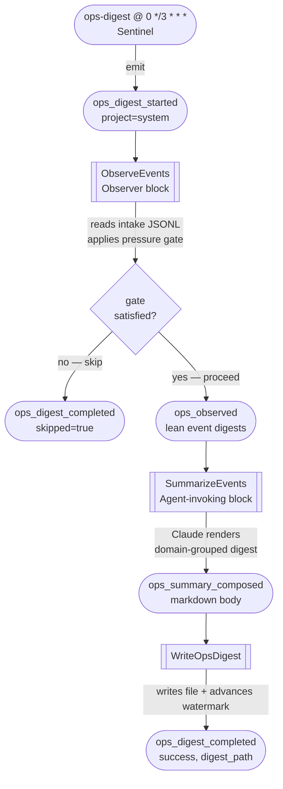

# Ops Digest

Every three hours, Foundry reads the MBOS event intake JSONL files, checks
whether enough new operational activity has accumulated, asks the agent to
summarise it, and drops a markdown digest at a stable path. This is the
third proactive formation Foundry ships, alongside the nightly maintenance run
and the daily commit digest.

The digest exists to answer one question reliably across the working day:
**what happened in my business and technical systems since the last check?**
It is intentionally lightweight — no deep triage, no automated response, just
a clear roll-up grouped by domain with an anomaly section when something needs
your attention.

## How it fires



The chain is linear — no fan-out. `OpsDigestStarted` is a span opener, so
every digest run gets its own `trace_id`.

## Pressure gate

`ObserveEvents` applies a pressure gate before passing events downstream.
The gate is satisfied when **either** condition holds:

- At least **25 new events** have arrived since the last watermark.
- At least one event qualifies as an **anomaly** (see below).

When the gate is not satisfied `ObserveEvents` emits
`OpsDigestCompleted{skipped: true}` directly and the chain terminates cleanly —
no agent call, no file written.

## Anomaly classification

An event is an anomaly if it matches any of these conditions:

| Condition | Detail |
|-----------|--------|
| Urgency `P0` | Any MBOS event with `"urgency": "P0"` |
| `ci_pipeline_failure` | Always anomalous |
| `maintenance_intervention_recorded` | When `intervention.outcome == "unresolved"` |
| `dependency_vulnerability_detected` | When `vulnerability.severity` is `"high"` or `"critical"` |
| `maintenance_run_completed` | When `maintenance.reposFailed > 0` |

## Where the digest lands

```
{FOUNDRY_OPS_DIGESTS_DIR}/YYYY-MM-DD.md
```

The default `ops_digests_dir` is `~/.foundry/ops-digests/`. Set
`FOUNDRY_OPS_DIGESTS_DIR` in the daemon's launchd plist to put it wherever
you prefer. The typical Operations-side override pattern:

```xml
<key>EnvironmentVariables</key>
<dict>
  <key>FOUNDRY_OPS_DIGESTS_DIR</key>
  <string>/Users/svetzal/Work/Operations/Automation/ops-digests</string>
</dict>
```

Running the digest multiple times in one day appends to the same dated file —
last one wins (atomic rename).

## Where the intake comes from

`ObserveEvents` reads MBOS JSONL files from:

```
{FOUNDRY_OPS_EVENTS_DIR}/YYYY-MM.jsonl
```

The default `ops_events_intake_dir` is `~/Work/Operations/Events/intake`.
Override with `FOUNDRY_OPS_EVENTS_DIR`.

Each line in the file is a MBOS event object with at minimum an `id`, `type`,
`occurredAt`, `urgency`, and `summary` field. Malformed lines are silently
skipped so a bad event never aborts the chain.

## Watermark-based incremental ingestion

After each successful digest write, `WriteOpsDigest` atomically advances
`~/.foundry/ops-digest.watermark` to the `occurredAt` timestamp of the newest
event included in that digest. On the next run `ObserveEvents` reads the
watermark and only considers events with `occurredAt` strictly after that
timestamp — so you never re-process the same event in two digests.

On the very first run (no watermark file), the lookback window is 24 hours.

A dry-run firing (`--throttle dry_run`) runs the full chain — reads events,
applies the gate, invokes the agent — but does **not** write the file or
advance the watermark.

## What's in the file

A typical digest looks roughly like this:

```markdown
# Ops Digest — 2026-05-29

_47 operational events._

## ⚠ Anomalies

- `ci_pipeline_failure` on foundry — PR #42 gate failure, suspected flake.

## Infrastructure

- [P1] `maintenance_run_completed` | 3 repos processed, 1 failed (hone-cli)
- [P2] `dependency_vulnerability_detected` | moderate CVE in libc

## AI

- [P2] `ai_session_start` | 12 agent sessions this period
- [P2] `hone_iteration_started` | 8 iterations across 5 projects

## Clients

- [P1] `email_inbound_support` | Acme Corp — billing question
- [P2] `whatsapp_inbound_support_message` | Quick status check from BetaCo

## Summary

One CI failure on foundry that looks like a test flake — worth a quick check.
Maintenance ran cleanly on all other projects. Moderate client activity,
nothing urgent beyond the billing query.
```

## Triggering it manually

```bash
foundry emit ops_digest_started --project system
foundry watch         # observe the chain
cat ~/.foundry/ops-digests/$(date +%Y-%m-%d).md
```

To pause the three-hourly run:

```bash
foundry sentinel disable ops-digest
```

And to re-enable:

```bash
foundry sentinel enable ops-digest
```

## Event taxonomy

| Event | Payload | Notes |
|---|---|---|
| `OpsDigestStarted` | `{ event_count }` | Span opener. Sentinel emits with an empty payload. |
| `OpsObserved` | `{ proceed, new_event_count, anomaly_present, new_watermark?, events: [{id, event_type, occurred_at, domain, urgency?, summary?, client?}] }` | Lean per-event digests. `proceed=false` causes downstream self-filter. |
| `OpsSummaryComposed` | `{ markdown, event_count, new_watermark? }` | The agent-rendered body, before the file header is prepended. |
| `OpsDigestCompleted` | `{ success, skipped, digest_path?, event_count }` | Terminal. `skipped=true` when the pressure gate was not satisfied. `digest_path` is `None` on dry-run, skip, or failure. |

## Environment variables

| Variable | Default | Purpose |
|----------|---------|---------|
| `FOUNDRY_OPS_DIGESTS_DIR` | `~/.foundry/ops-digests` | Where digest files land |
| `FOUNDRY_OPS_EVENTS_DIR` | `~/Work/Operations/Events/intake` | MBOS JSONL intake directory |
