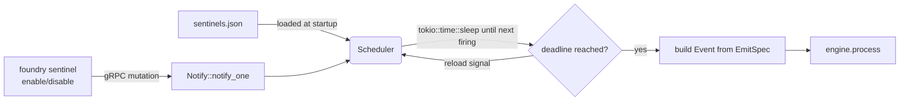

# Sentinels (Scheduled Triggers)

A **sentinel** is a declarative, named, scheduled trigger that lives inside
`foundryd` and emits an event into the engine when its schedule fires. They
internalise the kinds of proactive workflows that previously required an
external scheduler (a launchd plist, a cron entry, a systemd timer).

The shipping example is `nightly-maintenance`: at 02:00 every day it emits
`maintenance_cycle_started` with `project = "system"`, which is exactly the
event the `foundry run` command used to emit from outside the daemon.

## Why have them at all?

Before sentinels, the nightly maintenance run lived in
`launchd/com.mojility.foundry-maintenance.plist`. That meant:

- The trace store and event history had no record of *why* a cycle started.
  It just appeared, as if conjured from outside the daemon.
- Adding a second proactive workflow meant editing a per-machine system file.
- Pausing or rescheduling required editing that system file too.

Sentinels move all of that inside `foundryd`. The launchd plist's only job
becomes "keep `foundryd` running"; everything proactive happens through the
event bus, the scheduler, and the registry the daemon already owns.

## How they fire



The scheduler always knows the soonest upcoming firing across every enabled
sentinel. It blocks on `tokio::select!` between that deadline and a reload
`Notify`; when the reload fires (because a CLI command toggled a sentinel's
`enabled` state), the loop recomputes deadlines.

## The default seed

On first start the daemon writes `~/.foundry/sentinels.json` with a single
entry:

```json
{
  "version": 1,
  "sentinels": [
    {
      "name": "nightly-maintenance",
      "schedule": { "cron": "0 2 * * *" },
      "emit": {
        "event_type": "maintenance_cycle_started",
        "project": "system",
        "throttle": "full",
        "payload": {}
      },
      "enabled": true
    }
  ]
}
```

Restarts skip the seeding step — the file becomes the source of truth and you
can hand-edit it. The path is overridable via `FOUNDRY_SENTINELS_PATH`.

## Schedule format

Slice 1 supports a single schedule kind, `cron`, taking a standard 5-field
expression evaluated in **local time**:

```
minute hour day-of-month month day-of-week
```

Examples:

| Cron | Means |
|---|---|
| `0 2 * * *` | Every day at 02:00 local |
| `*/30 * * * *` | Every 30 minutes |
| `0 9 * * 1` | Every Monday at 09:00 local |
| `0 17 * * 1-5` | 17:00 on weekdays |

Six-field expressions (`second minute hour dom month dow`) are also accepted
verbatim; five-field expressions are auto-padded with a leading `0` for
seconds. The schedule shape is an externally-tagged enum
(`{"cron": "..."}`) so future kinds (`interval`, `event_silence`) can be
added without breaking the existing wire format.

## Defaults you should know about

- **Time zone is local.** A cron expression of `0 2 * * *` means 02:00
  wherever the daemon is running, not 02:00 UTC. This matches how the
  launchd plist behaved.
- **Catch-up policy is "skip missed firings."** If the daemon was down at
  02:00 and starts at 05:00, the next firing is the *next* 02:00. Sentinels
  intentionally never play catch-up on miss — workflows like maintenance
  should not run twice in quick succession because the daemon was offline.
- **Auto-seeding only happens once.** Subsequent restarts read the existing
  file even if you have deleted every entry. To restore the seed: remove
  `~/.foundry/sentinels.json` and restart.

## CLI

`foundry sentinel list | show | enable | disable` mirrors `foundry registry`
exactly:

```bash
foundry sentinel list
foundry sentinel show nightly-maintenance

# Toggle through gRPC (preferred — the daemon's scheduler wakes immediately):
foundry sentinel disable nightly-maintenance
foundry sentinel enable nightly-maintenance

# Toggle the file directly when the daemon is not running:
foundry sentinel disable --offline nightly-maintenance
```

`list` and `show` always read the file directly. `enable` and `disable` try
the gRPC `SentinelEnable` / `SentinelDisable` RPCs first; if the daemon is
unreachable they fall back to direct file mutation (and print a warning so
you know to restart the daemon to pick up the change).

## Adding a new sentinel

Slice 1 ships with `list / show / enable / disable` only — there is no
`foundry sentinel add` yet. To register a new one for now, hand-edit
`~/.foundry/sentinels.json` and restart the daemon. The schema is the JSON
shape shown above. Future slices will add `add | remove | edit` plus
non-cron schedule kinds.

## Relationship to launchd

After Slice 1, `launchd/com.mojility.foundry-maintenance.plist` is removed.
Only `com.mojility.foundryd.plist` remains, and its job shrinks to "keep the
daemon alive." If you are upgrading from an older Foundry install that had
the maintenance plist loaded, unload and delete it:

```bash
launchctl unload ~/Library/LaunchAgents/com.mojility.foundry-maintenance.plist
rm ~/Library/LaunchAgents/com.mojility.foundry-maintenance.plist
```

After the next `foundryd` restart, `foundry sentinel list` should show
`nightly-maintenance` as `enabled`. Without this cleanup step the daemon
*and* the legacy plist would both emit `maintenance_cycle_started` each
night, doubling the work.
