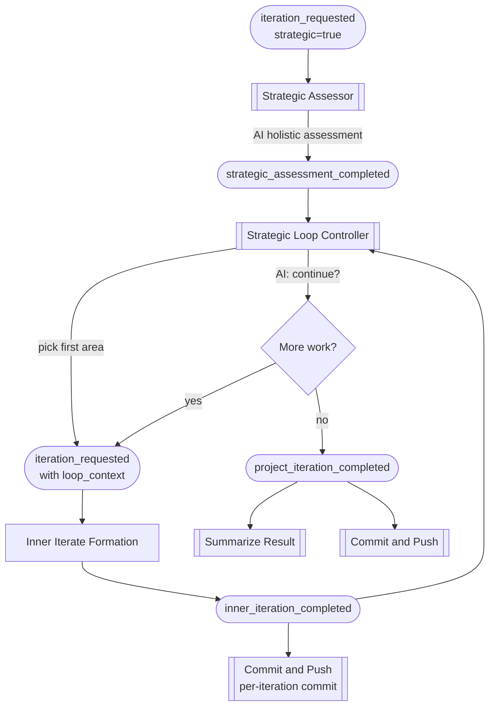

# Strategic Iteration

Strategic iteration wraps the standard [iterate workflow](iteration-workflow.md)
in an outer loop. Instead of finding and fixing one issue, it assesses the
project holistically, identifies multiple areas for improvement, and works
through them one at a time — committing changes after each cycle and
re-evaluating whether further work is warranted.

This is a two-layer nested loop:

1. **Outer loop (strategic)** — AI identifies areas to improve, decides
   when to stop
2. **Inner loop (operational)** — the existing iterate formation: assess,
   triage, plan, execute, verify gates, retry

## Prerequisites

Before running a strategic iteration you need the same setup as a standard
iterate workflow:

- A project registered in the Foundry registry (`foundry registry add`)
- A `CHARTER.md` (or equivalent intent documentation) in the project root
- A `.hone-gates.json` defining quality gates
- The `foundryd` daemon running

If you can successfully run `foundry iterate my-project`, you are ready
for strategic iteration.

## Step 1: Start the Daemon

```bash
foundryd
```

Verify the strategic blocks are registered in the startup logs:

```text
INFO foundryd::engine: registered task block block="Strategic Assessor" sinks=[IterationRequested]
INFO foundryd::engine: registered task block block="Strategic Loop Controller" sinks=[StrategicAssessmentCompleted, InnerIterationCompleted]
```

## Step 2: Dry Run First

Before committing to a full strategic run, use `dry_run` throttle to see
the shape of the event chain without modifying any files:

```bash
foundry emit iteration_requested my-project \
  --throttle dry_run \
  --payload '{"strategic": true, "max_iterations": 3}'
```

Watch the event stream in another terminal:

```bash
foundry watch --project my-project
```

You should see events flowing through the strategic assessment, into
the inner iterate chain, and back to the strategic controller. Mutator
blocks (Execute Plan, Commit and Push) emit simulated success events
under `dry_run`.

## Step 3: Run a Strategic Iteration

```bash
foundry emit iteration_requested my-project \
  --payload '{"strategic": true, "max_iterations": 5}'
```

### What happens



1. **Strategic Assessor** analyses the codebase and produces a ranked list
   of improvement areas (e.g., "test coverage in auth module",
   "inconsistent error handling in API layer").

2. **Strategic Loop Controller** picks the top area and enters the inner
   iterate formation by emitting `iteration_requested` with a
   `loop_context` payload.

3. The **inner iterate formation** runs exactly as described in the
   [Iteration Workflow](iteration-workflow.md) guide — charter check,
   gate resolution, preflight, assessment, triage, plan, execute, verify,
   retry. The only difference is that `Route Gate Result` emits
   `inner_iteration_completed` instead of `project_iteration_completed`.

4. **Commit and Push** fires on `inner_iteration_completed`, creating a
   per-iteration commit so each improvement is isolated in git history.

5. **Strategic Loop Controller** receives `inner_iteration_completed` and
   asks an AI agent: "Is there more meaningful work to do, or has the
   codebase reached a plateau?" Based on the response and the iteration
   cap, it either re-enters the inner loop or completes.

6. When the loop completes, the controller emits
   `project_iteration_completed` **without** `loop_context`, which
   triggers `Summarize Result` and a final `Commit and Push`.

## Step 4: Monitor Progress

Watch the live event stream:

```bash
foundry watch --project my-project
```

Key events to look for:

| Event | Meaning |
|-------|---------|
| `strategic_assessment_completed` | AI identified areas; check `areas` in payload |
| `iteration_requested` (with `loop_context`) | Inner loop entered for an area |
| `inner_iteration_completed` | One cycle done; check `success` |
| `project_changes_committed` | Per-iteration commit created |
| `project_iteration_completed` | Strategic loop finished |
| `summarize_completed` | Final summary generated |

## Step 5: Review the Trace

After completion, inspect the full event chain:

```bash
foundry trace <event-id>
```

Use the event ID from the original `iteration_requested` event. The
trace shows every block that executed, what it emitted, and how long
it took — across all iterations of the loop.

## Payload Reference

### Entry payload

| Field | Type | Default | Purpose |
|-------|------|---------|---------|
| `strategic` | bool | `false` | Must be `true` to activate strategic mode |
| `max_iterations` | integer | 5 | Maximum number of inner loop cycles |
| `strategic_prompt` | string | (built-in) | Custom directive for the assessment and continue checks (see below) |
| `actions` | object | — | Optional `{maintain: true}` to chain maintenance after the loop completes |

### loop_context (internal)

The `loop_context` object is managed by the strategic blocks. You do not
set it manually — it is created by the Strategic Assessor and threaded
through the chain automatically.

```json
{
  "loop_context": {
    "strategic": {
      "iteration": 2,
      "max": 5,
      "total_areas": 3,
      "current_area": {"area": "test coverage", "severity": 8}
    }
  }
}
```

All blocks in the iterate chain forward `loop_context` transparently.
Terminal blocks (`Summarize Result`, `Commit and Push`) skip when they
see it on a completion event — they only fire on the final completion
that the Strategic Loop Controller emits without `loop_context`.

## Controlling the Loop

### Iteration cap

The `max_iterations` field is the hard stop. Even if the AI wants to
continue, the loop completes when this count is reached. Start with a
low number (2–3) and increase once you are comfortable with the results.

### Custom prompt

By default the Strategic Assessor analyses broad code quality and the
continue check looks for remaining violations. You can replace both
directives with a `strategic_prompt` to steer the loop toward a
specific goal:

```bash
foundry emit iteration_requested my-project \
  --payload '{
    "strategic": true,
    "max_iterations": 5,
    "strategic_prompt": "Pick the highest priority interaction from et and implement it."
  }'
```

The prompt you supply is used in two places:

1. **Assessment** — the Strategic Assessor wraps your prompt in a
   request to produce the `areas` JSON. The AI reads the codebase with
   your directive as context and returns a ranked list of work items.
2. **Continue check** — after each inner iteration, the Strategic Loop
   Controller asks the AI the same prompt again to decide whether the
   loop should continue. The AI responds with `{"continue": true/false}`.

The prompt is stored inside `loop_context.strategic.prompt` so it
survives the full inner chain and is available on every re-entry.

Some examples:

| Goal | Prompt |
|------|--------|
| Product work from a backlog | `"Pick the highest priority interaction from et and implement it."` |
| Focused refactoring | `"Find the module with the worst test coverage and add tests."` |
| Dependency modernisation | `"Identify deprecated dependencies and upgrade them one at a time."` |
| Security hardening | `"Find the most critical OWASP Top 10 risk in this codebase and fix it."` |

### AI continue assessment

After each inner iteration, the Strategic Loop Controller asks an AI
agent whether further improvement is warranted. When no `strategic_prompt`
is set, the agent considers:

- Are there remaining violations with severity >= 4?
- Would another iteration produce meaningful improvement?
- Has the codebase reached a diminishing-returns plateau?

When `strategic_prompt` is set, your prompt replaces this default
reasoning — the AI uses your directive to decide whether more work
remains.

If the inner iteration **failed** (gates did not pass after retries),
the loop stops immediately rather than attempting further iterations on
a broken codebase.

### Throttle interaction

| Throttle | Strategic Assessor | Inner Iterate | Commits |
|----------|-------------------|---------------|---------|
| `full` | Runs | Runs (modifies files) | Real commits |
| `audit_only` | Runs | Runs, but mutator events suppressed | No commits |
| `dry_run` | Runs | Simulated success | No commits |

## Chaining with Maintenance

To run a strategic iteration and then chain into maintenance:

```bash
foundry emit iteration_requested my-project \
  --payload '{"strategic": true, "max_iterations": 3, "actions": {"maintain": true}}'
```

Maintenance chaining is suppressed during the inner loop (to prevent
maintenance from running after every cycle). It only fires after the
strategic loop completes — the final `project_iteration_completed`
event triggers `Route Gate Result`'s normal chaining logic.

## Example: Full Session

```bash
# Terminal 1: start daemon
foundryd

# Terminal 2: watch events
foundry watch --project my-api

# Terminal 3: trigger strategic iteration
foundry emit iteration_requested my-api \
  --payload '{"strategic": true, "max_iterations": 3}'

# After completion, review the trace
foundry trace evt_abc123def456
```

Expected event flow for a 2-iteration run:

```text
iteration_requested (strategic=true)
  strategic_assessment_completed (areas: [test coverage, error handling])
    iteration_requested (loop_context: iteration=1)
      charter_check_completed
      gate_resolution_completed
      preflight_completed
      assessment_completed
      triage_completed
      plan_completed
      execution_completed
      gate_verification_completed
      inner_iteration_completed (success=true)
        project_changes_committed
    iteration_requested (loop_context: iteration=2)
      charter_check_completed
      ...
      inner_iteration_completed (success=true)
        project_changes_committed
    project_iteration_completed (no loop_context — loop done)
      summarize_completed
      project_changes_committed
```

## Agent Capabilities

Strategic iteration adds two blocks with their own agent invocations on top
of the standard iterate chain:

| Phase | Capability | Model | Access | Purpose |
|-------|-----------|-------|--------|---------|
| Strategic Assessor | Reasoning | `claude-opus-4-6` | Read-only | Holistic codebase analysis producing ranked improvement areas |
| Continue check | Quick | `claude-haiku-4-5-20251001` | Read-only | Decide whether the loop should continue after each cycle |

The inner iterate formation uses the same model assignments described in
the [Iteration Workflow](iteration-workflow.md#agent-capabilities) guide.

When a `strategic_prompt` is set, both the assessment and continue-check
prompts incorporate it — the same custom directive steers area selection
and termination decisions.

## Comparison with Standard Iterate

| Aspect | Standard Iterate | Strategic Iterate |
|--------|-----------------|-------------------|
| Entry payload | `{}` or `{actions: ...}` | `{strategic: true, max_iterations: N}` |
| Scope | One issue per run | Multiple issues per run |
| Commits | One at the end | One per inner cycle + one final |
| Continue logic | None (single pass) | AI re-assessment after each cycle |
| Inner retry | Up to 3 retries on gate failure | Same (unchanged) |
| Maintenance chaining | After single completion | After loop completion only |
