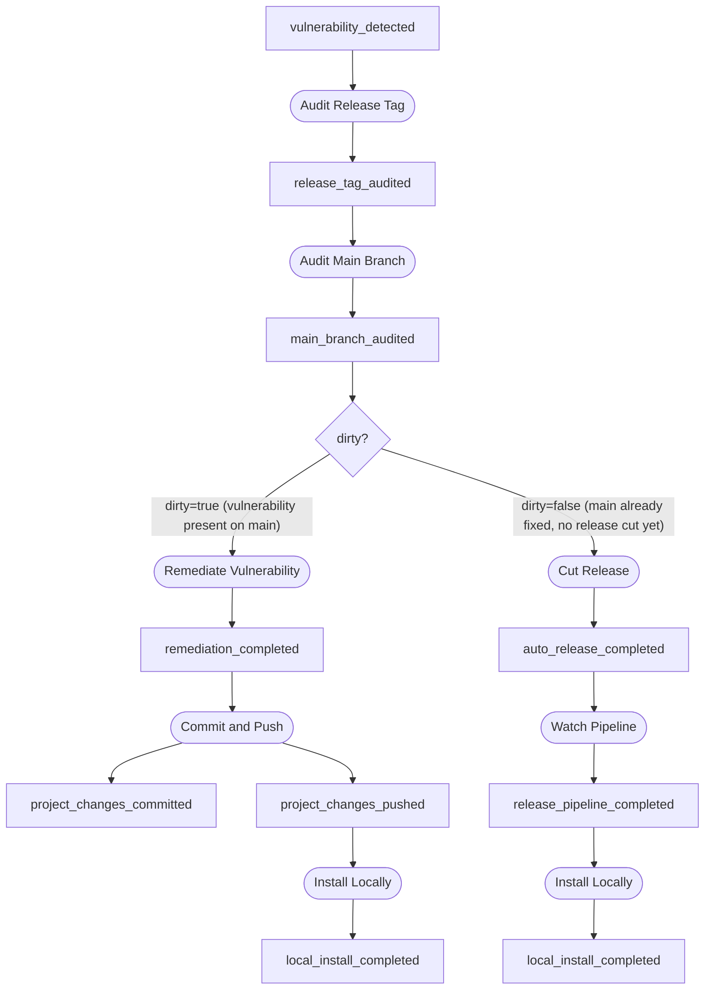

# Vulnerability Remediation Workflow

The vulnerability remediation workflow is Foundry's primary use case. It
replaces a linear shell script pipeline with an event-driven chain of task
blocks that branches based on the state of the codebase.

## The Two Paths

When a vulnerability is detected, the chain branches based on whether the
main branch still contains the vulnerability:



**Dirty path** — the vulnerability exists on main. Foundry remediates it
(e.g., dependency update), commits, pushes, and reinstalls locally.

**Clean path** — main is already fixed (perhaps by a developer), but no
release has been cut. Foundry tags a patch release, watches the CI pipeline,
and reinstalls locally.

If the release tag is **not vulnerable** at all, the chain stops after
`release_tag_audited` — `Audit Main Branch` self-filters and emits nothing.

## Self-Filtering

The engine routes events by type only — it cannot inspect payloads. When
both `Remediate Vulnerability` and `Cut Release` sink on `main_branch_audited`,
both blocks receive every `main_branch_audited` event. Each block checks the
`dirty` flag in the payload and returns an empty result if the condition
doesn't match. This ensures only one path fires.

## Running the Workflow

### Full run (default)

All blocks execute and emit. The complete chain runs to `local_install_completed`:

```bash
foundry emit vulnerability_detected \
  --project my-tool \
  --payload '{"cve": "CVE-2026-1234", "vulnerable": true, "dirty": true}'
```

Then inspect the trace:

```bash
foundry trace <event_id>
```

```text
vulnerability_detected (evt_...) project=my-tool
  → Audit Release Tag: ok — Release tag audited: CVE-2026-1234 vulnerable=true
    release_tag_audited (evt_...) project=my-tool
      → Audit Main Branch: ok — Main branch audited: CVE-2026-1234 dirty=true
        main_branch_audited (evt_...) project=my-tool
          → Remediate Vulnerability: ok — Remediated CVE-2026-1234
            remediation_completed (evt_...) project=my-tool
              → Commit and Push: ok — Committed and pushed fix for CVE-2026-1234
                project_changes_committed (evt_...) project=my-tool
                project_changes_pushed (evt_...) project=my-tool
                  → Install Locally: ok — Installed locally
                    local_install_completed (evt_...) project=my-tool
          → Cut Release: ok — Skipped: main branch is dirty
```

Notice that `Cut Release` still appears in the trace — it received the event
but self-filtered and returned an empty result.

### Audit only

Observers run and emit, mutators run but suppress downstream events:

```bash
foundry emit vulnerability_detected \
  --project my-tool \
  --throttle audit_only \
  --payload '{"cve": "CVE-2026-1234", "vulnerable": true, "dirty": true}'
```

This tells you *what would happen* without actually remediating, committing,
or releasing. The audit blocks produce their findings, but the chain stops
at `main_branch_audited`.

### Dry run

Only observers execute. Mutators are skipped entirely:

```bash
foundry emit vulnerability_detected \
  --project my-tool \
  --throttle dry_run \
  --payload '{"cve": "CVE-2026-1234", "vulnerable": true, "dirty": true}'
```

The chain produces `vulnerability_detected` → `release_tag_audited` →
`main_branch_audited` and stops. No remediation, no commits, no releases.

## Clean Path Example

When the main branch is already fixed but no release has been cut:

```bash
foundry emit vulnerability_detected \
  --project my-tool \
  --payload '{"cve": "CVE-2026-5678", "vulnerable": true, "dirty": false}'
```

The trace shows the release path instead:

```text
vulnerability_detected (evt_...) project=my-tool
  → Audit Release Tag: ok — ...
    release_tag_audited (evt_...) project=my-tool
      → Audit Main Branch: ok — Main branch audited: CVE-2026-5678 dirty=false
        main_branch_audited (evt_...) project=my-tool
          → Remediate Vulnerability: ok — Skipped: main branch is clean
          → Cut Release: ok — Cut patch release for CVE-2026-5678
            auto_release_completed (evt_...) project=my-tool
              → Watch Pipeline: ok — Release pipeline completed successfully
                release_pipeline_completed (evt_...) project=my-tool
                  → Install Locally: ok — Installed locally
                    local_install_completed (evt_...) project=my-tool
```

## Not Vulnerable

If the release tag has no vulnerability, the chain stops early:

```bash
foundry emit vulnerability_detected \
  --project my-tool \
  --payload '{"cve": "CVE-2026-9999", "vulnerable": false}'
```

Only two events: `vulnerability_detected` → `release_tag_audited`. The
`Audit Main Branch` block sees `vulnerable=false` and emits nothing.

## Payload Fields

| Field | Used By | Values | Default |
|-------|---------|--------|---------|
| `cve` | All blocks | CVE identifier string | `"unknown"` |
| `vulnerable` | Audit Release Tag, Audit Main Branch | `true` / `false` | `true` |
| `dirty` | Audit Main Branch, Remediate, Cut Release | `true` / `false` | `true` |

## Current Limitations

All blocks currently simulate their work — no actual vulnerability scanning,
dependency updates, git operations, or CI polling. The block structure is in
place for real tooling integration:

- **Audit Release Tag** — will shell out to `cargo audit`, `npm audit`, etc.
- **Audit Main Branch** — will check out main and run the same scan
- **Remediate Vulnerability** — will run `cargo update`, `npm audit fix`, etc.
- **Commit and Push** — will run `git add`, `git commit`, `git push`
- **Cut Release** — will create and push a git tag
- **Watch Pipeline** — will poll GitHub Actions API
- **Install Locally** — will run `cargo install`, `npm install -g`, etc.
