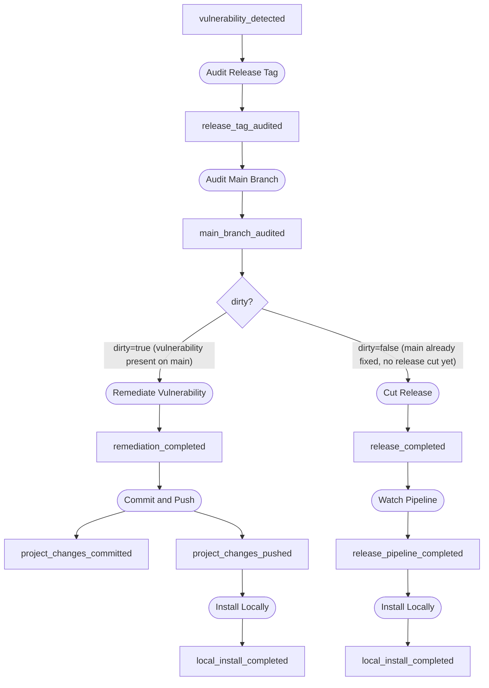

# Vulnerability Remediation Workflow

The vulnerability remediation workflow is Foundry's primary use case. It
replaces a linear shell script pipeline with an event-driven chain of task
blocks that branches based on the state of the codebase.

## The Two Paths

When a vulnerability is detected, the chain branches based on whether the
main branch still contains the vulnerability:


```mermaid
flowchart TD
    A[vulnerability_detected] --> B([Audit Release Tag])
    B --> C[release_tag_audited]
    C --> D([Audit Main Branch])
    D --> E[main_branch_audited]
    E --> F{dirty?}
    F -->|"dirty=true (vulnerability present on main)"| G([Remediate Vulnerability])
    G --> H[remediation_completed]
    H --> I([Commit and Push])
    I --> J[project_changes_committed]
    I --> K[project_changes_pushed]
    K --> L([Install Locally])
    L --> M[local_install_completed]
    F -->|"dirty=false (main already fixed, no release cut yet)"| N([Cut Release])
    N --> O[release_completed]
    O --> P([Watch Pipeline])
    P --> Q[release_pipeline_completed]
    Q --> R([Install Locally])
    R --> S[local_install_completed]
```

**Dirty path** — the vulnerability exists on main. Foundry remediates it
(e.g., dependency update), commits, pushes, and reinstalls locally.

**Clean path** — main is already fixed (perhaps by a developer), but no
release has been cut. Foundry tags a patch release, watches the CI pipeline,
and reinstalls locally.

If the release tag is **not vulnerable** at all, the chain stops after
`release_tag_audited` — `Audit Main Branch` self-filters and emits nothing.

## The remediation agent is checked, not trusted

An agent asked to fix a CVE is the agent most likely to make it go away some
other way. So `Remediate Vulnerability` (and `Remediate Pipeline`, whose CI
failure can be an audit job) runs its agent between the same checks as the
maintain agent:

1. Before the agent, Foundry records `HEAD` and `origin/<branch>`.
2. The agent runs with pushing to `origin` disabled, and its prompt says to
   commit locally and never suppress an advisory.
3. After the agent, Foundry checks whether `origin/<branch>` moved to the
   agent's commits (a direct push), and diffs the checkout against the
   recorded start for new suppressions: an allowlist entry in
   `.supply-chain-allow.json`, `ignore_advisories`, a Dependency-Check
   `<suppress>`, `pip-audit --ignore-vuln`, `cargo audit --ignore`, an
   advisory in `deny.toml` or `audit.toml`, or an npm override pinned to a
   vulnerable version. New files the agent never added to Git count too.

If either check trips, `remediation_completed` carries `success: false` and a
`needs_review` reason that starts with "needs review: ". `Commit and Push`
keeps a failed run's commits local (`push_failure: "run_failed"`), so
`project_changes_pushed` is never emitted, and the post-push audit, the
release and the local install that hang off it never run. There is no retry.

A suppression commit left local this way is still checked later: the next
guarded run diffs from the commit `HEAD` shared with `origin/<branch>`, so a
stranded suppression fails that run too instead of being pushed with it.
Resolve it by hand: upgrade and drop the commit, or, if accepting the
advisory is the right call, commit the allowlist entry yourself.

## Self-Filtering

The engine routes events by type only — it cannot inspect payloads. When
both `Remediate Vulnerability` and `Cut Release` sink on `main_branch_audited`,
both blocks receive every `main_branch_audited` event. Each block checks the
`dirty` flag in the payload and returns an empty result if the condition
doesn't match. This ensures only one path fires.

## Running the Workflow

### Full run (default)

All blocks execute and emit. The complete chain runs to `local_install_completed`:

```bash
foundry emit vulnerability_detected \
  --project my-tool \
  --payload '{"cve": "CVE-2026-1234", "vulnerable": true, "dirty": true}'
```

Then inspect the trace:

```bash
foundry trace <event_id>
```

```text
vulnerability_detected (evt_...) project=my-tool
  → Audit Release Tag: ok — Release tag audited: CVE-2026-1234 vulnerable=true
    release_tag_audited (evt_...) project=my-tool
      → Audit Main Branch: ok — Main branch audited: CVE-2026-1234 dirty=true
        main_branch_audited (evt_...) project=my-tool
          → Remediate Vulnerability: ok — Remediated CVE-2026-1234
            remediation_completed (evt_...) project=my-tool
              → Commit and Push: ok — Committed and pushed fix for CVE-2026-1234
                project_changes_committed (evt_...) project=my-tool
                project_changes_pushed (evt_...) project=my-tool
                  → Install Locally: ok — Installed locally
                    local_install_completed (evt_...) project=my-tool
          → Cut Release: ok — Skipped: main branch is dirty
```

Notice that `Cut Release` still appears in the trace — it received the event
but self-filtered and returned an empty result.

### Dry run

Observers run and emit; mutators are simulated rather than executed:

```bash
foundry emit vulnerability_detected \
  --project my-tool \
  --throttle dry_run \
  --payload '{"cve": "CVE-2026-1234", "vulnerable": true, "dirty": true}'
```

This tells you *what would happen* without actually remediating, committing,
or releasing. The audit blocks produce their findings, and the Mutators
emit simulated `dry_run: true` events so the rest of the chain stays visible.

### Dry run

Only observers execute. Mutators are skipped entirely:

```bash
foundry emit vulnerability_detected \
  --project my-tool \
  --throttle dry_run \
  --payload '{"cve": "CVE-2026-1234", "vulnerable": true, "dirty": true}'
```

The chain produces `vulnerability_detected` → `release_tag_audited` →
`main_branch_audited` and stops. No remediation, no commits, no releases.

## Clean Path Example

When the main branch is already fixed but no release has been cut:

```bash
foundry emit vulnerability_detected \
  --project my-tool \
  --payload '{"cve": "CVE-2026-5678", "vulnerable": true, "dirty": false}'
```

The trace shows the release path instead:

```text
vulnerability_detected (evt_...) project=my-tool
  → Audit Release Tag: ok — ...
    release_tag_audited (evt_...) project=my-tool
      → Audit Main Branch: ok — Main branch audited: CVE-2026-5678 dirty=false
        main_branch_audited (evt_...) project=my-tool
          → Remediate Vulnerability: ok — Skipped: main branch is clean
          → Cut Release: ok — Cut patch release for CVE-2026-5678
            release_completed (evt_...) project=my-tool
              → Watch Pipeline: ok — Release pipeline completed successfully
                release_pipeline_completed (evt_...) project=my-tool
                  → Install Locally: ok — Installed locally
                    local_install_completed (evt_...) project=my-tool
```

## Not Vulnerable

If the release tag has no vulnerability, the chain stops early:

```bash
foundry emit vulnerability_detected \
  --project my-tool \
  --payload '{"cve": "CVE-2026-9999", "vulnerable": false}'
```

Only two events: `vulnerability_detected` → `release_tag_audited`. The
`Audit Main Branch` block sees `vulnerable=false` and emits nothing.

## Payload Fields

| Field | Used By | Values | Default |
|-------|---------|--------|---------|
| `cve` | All blocks | CVE identifier string | `"unknown"` |
| `vulnerable` | Audit Release Tag, Audit Main Branch | `true` / `false` | `true` |
| `dirty` | Audit Main Branch, Remediate, Cut Release | `true` / `false` | `true` |

## Real Implementations

All blocks in the vulnerability remediation workflow perform real work:

- **Audit Release Tag** — shells out to the stack-appropriate tool (`cargo audit --json`,
  `npm audit --json`, `pip-audit --format=json`, `mix deps.audit`, `osv-scanner`,
  or `./gradlew dependencyCheckAggregate`) via the
  `ScannerGateway` abstraction
- **Audit Main Branch** — checks out the main branch and runs the same scan
- **Remediate Vulnerability** — invokes the configured AI agent (e.g. via the
  `claude` CLI) to apply a fix, then runs the direct-push and suppression
  checks described above
- **Commit and Push** — runs `git add`, `git commit`, and optionally `git push`
- **Cut Release** — creates and pushes a git tag using the AI agent
- **Watch Pipeline** — polls the GitHub Actions API until the release workflow
  completes or times out
- **Install Locally** — runs the project's configured install command
  (e.g. `cargo install --path .`) or Homebrew formula after a successful release
