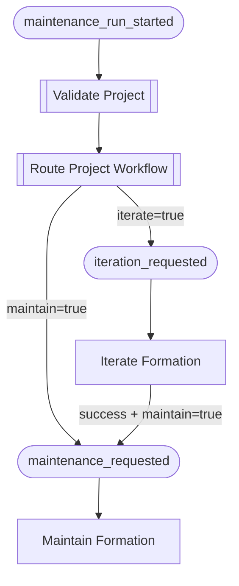
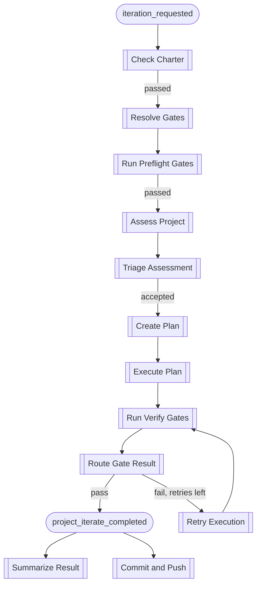
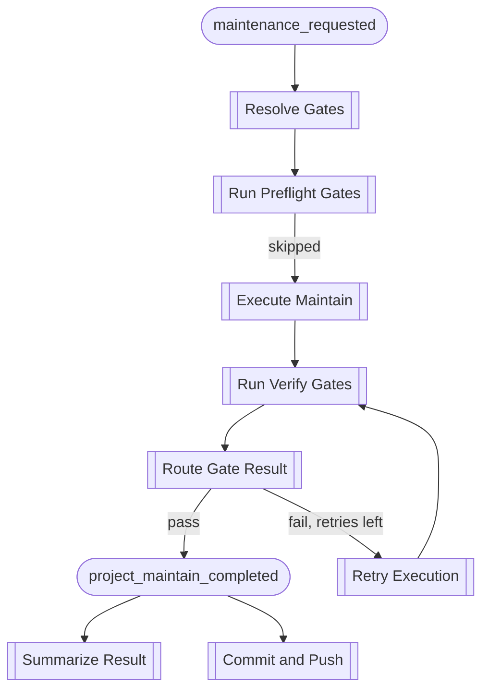
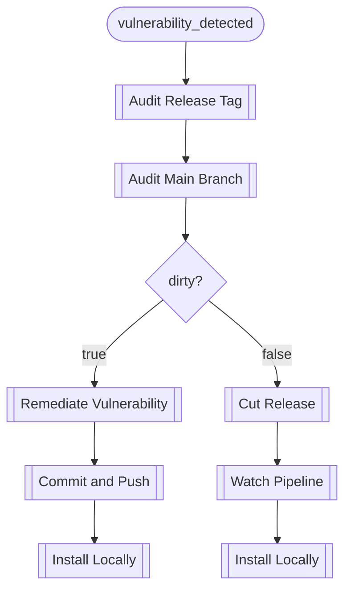
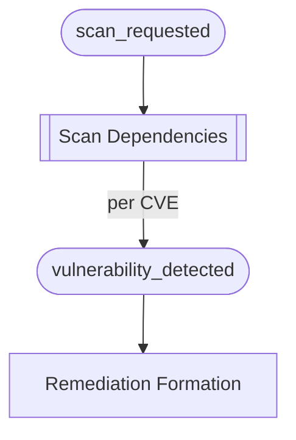
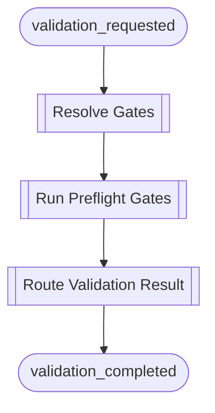

# Workflow Formations

A workflow formation is not a first-class object in Foundry. It is the
logical result of which blocks sink on which events — a chain that
emerges when you emit a particular entry event. All blocks live in one
engine. The formation that fires depends entirely on the entry event and
the payload values that flow through it.

This page documents the formations that exist today and explores how the
current block library could be recombined for different purposes.

## The Block Library at a Glance

Every block declares its sinks (what triggers it), its emits (what it
produces), and its kind (Observer or Mutator). The engine does the rest.

### Shared Infrastructure

These blocks appear in multiple formations:

| Block | Kind | Sinks On | Emits |
|-------|------|----------|-------|
| Resolve Gates | Observer | `charter_check_completed`, `maintenance_requested`, `validation_requested` | `gates_resolved` |
| Run Preflight Gates | Observer | `gates_resolved` | `preflight_completed` |
| Run Verify Gates | Observer | `execution_completed` | `gate_verification_completed` |
| Route Gate Result | Observer | `gate_verification_completed` | `project_iterate_completed` / `project_maintain_completed` / `retry_requested` |
| Retry Execution | Mutator | `retry_requested` | `execution_completed` |
| Summarize Result | Observer | `project_iterate_completed`, `project_maintain_completed` | `summarize_completed` |
| Commit and Push | Mutator | `remediation_completed`, `project_iterate_completed`, `project_maintain_completed` | `project_changes_committed`, `project_changes_pushed` |

### Iteration Blocks

| Block | Kind | Sinks On | Emits |
|-------|------|----------|-------|
| Check Charter | Observer | `iteration_requested` | `charter_check_completed` |
| Assess Project | Observer | `preflight_completed` | `assessment_completed` |
| Triage Assessment | Observer | `assessment_triaged` | `triage_completed` |
| Create Plan | Observer | `triage_completed` | `plan_completed` |
| Execute Plan | Mutator | `plan_completed` | `execution_completed` |

### Maintenance Blocks

| Block | Kind | Sinks On | Emits |
|-------|------|----------|-------|
| Execute Maintain | Mutator | `gates_resolved` | `execution_completed` |

### Vulnerability Blocks

| Block | Kind | Sinks On | Emits |
|-------|------|----------|-------|
| Scan Dependencies | Observer | `scan_requested` | `vulnerability_detected` (per CVE) |
| Audit Release Tag | Observer | `vulnerability_detected`, `project_changes_pushed` | `release_tag_audited` |
| Audit Main Branch | Observer | `release_tag_audited` | `main_branch_audited` |
| Remediate Vulnerability | Mutator | `main_branch_audited` | `remediation_completed` |
| Cut Release | Mutator | `main_branch_audited` | `auto_release_completed` |
| Watch Pipeline | Mutator | `auto_release_completed` | `release_pipeline_completed` |
| Install Locally | Mutator | `project_changes_pushed`, `release_pipeline_completed` | `local_install_completed` |

### Orchestration Blocks

| Block | Kind | Sinks On | Emits |
|-------|------|----------|-------|
| Validate Project | Observer | `maintenance_run_started` | `project_validation_completed` |
| Route Project Workflow | Observer | `project_validation_completed` | `iteration_requested` / `maintenance_requested` |

## Current Formations

These are the formations that fire today, depending on which entry event
you emit.

### The Full Nightly Run

Entry event: `maintenance_run_started`

This is the broadest formation. It validates the project, routes to
iteration and/or maintenance based on the project's registry flags, and
chains the two sub-workflows together when both are enabled.



### Iterate Formation

Entry event: `iteration_requested`

The full assessment-to-execution pipeline with gate verification and
bounded retry.



### Maintain Formation

Entry event: `maintenance_requested`

Dependency updates and general maintenance. Preflight gates are skipped
(the codebase may be in a pre-maintenance state), but verification gates
run after execution.



### Vulnerability Remediation Formation

Entry event: `vulnerability_detected`

Two paths through the same blocks, governed by the `dirty` payload flag.



### Scan Formation

Entry event: `scan_requested`

A broader entry point that discovers vulnerabilities and feeds them into
the remediation formation. Scan Dependencies emits one
`vulnerability_detected` event per CVE found, so a single scan can
trigger multiple parallel remediation chains.



### Validation Formation

Entry event: `validation_requested`

A read-only health check. No Mutator blocks fire — it just resolves
gates, runs them, and reports the results.



## Possible Formations

The block library already supports formations that aren't part of the
nightly run. Because the engine routes by event type and blocks
self-filter on payload, you can trigger these directly.

### Iterate Without Maintenance

Emit `iteration_requested` with `actions.maintain=false`. The iterate
formation runs, and on success `Route Gate Result` emits
`project_iterate_completed` without chaining to `maintenance_requested`.

```bash
foundry emit iteration_requested my-project \
  --payload '{"actions":{"iterate":true,"maintain":false}}'
```

This is useful when you want to improve code quality without touching
dependencies — a focused structural improvement pass.

### Maintenance Without Iteration

Emit `maintenance_requested` directly. The maintain formation runs on its
own, skipping assessment, triage, and planning entirely.

```bash
foundry emit maintenance_requested my-project
```

This is a pure dependency update pass — update libraries, run gates,
commit if they pass.

### Scan Without Remediation

Emit `scan_requested` with `audit_only` throttle. Scan Dependencies and
the audit blocks run (they are Observers), but Remediate Vulnerability
and Cut Release (Mutators) suppress their output.

```bash
foundry emit scan_requested my-project --throttle audit_only
```

This tells you what vulnerabilities exist and whether main is dirty,
without making any changes.

### Remediation Without Scanning

Emit `vulnerability_detected` directly with the CVE details. This skips
the scan entirely and jumps straight into the audit-and-fix chain.

```bash
foundry emit vulnerability_detected my-project \
  --payload '{"cve":"CVE-2026-1234","vulnerable":true,"dirty":true}'
```

This is how you would handle a vulnerability reported through a channel
other than Foundry's scanner — a security advisory, a colleague's
finding, or a CI notification.

### Post-Push Audit

The `Audit Release Tag` block also sinks on `project_changes_pushed`.
This means that after an iterate or maintain formation commits and pushes,
the release tag is automatically re-audited. If the push introduced a
vulnerability (or resolved one), the audit chain picks it up without a
separate scan.

### Gate Check Only

Emit `validation_requested` to run all gates without modifying anything.
This is the lightest formation — it tells you whether the project is
healthy right now.

```bash
foundry emit validation_requested my-project
```

## Designing New Formations

The current block library is a toolkit. The formations above are the
ones we use today, but the same blocks can participate in formations we
haven't built yet. A few principles guide what's possible:

1. **Entry events define scope.** The deeper into a chain you emit, the
   narrower the formation. Emitting `maintenance_run_started` runs
   everything; emitting `plan_completed` skips assessment entirely and
   just executes a plan you provide.

2. **Payload values steer routing.** Blocks self-filter on payload
   fields like `dirty`, `accepted`, `workflow`, and `actions`. Changing
   a payload value changes which blocks fire without changing any code.

3. **Throttle controls depth.** The same formation behaves differently
   under `full`, `audit_only`, and `dry_run`. This gives you three
   versions of every formation for free.

4. **Shared blocks multiply formations.** `Commit and Push` sinks on
   three different event types. `Install Locally` sinks on two. Every
   block that participates in multiple formations is a junction point
   where chains can converge or diverge.
