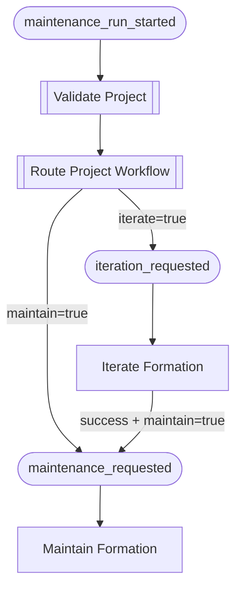
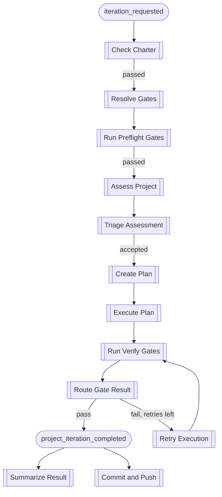
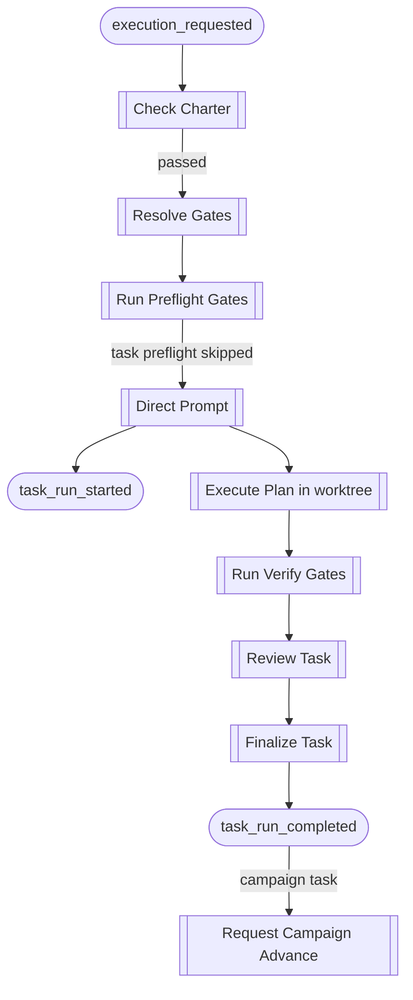
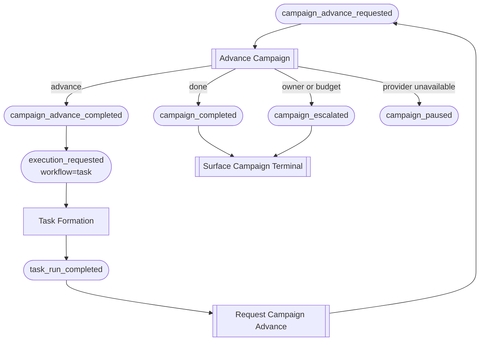
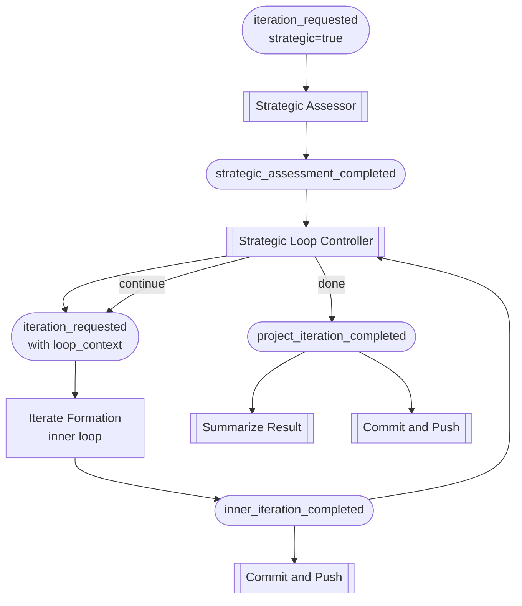
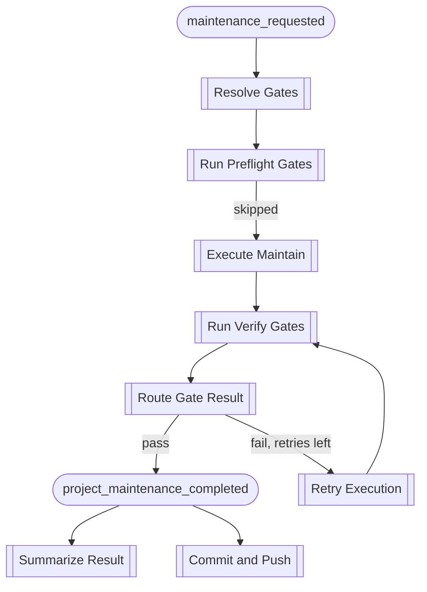
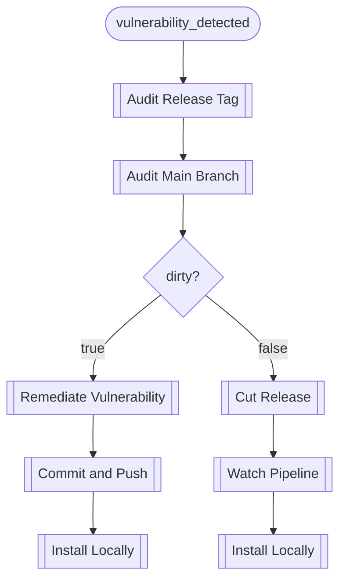
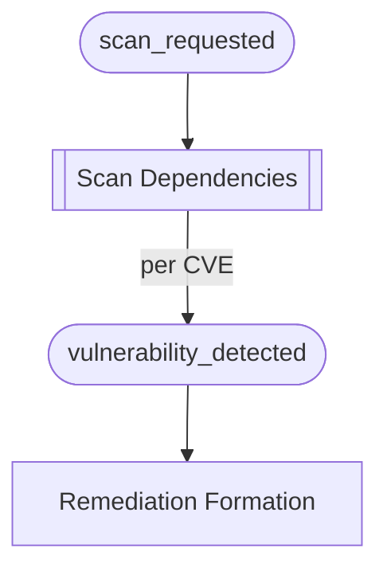
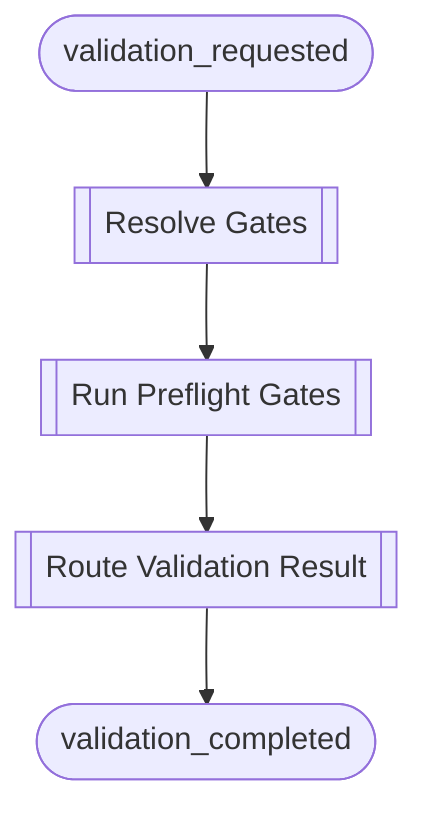

# Workflow Formations

A workflow formation is not a first-class object in Foundry. It is the logical
result of which blocks sink on which events — a chain that emerges when you emit
a particular entry event. All blocks live in one engine. The formation that
fires depends entirely on the entry event and the payload values that flow
through it.

This page documents the formations that exist today and explores how the current
block library could be recombined for different purposes.

## The Block Library at a Glance

Every block declares its sinks (what triggers it), its emits (what it produces),
and its kind (Observer or Mutator). The engine does the rest.

### Shared Infrastructure

These blocks appear in multiple formations:

| Block               | Kind     | Sinks On                                                                                | Emits                                                                               |
| ------------------- | -------- | --------------------------------------------------------------------------------------- | ----------------------------------------------------------------------------------- |
| Resolve Gates       | Observer | `charter_check_completed`, `maintenance_requested`, `validation_requested`              | `gate_resolution_completed`                                                         |
| Run Preflight Gates | Observer | `gate_resolution_completed`                                                             | `preflight_completed`                                                               |
| Run Verify Gates    | Observer | `execution_completed`                                                                   | `gate_verification_completed`                                                       |
| Route Gate Result   | Observer | `gate_verification_completed`                                                           | `project_iteration_completed` / `project_maintenance_completed` / `retry_requested` |
| Retry Execution     | Mutator  | `retry_requested`                                                                       | `execution_completed`                                                               |
| Summarize Result    | Observer | `project_iteration_completed`, `project_maintenance_completed`                          | `summarize_completed`                                                               |
| Commit and Push     | Mutator  | `remediation_completed`, `project_iteration_completed`, `project_maintenance_completed` | `project_changes_committed`, `project_changes_pushed`                               |

### Iteration Blocks

| Block             | Kind     | Sinks On              | Emits                     |
| ----------------- | -------- | --------------------- | ------------------------- |
| Check Charter     | Observer | `iteration_requested` | `charter_check_completed` |
| Assess Project    | Observer | `preflight_completed` | `assessment_completed`    |
| Triage Assessment | Observer | `assessment_triaged`  | `triage_completed`        |
| Create Plan       | Observer | `triage_completed`    | `plan_completed`          |
| Execute Plan      | Mutator  | `plan_completed`      | `execution_completed`     |

### Maintenance Blocks

| Block            | Kind    | Sinks On                    | Emits                 |
| ---------------- | ------- | --------------------------- | --------------------- |
| Execute Maintain | Mutator | `gate_resolution_completed` | `execution_completed` |

### Vulnerability Blocks

| Block                   | Kind     | Sinks On                                               | Emits                              |
| ----------------------- | -------- | ------------------------------------------------------ | ---------------------------------- |
| Scan Dependencies       | Observer | `scan_requested`                                       | `vulnerability_detected` (per CVE) |
| Audit Release Tag       | Observer | `vulnerability_detected`, `project_changes_pushed`     | `release_tag_audited`              |
| Audit Main Branch       | Observer | `release_tag_audited`                                  | `main_branch_audited`              |
| Remediate Vulnerability | Mutator  | `main_branch_audited`                                  | `remediation_completed`            |
| Cut Release             | Mutator  | `main_branch_audited`                                  | `release_completed`                |
| Watch Pipeline          | Mutator  | `release_completed`                                    | `release_pipeline_completed`       |
| Install Locally         | Mutator  | `project_changes_pushed`, `release_pipeline_completed` | `local_install_completed`          |

### Task/Prompt Workflow Blocks

| Block                    | Kind     | Sinks On                             | Emits                                |
| ------------------------ | -------- | ------------------------------------ | ------------------------------------ |
| Direct Prompt            | Observer | `preflight_completed` (task)         | `task_run_started`, `plan_completed` |
| Execute Plan             | Mutator  | `plan_completed` (task)              | `execution_completed`                |
| Run Verify Gates         | Observer | `execution_completed` (task)         | `gate_verification_completed`        |
| Review Task              | Observer | `gate_verification_completed` (task) | `task_reviewed`                      |
| Finalize Task            | Mutator  | `task_reviewed`                      | `task_run_completed`                 |
| Request Campaign Advance | Observer | `task_run_completed` (campaign)      | `campaign_advance_requested`         |

### Campaign Blocks

| Block                     | Kind     | Sinks On                                   | Emits                                                                                                                 |
| ------------------------- | -------- | ------------------------------------------ | --------------------------------------------------------------------------------------------------------------------- |
| Advance Campaign          | Mutator  | `campaign_advance_requested`               | `campaign_advance_completed`, `execution_requested`, `campaign_completed`, `campaign_escalated`, or `campaign_paused` |
| Surface Campaign Terminal | Observer | `campaign_completed`, `campaign_escalated` | `ops_digest_started`                                                                                                  |

### Strategic Loop Blocks

| Block                     | Kind     | Sinks On                                                      | Emits                                                               |
| ------------------------- | -------- | ------------------------------------------------------------- | ------------------------------------------------------------------- |
| Strategic Assessor        | Observer | `iteration_requested` (strategic=true)                        | `strategic_assessment_completed`                                    |
| Strategic Loop Controller | Observer | `strategic_assessment_completed`, `inner_iteration_completed` | `iteration_requested` (loop) / `project_iteration_completed` (done) |

### Orchestration Blocks

| Block                  | Kind     | Sinks On                       | Emits                                           |
| ---------------------- | -------- | ------------------------------ | ----------------------------------------------- |
| Validate Project       | Observer | `maintenance_run_started`      | `project_validation_completed`                  |
| Route Project Workflow | Observer | `project_validation_completed` | `iteration_requested` / `maintenance_requested` |

## Current Formations

These are the formations that fire today, depending on which entry event you
emit.

### The Full Nightly Run

Entry event: `maintenance_run_started`

This is the broadest formation. It validates the project, routes to iteration
and/or maintenance based on the project's registry flags, and chains the two
sub-workflows together when both are enabled.


```mermaid
flowchart TD
    A([maintenance_run_started]) --> B[[Validate Project]]
    B --> C[[Route Project Workflow]]
    C -->|iterate=true| D([iteration_requested])
    C -->|maintain=true| E([maintenance_requested])
    D --> F[Iterate Formation]
    F -->|success + maintain=true| E
    E --> G[Maintain Formation]
```

### Iterate Formation

Entry event: `iteration_requested`

The full assessment-to-execution pipeline with gate verification and bounded
retry.


```mermaid
flowchart TD
    A([iteration_requested]) --> B[[Check Charter]]
    B -->|passed| C[[Resolve Gates]]
    C --> D[[Run Preflight Gates]]
    D -->|passed| E[[Assess Project]]
    E --> F[[Triage Assessment]]
    F -->|accepted| G[[Create Plan]]
    G --> H[[Execute Plan]]
    H --> I[[Run Verify Gates]]
    I --> J[[Route Gate Result]]
    J -->|pass| K([project_iteration_completed])
    J -->|fail, retries left| L[[Retry Execution]]
    L --> I
    K --> M[[Summarize Result]]
    K --> N[[Commit and Push]]
```

### Task Formation

Entry event: `execution_requested`

A task executes one user-provided objective in an isolated Git worktree. It
skips assessment and triage: the description is the plan. Unlike iterate and
maintain, it never enters the generic retry loop. A separate reviewer produces a
typed verdict before Foundry decides whether the work can land.


```mermaid
flowchart TD
    A([execution_requested]) --> B[[Check Charter]]
    B -->|passed| C[[Resolve Gates]]
    C --> D[[Run Preflight Gates]]
    D -->|task preflight skipped| E[[Direct Prompt]]
    E --> F([task_run_started])
    E --> G[[Execute Plan in worktree]]
    G --> H[[Run Verify Gates]]
    H --> I[[Review Task]]
    I --> J[[Finalize Task]]
    J --> K([task_run_completed])
    K -->|campaign task| L[[Request Campaign Advance]]
```

Usage:

```bash
foundry task my-project "Pick the highest priority interaction from et and implement it."
```

The older direct event shape remains supported for compatibility by emitting
`execution_requested` with `workflow="prompt"` or `workflow="task"` in the
payload.

`complete` work lands when required gates pass. A converging `remainder` also
lands when at least one required gate ran and every required gate passed; its
reviewer gaps remain in the typed result. `defect`, `blocked_on_decision`, and
`runner_error` never land. Non-landing work is committed and preserved on a
remote task branch or in a Git bundle.

### Campaign Formation

Entry event: `campaign_advance_requested`

Campaign formation evaluates a durable mission against delivered trunk, campaign
done evidence, neutral context artifacts, recent objectives, owner decisions,
and any accumulated preserved work. It chooses exactly one of done, one next
objective, or escalation.


```mermaid
flowchart TD
    A([campaign_advance_requested]) --> B[[Advance Campaign]]
    B -->|done| C([campaign_completed])
    B -->|advance| D([campaign_advance_completed])
    D --> E([execution_requested<br/>workflow=task])
    E --> F[Task Formation]
    F --> G([task_run_completed])
    G --> H[[Request Campaign Advance]]
    H --> A
    B -->|owner or budget| I([campaign_escalated])
    B -->|provider unavailable| J([campaign_paused])
    C --> K[[Surface Campaign Terminal]]
    I --> K
```

Each advance mints a trace and cycle span. Task-side events carry
`campaign_cycle`, making concurrent cycles reconstructible from the event
stream. A final budgeted task still receives completion evaluation; only a
request for another task exceeds the budget. See
[Tasks and Campaigns](campaigns.md) for evidence, landing, preservation, pause,
decision, and recovery rules.

### Strategic Iterate Formation

Entry event: `iteration_requested` with `strategic: true`

A nested loop that wraps the iterate formation. The strategic assessor
identifies multiple areas for improvement, then the loop controller enters the
inner iterate formation for each area. After each inner iteration completes, an
AI assessment decides whether to continue. Changes are committed per iteration.


```mermaid
flowchart TD
    A([iteration_requested<br/>strategic=true]) --> B[[Strategic Assessor]]
    B --> C([strategic_assessment_completed])
    C --> D[[Strategic Loop Controller]]
    D --> E([iteration_requested<br/>with loop_context])
    E --> F[Iterate Formation<br/>inner loop]
    F --> G([inner_iteration_completed])
    G --> H[[Commit and Push]]
    G --> D
    D -->|continue| E
    D -->|done| I([project_iteration_completed])
    I --> J[[Summarize Result]]
    I --> K[[Commit and Push]]
```

The inner iterate formation runs exactly as documented above, with one
difference: `Route Gate Result` emits `inner_iteration_completed` instead of
`project_iteration_completed` when `loop_context` is present in the payload.
This allows the strategic loop controller to intercept the completion and decide
whether to continue.

Terminal blocks (`Summarize Result` and `Commit and Push`) self-filter on
`loop_context` — they skip intermediate completions and only fire on the final
`project_iteration_completed` emitted by the strategic loop controller (which
strips `loop_context` before emitting it).

### Maintain Formation

Entry event: `maintenance_requested`

Dependency updates and general maintenance. Preflight gates are skipped (the
codebase may be in a pre-maintenance state), but verification gates run after
execution.


```mermaid
flowchart TD
    A([maintenance_requested]) --> B[[Resolve Gates]]
    B --> C[[Run Preflight Gates]]
    C -->|skipped| D[[Execute Maintain]]
    D --> E[[Run Verify Gates]]
    E --> F[[Route Gate Result]]
    F -->|pass| G([project_maintenance_completed])
    F -->|fail, retries left| H[[Retry Execution]]
    H --> E
    G --> I[[Summarize Result]]
    G --> J[[Commit and Push]]
```

### Vulnerability Remediation Formation

Entry event: `vulnerability_detected`

Two paths through the same blocks, governed by the `dirty` payload flag.


```mermaid
flowchart TD
    A([vulnerability_detected]) --> B[[Audit Release Tag]]
    B --> C[[Audit Main Branch]]
    C --> D{dirty?}
    D -->|true| E[[Remediate Vulnerability]]
    E --> F[[Commit and Push]]
    F --> G[[Install Locally]]
    D -->|false| H[[Cut Release]]
    H --> I[[Watch Pipeline]]
    I --> J[[Install Locally]]
```

### Scan Formation

Entry event: `scan_requested`

A broader entry point that discovers vulnerabilities and feeds them into the
remediation formation. Scan Dependencies emits one `vulnerability_detected`
event per CVE found, so a single scan can trigger multiple parallel remediation
chains.


```mermaid
flowchart TD
    A([scan_requested]) --> B[[Scan Dependencies]]
    B -->|per CVE| C([vulnerability_detected])
    C --> D[Remediation Formation]
```

### Validation Formation

Entry event: `validation_requested`

A read-only health check. No Mutator blocks fire — it just resolves gates, runs
them, and reports the results.


```mermaid
flowchart TD
    A([validation_requested]) --> B[[Resolve Gates]]
    B --> C[[Run Preflight Gates]]
    C --> D[[Route Validation Result]]
    D --> E([validation_completed])
```

## Possible Formations

The block library already supports formations that aren't part of the nightly
run. Because the engine routes by event type and blocks self-filter on payload,
you can trigger these directly.

### Iterate Without Maintenance

Emit `iteration_requested` with `actions.maintain=false`. The iterate formation
runs, and on success `Route Gate Result` emits `project_iteration_completed`
without chaining to `maintenance_requested`.

```bash
foundry emit iteration_requested my-project \
  --payload '{"actions":{"iterate":true,"maintain":false}}'
```

This is useful when you want to improve code quality without touching
dependencies — a focused structural improvement pass.

### Maintenance Without Iteration

Emit `maintenance_requested` directly. The maintain formation runs on its own,
skipping assessment, triage, and planning entirely.

```bash
foundry emit maintenance_requested my-project
```

This is a pure dependency update pass — update libraries, run gates, commit if
they pass.

### Scan Without Remediation

Emit `scan_requested` with `dry_run` throttle. Scan Dependencies and the audit
blocks run (they are Observers), but Remediate Vulnerability and Cut Release
(Mutators) are simulated rather than executed.

```bash
foundry emit scan_requested my-project --throttle dry_run
```

This tells you what vulnerabilities exist and whether main is dirty, without
making any changes.

### Remediation Without Scanning

Emit `vulnerability_detected` directly with the CVE details. This skips the scan
entirely and jumps straight into the audit-and-fix chain.

```bash
foundry emit vulnerability_detected my-project \
  --payload '{"cve":"CVE-2026-1234","vulnerable":true,"dirty":true}'
```

This is how you would handle a vulnerability reported through a channel other
than Foundry's scanner — a security advisory, a colleague's finding, or a CI
notification.

### Post-Push Audit

The `Audit Release Tag` block also sinks on `project_changes_pushed`. This means
that after an iterate or maintain formation commits and pushes, the release tag
is automatically re-audited. If the push introduced a vulnerability (or resolved
one), the audit chain picks it up without a separate scan.

### Strategic Iteration

Emit `iteration_requested` with `strategic: true` to enter the nested loop. The
strategic assessor analyses the codebase holistically and the loop controller
runs multiple inner iterate cycles until the AI determines the codebase has
plateaued.

```bash
foundry emit iteration_requested my-project \
  --payload '{"strategic":true,"max_iterations":5}'
```

The `max_iterations` field caps the loop to prevent runaway iterations. Each
inner cycle commits its changes independently.

### Gate Check Only

Emit `validation_requested` to run all gates without modifying anything. This is
the lightest formation — it tells you whether the project is healthy right now.

```bash
foundry emit validation_requested my-project
```

## Designing New Formations

The current block library is a toolkit. The formations above are the ones we use
today, but the same blocks can participate in formations we haven't built yet. A
few principles guide what's possible:

1. **Entry events define scope.** The deeper into a chain you emit, the narrower
   the formation. Emitting `maintenance_run_started` runs everything; emitting
   `plan_completed` skips assessment entirely and just executes a plan you
   provide.

2. **Payload values steer routing.** Blocks self-filter on payload fields like
   `dirty`, `accepted`, `workflow`, and `actions`. Changing a payload value
   changes which blocks fire without changing any code.

3. **Throttle controls depth.** The same formation behaves differently under
   `full` and `dry_run`. This gives you two versions of every formation for
   free.

4. **Shared blocks multiply formations.** `Commit and Push` sinks on three
   different event types. `Install Locally` sinks on two. Every block that
   participates in multiple formations is a junction point where chains can
   converge or diverge.
