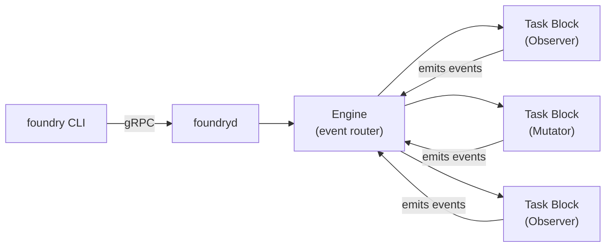

# Foundry Workflow Engine

Foundry is an event-driven workflow engine for engineering automation. It runs as a daemon (`foundryd`) controlled by a CLI (`foundry`). Projects are registered in a central registry, and Foundry orchestrates quality gates, AI-assisted iteration, dependency maintenance, vulnerability remediation, and drift detection across them.

## Architecture at a Glance



The CLI emits events into the daemon. The engine routes each event to task blocks that declared interest. Blocks execute and may emit new events, forming chains. Every event and block execution is recorded in traces.

## Common Workflows

### 1. Iterate on a Project

Run an AI-assisted quality improvement cycle: charter check, assessment, triage, planning, execution, gate verification.

```bash
foundry iterate <project-name>
```

What happens:
- Validates the project has intent documentation (CHARTER.md or equivalent)
- Resolves quality gates from `.hone-gates.json`
- Runs preflight gates to establish baseline
- AI assesses the project against its charter
- AI triages whether the assessment warrants action
- AI creates a correction plan and executes it
- Gates are re-verified; retries up to 3 times if they fail
- Results are summarized

### 2. Scout for Intent Drift

Detect potential bugs and architectural mismatches without making changes.

```bash
foundry scout <project-name>
```

Returns ranked candidates with divergence type, severity, confidence, and suggested next steps. High-value candidates are marked with `***`.

### 3. Validate Gate Health

Check whether a project's quality gates pass without running iterate or maintain.

```bash
# Single project
foundry validate <project-name>

# Multiple projects
foundry validate alpha beta gamma

# All active projects
foundry validate --all
```

Exits with code 1 if any project fails. Useful in CI or as a quick health check.

### 4. Run Full Maintenance

Run maintenance across all registered projects (or a single one).

```bash
# All active projects
foundry run

# Single project
foundry run --project <name>

# Dry run (no mutations, simulated success)
foundry run --throttle dry_run
```

Each project goes through validation, then routes to iterate or maintain based on its registry flags.

### 5. Derive Quality Gates

Auto-discover quality gates for a project using AI inspection.

```bash
# From a registered project
foundry gates <project-name>

# From any directory
foundry gates --dir /path/to/project

# Generate .hone-gates.json
foundry gates --init <project-name>
```

### 6. Emit Raw Events

For advanced use or testing, emit any event directly.

```bash
foundry emit <event_type> --project <name> [--throttle full|audit_only|dry_run] [--payload '{"key":"value"}'] [--wait]
```

With `--wait`, the CLI polls until processing completes and shows the trace.

## Registry Management

The registry (`~/.foundry/registry.json`) tracks which projects Foundry manages.

```bash
# Initialize empty registry
foundry registry init

# Add a project
foundry registry add \
  --name my-project \
  --path /path/to/project \
  --stack rust \
  --agent claude \
  --repo owner/repo \
  --branch main \
  --iterate --maintain --push

# List projects
foundry registry list

# Show project details
foundry registry show my-project

# Edit project flags
foundry registry edit my-project --iterate --maintain

# Remove a project
foundry registry remove my-project
```

**Key flags on each project:**
- `--iterate` / `--maintain` — enable iterate and/or maintain workflows
- `--push` — allow git push after changes
- `--audit` — enable vulnerability auditing
- `--release` — enable automatic releases
- `--skip` — temporarily disable without removing

## Examining Results

### Traces

Every event chain produces a trace file at `~/.foundry/traces/YYYY-MM-DD/{event_id}.json`.

```bash
# View a specific trace
foundry trace <event_id> [--verbose]

# View recent trace history (last 7 days)
foundry history

# View traces for a specific date
foundry history 2026-03-29

# Filter by project
foundry history --project my-project
```

The `--verbose` flag on `trace` shows trigger payloads, emitted payloads, raw command output, and audit artifacts for each block execution.

### Live Event Stream

Watch events as they flow through the engine in real-time.

```bash
# All events
foundry watch

# Filter to one project
foundry watch --project my-project
```

### Audit Reports

After a full maintenance run (`foundry run`), a markdown summary is written to `~/.foundry/audits/runs/YYYY-MM-DD/summary.md`. It contains:

- **Project Status table** — success/failed/skipped with durations
- **Failures section** — details on what failed and why
- **Release Audit table** — which release tags are clean vs vulnerable
- **Auto-Releases table** — releases that were cut automatically
- **Local Installs table** — local reinstallation results
- **Summary stats** — total/succeeded/failed/skipped counts and durations

To review audit reports:

```bash
# Read the latest audit
cat ~/.foundry/audits/runs/$(ls -t ~/.foundry/audits/runs/ | head -1)/summary.md

# Or use your editor
code ~/.foundry/audits/runs/
```

### Event Log

All events are persisted to monthly JSONL files at `~/.foundry/events/YYYY-MM.jsonl`. Each line is a complete Event JSON object. Useful for analytics or debugging:

```bash
# Recent events for a project
grep '"project":"my-project"' ~/.foundry/events/2026-03.jsonl | tail -20

# Count events by type
jq -r '.event_type' ~/.foundry/events/2026-03.jsonl | sort | uniq -c | sort -rn
```

## Throttle Levels

Every event chain runs under a throttle that controls what blocks can do:

| Level | Observers | Mutators | Use Case |
|-------|-----------|----------|----------|
| `full` | Execute normally | Execute normally | Production runs |
| `audit_only` | Execute normally | Log but don't deliver downstream | Audit what would happen |
| `dry_run` | Execute normally | Simulate success, no side effects | Safe preview |

```bash
foundry run --throttle dry_run
foundry emit scan_requested --project alpha --throttle audit_only
```

## Workflow Status

Check what's currently running:

```bash
# All active workflows
foundry status

# Specific workflow
foundry status <workflow_id>
```

## Environment Variables

| Variable | Default | Purpose |
|----------|---------|---------|
| `FOUNDRY_REGISTRY_PATH` | `~/.foundry/registry.json` | Project registry file |
| `FOUNDRY_EVENTS_DIR` | `~/.foundry/events` | JSONL event log directory |
| `FOUNDRY_TRACES_DIR` | `~/.foundry/traces` | Trace file storage |
| `FOUNDRY_AUDITS_DIR` | `~/.foundry/audits` | Audit report storage |

## Event Model Reference

For the complete event taxonomy, workflow chain diagrams, and naming conventions, read `references/event-model.md`.

For detailed workflow descriptions including which blocks execute at each step, read `references/workflows.md`.
