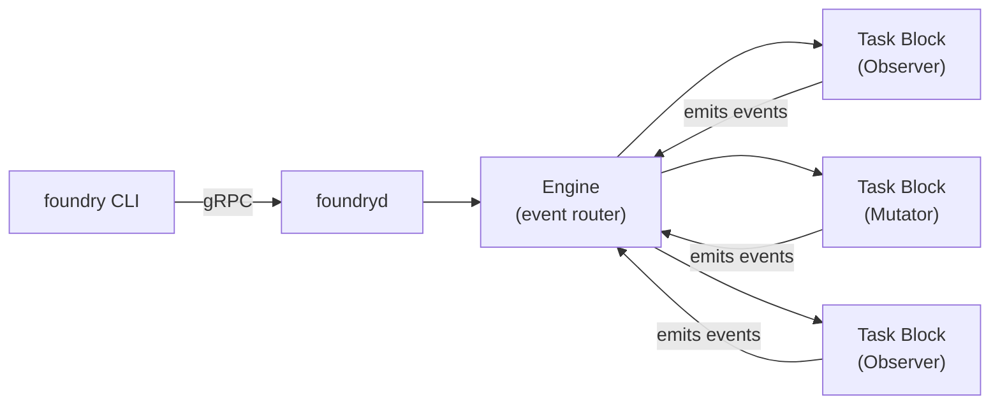

# Foundry Workflow Engine

Foundry is an event-driven workflow engine for engineering automation. It runs as a daemon (`foundryd`) controlled by a CLI (`foundry`). Projects are registered in a central registry, and Foundry orchestrates quality gates, AI-assisted iteration, dependency maintenance, vulnerability remediation, and drift detection across them.

## Architecture at a Glance



The CLI emits events into the daemon. The engine routes each event to task blocks that declared interest. Blocks execute and may emit new events, forming chains. Every event and block execution is recorded in traces.

## Common Workflows

### 1. Iterate on a Project

Run an AI-assisted quality improvement cycle: charter check, assessment, triage, planning, execution, gate verification.

```bash
foundry iterate <project-name>
```

What happens:
- Validates the project has intent documentation (CHARTER.md or equivalent)
- Resolves quality gates from `.hone-gates.json`
- Runs preflight gates to establish baseline
- AI assesses the project against its charter
- AI triages whether the assessment warrants action
- AI creates a correction plan and executes it
- Gates are re-verified; retries up to 3 times if they fail
- Results are summarized

### 2. Scout for Intent Drift

Detect potential bugs and architectural mismatches without making changes.

```bash
foundry scout <project-name>
```

Returns ranked candidates with divergence type, severity, confidence, and suggested next steps. High-value candidates are marked with `***`.

### 3. Validate Gate Health

Check whether a project's quality gates pass without running iterate or maintain.

```bash
# Single project
foundry validate <project-name>

# Multiple projects
foundry validate alpha beta gamma

# All active projects
foundry validate --all
```

Exits with code 1 if any project fails. Useful in CI or as a quick health check.

### 4. Run Full Maintenance

Run maintenance across all registered projects (or a single one).

```bash
# All active projects
foundry run

# Single project
foundry run --project <name>

# Dry run (no mutations, simulated success)
foundry run --throttle dry_run
```

Each project goes through validation, then routes to iterate or maintain based on its registry flags.

### 5. Derive Quality Gates

Auto-discover quality gates for a project using AI inspection.

```bash
# From a registered project
foundry gates <project-name>

# From any directory
foundry gates --dir /path/to/project

# Generate .hone-gates.json
foundry gates --init <project-name>
```

### 6. Check Pipeline Health

Check GitHub Actions pipeline status for a project and auto-remediate failures.

```bash
foundry pipeline <project-name>
```

What happens:
- Looks up the project's repo and branch from the registry
- Runs `gh run list` to check GitHub Actions pipeline status
- If pipeline is passing, reports success and stops
- If pipeline is failing, fetches failure logs with `gh run view --log-failed`
- Invokes Claude with Coding capability and Full access to diagnose and fix CI failures
- Commits and pushes the fix

### 7. Release a Project

Run an agent-driven release workflow: quality gates, changelog, version bump, tag, push, pipeline watch, local install.

```bash
# Auto-determine bump from changelog
foundry release <project-name>

# Specify bump type
foundry release <project-name> --bump patch
foundry release <project-name> --bump minor
foundry release <project-name> --bump major
```

What happens:
- Requires `release` action enabled in the project's registry entry
- Invokes Claude agent to follow the release process in the project's AGENTS.md
- If no `--bump` is specified, the agent determines the appropriate bump from changelog and unreleased changes
- Agent runs quality gates, updates changelog, bumps version, commits, tags, and pushes
- After release completes, watches the CI/CD pipeline for the release tag
- Once pipeline succeeds, installs the new version locally

The release chain also fires automatically during vulnerability remediation when the main branch is clean after a CVE fix.

### Prefer convenience commands over raw emit

Always use the convenience commands above (`iterate`, `scout`, `validate`, `run`, `gates`, `pipeline`, `release`) rather than `foundry emit`. The convenience commands handle watch-stream setup, progress display, and trace rendering automatically.

Only use `foundry emit` for workflows that lack a convenience command (e.g., vulnerability scanning) or for advanced debugging:

```bash
foundry emit <event_type> --project <name> [--throttle full|audit_only|dry_run] [--payload '{"key":"value"}'] [--wait]
```

## Registry Management

The registry (`~/.foundry/registry.json`) tracks which projects Foundry manages.

```bash
# Initialize empty registry
foundry registry init

# Add a project
foundry registry add \
  --name my-project \
  --path /path/to/project \
  --stack rust \
  --agent claude \
  --repo owner/repo \
  --branch main \
  --iterate --maintain --push

# List projects
foundry registry list

# Show project details
foundry registry show my-project

# Edit project flags
foundry registry edit my-project --iterate --maintain

# Remove a project
foundry registry remove my-project
```

**Key flags on each project:**
- `--iterate` / `--maintain` — enable iterate and/or maintain workflows
- `--push` — allow git push after changes
- `--audit` — enable vulnerability auditing
- `--release` — enable automatic releases
- `--skip` — temporarily disable without removing

## Examining Results

Always use the CLI commands first — they format output, handle pagination, and render traces as trees. Only read raw files on disk when CLI output is insufficient.

**Start here:**

1. `foundry history` — overview of recent runs (last 7 days), shows event ID, status, duration, type, project
2. `foundry trace <event_id> --verbose` — drill into a specific run to see what each block did
3. `foundry watch --project <name>` — live stream for runs currently in progress

```bash
# What happened recently?
foundry history

# What happened on a specific date?
foundry history 2026-03-29

# Filter to one project
foundry history --project my-project

# Drill into a specific trace (event ID from history output)
foundry trace evt_a1b2c3d4e5f6 --verbose
```

**Only if you need more detail**, fall back to the files on disk:

- **Audit reports** (`~/.foundry/audits/runs/YYYY-MM-DD/summary.md`) — markdown summary after `foundry run`, with project status tables, failure details, release audits, and aggregate stats
- **Event log** (`~/.foundry/events/YYYY-MM.jsonl`) — raw JSONL of every event, useful for analytics or grep
- **Trace files** (`~/.foundry/traces/YYYY-MM-DD/{event_id}.json`) — full ProcessResult JSON with all events and block executions

## Throttle Levels

Every event chain runs under a throttle that controls what blocks can do:

| Level | Observers | Mutators | Use Case |
|-------|-----------|----------|----------|
| `full` | Execute normally | Execute normally | Production runs |
| `audit_only` | Execute normally | Log but don't deliver downstream | Audit what would happen |
| `dry_run` | Execute normally | Simulate success, no side effects | Safe preview |

```bash
foundry run --throttle dry_run
foundry run --project alpha --throttle audit_only
```

## Workflow Status

Check what's currently running:

```bash
# All active workflows
foundry status

# Specific workflow
foundry status <workflow_id>
```

## Environment Variables

| Variable | Default | Purpose |
|----------|---------|---------|
| `FOUNDRY_REGISTRY_PATH` | `~/.foundry/registry.json` | Project registry file |
| `FOUNDRY_EVENTS_DIR` | `~/.foundry/events` | JSONL event log directory |
| `FOUNDRY_TRACES_DIR` | `~/.foundry/traces` | Trace file storage |
| `FOUNDRY_AUDITS_DIR` | `~/.foundry/audits` | Audit report storage |

## Event Model Reference

For the complete event taxonomy, workflow chain diagrams, and naming conventions, read `references/event-model.md`.

For detailed workflow descriptions including which blocks execute at each step, read `references/workflows.md`.
