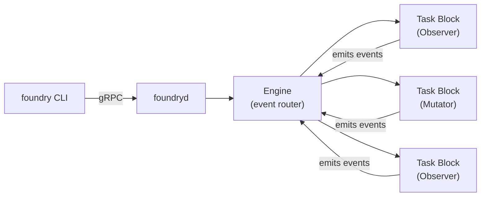

# Foundry Workflow Engine

Foundry is an event-driven workflow engine for engineering automation. It runs
as a daemon (`foundryd`) controlled by a CLI (`foundry`). Projects are
registered in a central registry, and Foundry orchestrates quality gates,
AI-assisted iteration, dependency maintenance, vulnerability remediation, and
drift detection across them.

## Architecture at a Glance


```mermaid
graph LR
  CLI["foundry CLI"] -->|gRPC| Daemon["foundryd"]
  Daemon --> Engine["Engine<br/>(event router)"]
  Engine --> O1["Task Block<br/>(Observer)"]
  Engine --> M1["Task Block<br/>(Mutator)"]
  Engine --> O2["Task Block<br/>(Observer)"]
  O1 -->|emits events| Engine
  M1 -->|emits events| Engine
  O2 -->|emits events| Engine
```

The CLI emits events into the daemon. The engine routes each event to task
blocks that declared interest. Blocks execute and may emit new events, forming
chains. Every event and block execution is recorded in traces.

## Common Workflows

### 1. Iterate on a Project

Run an AI-assisted quality improvement cycle: charter check, assessment, triage,
planning, execution, gate verification.

```bash
foundry iterate <project-name>
```

What happens:

- Validates the project has intent documentation (CHARTER.md or equivalent)
- Resolves quality gates from `.hone-gates.json`
- Runs preflight gates to establish baseline
- AI assesses the project against its charter
- AI triages whether the assessment warrants action
- AI creates a correction plan and executes it
- Gates are re-verified; retries up to 3 times if they fail
- Results are summarized

### 2. Scout for Intent Drift

Detect potential bugs and architectural mismatches without making changes.

```bash
foundry scout <project-name>
```

Returns ranked candidates with divergence type, severity, confidence, and
suggested next steps. High-value candidates are marked with `***`.

### 3. Validate Gate Health

Check whether a project's quality gates pass without running iterate or
maintain.

```bash
# Single project
foundry validate <project-name>

# Multiple projects
foundry validate alpha beta gamma

# All active projects
foundry validate --all
```

Exits with code 1 if any project fails. Useful in CI or as a quick health check.

### 4. Run Full Maintenance

Run maintenance across all registered projects (or a single one).

```bash
# All active projects
foundry run

# Single project
foundry run --project <name>

# Dry run (no mutations, simulated success)
foundry run --throttle dry_run
```

Each project goes through validation, then routes to iterate or maintain based
on its registry flags.

The same chain fires automatically every night at 02:00 local time via the
in-daemon `nightly-maintenance` sentinel. Inspect or toggle it with
`foundry sentinel list | show | enable | disable` (see "Sentinels" below).

### 5. Run One Task

Run one concrete user-provided coding task against a registered project:

```bash
foundry task <project-name> "Add a --quiet flag to the CLI and cover it with tests"
foundry task <project-name> "Fix the failing parser regression" --agent codex
```

The task runs inside an isolated Git worktree, checks the project charter,
resolves and verifies gates, and performs a skeptical read-only review. It ends
with one structural verdict: `complete`, `remainder`, `defect`,
`blocked_on_decision`, or `runner_error`.

Complete work with passing required gates lands on trunk. A converging
`remainder` also lands when at least one required gate ran and every required
gate passed; its reviewer gaps become the campaign's next objective. Every other
non-complete result is committed and preserved on a named remote branch, with a
Git bundle fallback when push is unavailable. The task formation never retries.

While the command is waiting, it streams both workflow events and non-routable
block progress messages such as `running block Run Verify Gates` and
`finished block Run Verify Gates (ok, 143.0s)`. Progress observations are
persisted to the event log for auditability, but never delivered to downstream
task blocks.

Use this for small, concrete, immediately executable coding work.

### 6. Manage Durable Campaigns

Use a campaign when the mission is broader than one task and the next objective
should be derived from the latest repository state:

```bash
foundry campaign add ./campaign.json
foundry campaign list
foundry campaign show <name>
foundry campaign advance <name>
foundry campaign pause <name>
foundry campaign decide <name> --decision "Use the generated tonic client path."
foundry campaign complete <name> --reason "Production evidence confirms the mission shipped."
foundry campaign resume <name> [--add-cycles N]
```

Campaign definitions live in the daemon-owned campaign store. By default,
`foundry campaign add/list/show/advance/pause/resume/decide/complete` all go
through typed gRPC and do not read or mutate the client-side
`FOUNDRY_CAMPAIGNS_PATH`. Successful online reads and mutations render the
daemon's typed response or workflow output directly, so stale client-side
campaign files cannot mask the live daemon-owned state. Pass `--offline` only
when the daemon is stopped and you intentionally need direct-file recovery. If
`foundryd` is unreachable, the online command fails and leaves any absent or
pre-existing client-side `FOUNDRY_CAMPAIGNS_PATH` untouched. Campaigns carry a
mission, neutral context artifact paths, required done evidence, escalation
rules, an owner authorization, an optional agent provider, and a campaign-level
cycle budget. The formation chooses exactly one of done, one next objective, or
escalation. A task result automatically requests the next advance; remainders
and defects continue from preserved work, while human decisions and runner
errors escalate. Completion and escalation are forced into the ops digest.

When owner-reviewed evidence proves a mission shipped outside the formation
loop, use `campaign complete` with a non-empty reason. Foundry records the
authorizing owner and reason, clears stale pending results, and emits the normal
campaign completion event. Pass `--offline` only when the daemon is stopped.

A final budgeted task still receives completion evaluation. Only an attempted
dispatch beyond the authorized cycle budget escalates the campaign.

Each advance mints trace and cycle-span identity. Task-side events carry
`campaign_cycle`, and `CampaignAdvanceCompleted` retains the exact formation
prompt, selected provider, and done-evidence gate results, so a cycle can be
reconstructed from the event stream without inferring boundaries from time.

When a task finishes while its campaign is paused, Foundry durably retains the
typed result and preservation ref. The first manual advance after resume
consumes that pending result, preserving reviewer gaps and branch continuity.

Campaign gate evidence may declare repository-relative `artifacts`. Foundry
requires each path to exist before running the command, preventing tools that
silently ignore absent test files from yielding false-green evidence.

When a campaign escalates because its cycle budget is exhausted, resuming
requires an explicit owner-authorized extension, for example
`foundry campaign resume <name> --add-cycles 1`.

When a campaign escalates on a human judgment question, record the owner's
policy with `foundry campaign decide <name> --decision "<text>"`. This appends
an owner decision record to the durable campaign and returns the campaign to
`active`; future formation prompts treat every recorded owner decision as
binding context instead of re-escalating on the same question. By default,
campaign control commands require a reachable `foundryd` daemon; pass
`--offline` only when you intentionally want direct-file recovery while the
daemon is stopped.

Online control-plane mutations are persistence-atomic at the daemon boundary: if
a save fails during `pause`, `resume`, `decide`, or `complete`, the RPC returns
`INTERNAL`, the persisted campaign store stays byte-identical, and `complete`
does not emit `CampaignCompleted`.

Read `references/workflows.md` for the event chain and the campaign definition
example in `book/src/guide/campaigns.md` when preparing a new campaign.

### 7. Manage Sentinels

Sentinels are declarative, named, scheduled triggers that live inside `foundryd`
and emit an event when their schedule fires. They replace the per-machine
launchd plist that used to drive the nightly maintenance run.

```bash
# List configured sentinels
foundry sentinel list

# Show full details for one
foundry sentinel show nightly-maintenance

# Pause the schedule (e.g. before a debug session)
foundry sentinel disable nightly-maintenance

# Re-enable it
foundry sentinel enable nightly-maintenance
```

`enable` and `disable` go through gRPC by default so the daemon's scheduler
wakes immediately; pass `--offline` to mutate `~/.foundry/sentinels.json`
directly when the daemon is not running. The file is auto-seeded with the
canonical entries on first daemon start, and the daemon additively merges any
missing canonical entries on every restart (so new Foundry releases that ship
more sentinels reach existing installs automatically).

**Canonical sentinels that ship today:**

- `nightly-maintenance` (`0 2 * * *`) — emits `maintenance_cycle_started`.
  Drives the full maintenance run across registered projects.
- `daily-commit-digest` (`0 17 * * *`) — emits `commit_digest_started`. Renders
  a markdown digest of every active project's commits in the last 24 hours and
  writes it to `{FOUNDRY_DIGESTS_DIR}/{YYYY-MM-DD}.md` (default
  `~/.foundry/digests/`). See `book/src/guide/commit-digest.md` for the full
  chain.
- `ops-digest` (`0 */3 * * *`) — emits `ops_digest_started`. Reads MBOS JSONL
  events from `{FOUNDRY_OPS_EVENTS_DIR}` (default
  `~/Work/Operations/Events/intake`), applies a pressure gate (≥25 new events or
  any anomaly), summarises via agent, and writes
  `{FOUNDRY_OPS_DIGESTS_DIR}/{YYYY-MM-DD}.md` (default
  `~/.foundry/ops-digests/`). Anomalies include P0 events, CI failures,
  unresolved maintenance interventions, high/critical vulnerability alerts, and
  maintenance runs with failed repos. See `book/src/guide/ops-digest.md` for the
  full chain.
- `nightly-supply-chain` (`0 6 * * *`) — emits `supply_chain_scan_started`.
  Scans active projects, classifies findings against `.supply-chain-allow.json`,
  and writes `{FOUNDRY_SUPPLY_CHAIN_DIR}/{YYYY-MM-DD}.md`. Remediation is dark
  by default and requires `FOUNDRY_SUPPLY_CHAIN_REMEDIATE`.

### 8. Derive Quality Gates

Auto-discover quality gates for a project using AI inspection.

```bash
# From a registered project
foundry gates <project-name>

# From any directory
foundry gates --dir /path/to/project

# Generate .hone-gates.json
foundry gates --init <project-name>
```

### 9. Check Pipeline Health

Check GitHub Actions pipeline status for a project and auto-remediate failures.

```bash
foundry pipeline <project-name>
```

What happens:

- Looks up the project's repo and branch from the registry
- Runs `gh run list` to check GitHub Actions pipeline status
- If pipeline is passing, reports success and stops
- If pipeline is failing, fetches failure logs with `gh run view --log-failed`
- Invokes Claude with Coding capability and Full access to diagnose and fix CI
  failures
- Commits and pushes the fix

### 10. Release a Project

Run an agent-driven release workflow: quality gates, changelog, version bump,
tag, push, pipeline watch, local install.

```bash
# Auto-determine bump from changelog
foundry release <project-name>

# Specify bump type
foundry release <project-name> --bump patch
foundry release <project-name> --bump minor
foundry release <project-name> --bump major
```

What happens:

- Requires `release` action enabled in the project's registry entry
- Invokes Claude agent to follow the release process in the project's AGENTS.md
- If no `--bump` is specified, the agent determines the appropriate bump from
  changelog and unreleased changes
- Agent runs quality gates, updates changelog, bumps version, commits, tags, and
  pushes
- After release completes, watches the CI/CD pipeline for the release tag
- Once pipeline succeeds, installs the new version locally

The release chain also fires automatically during vulnerability remediation when
the main branch is clean after a CVE fix.

### Prefer convenience commands over raw emit

Always use the convenience commands above (`task`, `campaign`, `iterate`,
`scout`, `validate`, `run`, `gates`, `pipeline`, `release`) rather than
`foundry emit`. The convenience commands handle watch-stream setup, block
progress display, and trace rendering automatically.

Only use `foundry emit` for workflows that lack a convenience command (e.g.,
vulnerability scanning) or for advanced debugging:

```bash
foundry emit <event_type> --project <name> [--throttle full|dry_run] [--payload '{"key":"value"}'] [--wait]
```

## Registry Management

The registry (`~/.foundry/registry.json`) tracks which projects Foundry manages.
`init` is an explicit offline recovery command and rejects runs without
`--offline` before contacting the daemon or touching the filesystem. It never
uses the daemon, even when `foundryd` is running. `list`, `show`, `add`,
`remove`, and `edit` are daemon-authoritative in normal online use: they go
through `foundryd`'s typed gRPC API and operate on the daemon-owned registry
state. Add `--offline` only for explicit recovery when the daemon is not running
and you need to read or mutate the file directly. Without `--offline`, an
unreachable daemon is an error and the client-side registry file remains
untouched byte-for-byte. `list` and `show` render the daemon response directly
and never read the client-side registry file. If `FOUNDRY_REGISTRY_PATH` does
not exist, the online path leaves it absent rather than creating it. If daemon
persistence fails during an online add/edit/remove, the daemon returns a stable
`INTERNAL` error and leaves its registry state unchanged in memory and on disk.
Missing or duplicate projects surface typed `NotFound` and `AlreadyExists`
daemon statuses.

```bash
# Initialize an empty registry during offline recovery
foundry --offline registry init

# Add a project through the daemon
foundry registry add \
  --name my-project \
  --path /path/to/project \
  --stack rust \
  --agent claude \
  --repo owner/repo \
  --branch main \
  --iterate --maintain --push

# Add without daemon (direct file write)
foundry --offline registry add \
  --name my-project \
  --path /path/to/project \
  --stack rust \
  --agent claude \
  --repo owner/repo

# List projects from the daemon-owned registry
foundry registry list

# Show project details from the daemon-owned registry
foundry registry show my-project

# Edit project flags (use true/false)
foundry registry edit my-project --iterate true --maintain true

# Remove a project
foundry registry remove my-project
```

**Key flags on each project:**

- `--iterate` / `--maintain` — enable iterate and/or maintain workflows
- `--push` — allow git push after changes
- `--audit` — enable vulnerability auditing
- `--release` — enable automatic releases
- `--skip` — temporarily disable without removing

## Examining Results

Use CLI commands first — they format output and render traces as trees. Fall
back to raw files only when CLI output is insufficient.

- `foundry history` — recent runs (last 7 days); filter with `--project <name>`
  or a date (`foundry history 2026-03-29`)
- `foundry trace <event_id> --verbose` — drill into a specific run
- `foundry watch --project <name>` — live stream for runs in progress

Raw files on disk (when CLI isn't enough):

- `~/.foundry/audits/runs/YYYY-MM-DD/summary.md` — markdown summary after
  `foundry run`
- `~/.foundry/events/YYYY-MM.jsonl` — raw JSONL event log
- `~/.foundry/traces/YYYY-MM-DD/{event_id}.json` — full ProcessResult JSON

## Throttle Levels

Every event chain runs under a throttle that controls what blocks can do:

| Level     | Observers        | Mutators                          | Use Case        |
| --------- | ---------------- | --------------------------------- | --------------- |
| `full`    | Execute normally | Execute normally                  | Production runs |
| `dry_run` | Execute normally | Simulate success, no side effects | Safe preview    |

```bash
foundry run --throttle dry_run
foundry run --project alpha --throttle dry_run
```

## Workflow Status

Check what's currently running:

```bash
# All active workflows
foundry status

# Specific workflow
foundry status <workflow_id>
```

## Event Model Reference

For the complete event taxonomy, workflow chain diagrams, and naming
conventions, read `references/event-model.md`.

For detailed workflow descriptions including which blocks execute at each step,
read `references/workflows.md`.
