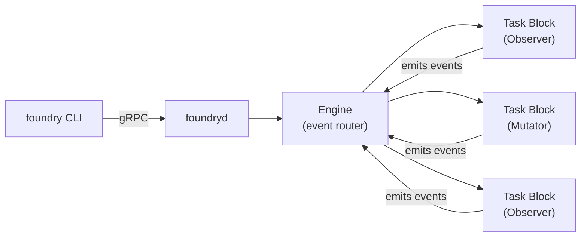

# Foundry Workflow Engine

Foundry is an event-driven workflow engine for engineering automation. It runs
as a daemon (`foundryd`) controlled by a CLI (`foundry`). Projects are
registered in a central registry, and Foundry orchestrates quality gates,
AI-assisted iteration, dependency maintenance, vulnerability remediation, and
drift detection across them.

## Architecture at a Glance


```mermaid
graph LR
  CLI["foundry CLI"] -->|gRPC| Daemon["foundryd"]
  Daemon --> Engine["Engine<br/>(event router)"]
  Engine --> O1["Task Block<br/>(Observer)"]
  Engine --> M1["Task Block<br/>(Mutator)"]
  Engine --> O2["Task Block<br/>(Observer)"]
  O1 -->|emits events| Engine
  M1 -->|emits events| Engine
  O2 -->|emits events| Engine
```

The CLI emits events into the daemon. The engine routes each event to task
blocks that declared interest. Blocks execute and may emit new events, forming
chains. Every event and block execution is recorded in traces.

## Common Workflows

### 1. Iterate on a Project

Run an AI-assisted quality improvement cycle: charter check, assessment, triage,
planning, execution, gate verification.

```bash
foundry iterate <project-name>
```

What happens:

- Validates the project has intent documentation (CHARTER.md or equivalent)
- Resolves quality gates from `.hone-gates.json`
- Runs preflight gates to establish baseline
- AI assesses the project against its charter
- AI triages whether the assessment warrants action
- AI creates a correction plan and executes it
- Gates are re-verified; retries up to 3 times if they fail
- Results are summarized

### 2. Scout for Intent Drift

Detect potential bugs and architectural mismatches without making changes.

```bash
foundry scout <project-name>
```

Returns ranked candidates with divergence type, severity, confidence, and
suggested next steps. High-value candidates are marked with `***`.

### 3. Validate Gate Health

Check whether a project's quality gates pass without running iterate or
maintain.

```bash
# Single project
foundry validate <project-name>

# Multiple projects
foundry validate alpha beta gamma

# All active projects
foundry validate --all
```

Exits with code 1 if any project fails. Useful in CI or as a quick health check.

### 4. Run Full Maintenance

Run maintenance across all registered projects (or a single one).

```bash
# All active projects
foundry run

# Single project
foundry run --project <name>

# Dry run (no mutations, simulated success)
foundry run --throttle dry_run
```

Each project goes through validation, then routes to iterate or maintain based
on its registry flags.

Maintain works from a dependency brief decided in code under the project's
`update_policy` (`patch` | `minor` | `major`; unset behaves as `minor`). The
agent applies exactly the listed updates. Majors become separate
`foundry task` runs after the nightly (for `major` projects) or proposals with
a command (for the others). See what a project would get with:

```bash
foundry deps <project>                  # outdated deps, the brief, the majors plan
foundry deps <project> --policy major   # preview another policy; registry unchanged
```

When an otherwise eligible nightly major upgrade matches a `preserved` ledger
item by exact registered project, package and target version, the majors lane
resumes that obligation from its preservation ref and original objective. Its
child records `kind: major_upgrade`, `lane: maintenance`, origin `nightly majors
lane` and the exact `resumes` id; automation records no operator action. The
parent retains its submission identity and evidence. Only an actual child
landing settles the preserved parent landed; other outcomes leave it open,
and owner cancellation remains terminal. A selected resume admission failure
is reported and never falls back to a fresh task.

Continuations count against the existing nightly caps and run sequentially
with fresh upgrades in the existing order. Update policies, holds, security
eligibility, successful maintenance and in-flight suppression still apply.
Reviews, dry runs and interrupted-cycle summaries dispatch nothing. Without a
matching preserved ledger item, the existing fresh-task and history-suppression
rules apply. Owner `queue resume` remains an interactive, asynchronous task.

The same chain fires automatically every night at 02:00 local time via the
in-daemon `nightly-maintenance` sentinel. Inspect or toggle it with
`foundry sentinel list | show | enable | disable` (see "Sentinels" below).

### 5. Run One Task

Run one concrete user-provided coding task against a registered project:

```bash
foundry task <project-name> "Add a --quiet flag to the CLI and cover it with tests"
foundry task <project-name> "Fix the failing parser regression" --agent codex
foundry task <project-name> "Add retries to the uploader" --origin "asked by Stacey in standup"
```

`--origin <text>` is a free-text note recorded on the work item beside the CLI
client's hostname. It is opaque — it changes nothing about how the task runs.

The task runs inside an isolated Git worktree, checks the project charter,
resolves and verifies gates, and performs a skeptical read-only review. It ends
with one structural verdict: `complete`, `remainder`, `defect`,
`blocked_on_decision`, or `runner_error`.

Complete work with passing required gates lands on trunk. A converging
`remainder` also lands when at least one required gate ran and every required
gate passed; its reviewer gaps become the campaign's next objective. Every other
non-complete result is committed and preserved on a named remote branch, with a
Git bundle fallback when push is unavailable. The task formation never retries.

While the command is waiting, it streams both workflow events and non-routable
block progress messages such as `running block Run Verify Gates` and
`finished block Run Verify Gates (ok, 143.0s)`. Progress observations are
persisted to the event log for auditability, but never delivered to downstream
task blocks. Every event published on Foundry's Watch stream is durable.

Use this for small, concrete, immediately executable coding work.

### 6. Manage Durable Campaigns

Use a campaign when the mission is broader than one task and the next objective
should be derived from the latest repository state:

```bash
foundry campaign add ./campaign.json
foundry campaign list
foundry campaign show <name>
foundry campaign report <name> [--json]
foundry campaign advance <name> [--origin "<note>"]
foundry campaign pause <name>
foundry campaign decide <name> --decision "Use the generated tonic client path."
foundry campaign complete <name> --reason "Production evidence confirms the mission shipped."
foundry campaign cancel <name> --reason "Superseded." [--now] [--discard-work]
foundry campaign resume <name> [--add-cycles N]
```

Campaign definitions live in the daemon-owned campaign store. By default,
`foundry campaign add/list/show/advance/pause/resume/decide/complete/cancel` all go
through typed gRPC and do not read or mutate the client-side
`FOUNDRY_CAMPAIGNS_PATH`. Successful online reads and mutations render the
daemon's typed response or workflow output directly, so stale client-side
campaign files cannot mask the live daemon-owned state. Pass `--offline` only
when the daemon is stopped and you intentionally need direct-file recovery. If
`foundryd` is unreachable, the online command fails and leaves any absent or
pre-existing client-side `FOUNDRY_CAMPAIGNS_PATH` untouched. Campaigns carry a
mission, neutral context artifact paths, required done evidence, escalation
rules, an owner authorization, an optional agent provider, and a campaign-level
cycle budget. The formation chooses exactly one of done, one next objective, or
escalation. A task result automatically requests the next advance; remainders
and defects continue from preserved work, while human decisions and runner
errors escalate. Completion and escalation are forced into the ops digest.

When owner-reviewed evidence proves a mission shipped outside the formation
loop, use `campaign complete` with a non-empty reason. Foundry records the
authorizing owner and reason, clears stale pending results, and emits the normal
campaign completion event. Pass `--offline` only when the daemon is stopped.

A landed final task still receives completion evaluation. An exhausted budget
with an unlanded non-complete result escalates before formation. Campaigns use
Codex by default and enforce one writable repository. Declare
`writable_repositories` as the project name alone; other declarations are
rejected. Other campaign providers are currently refused because they cannot
enforce this scope. Standalone tasks retain their existing provider behavior.

Campaign `budget.stages.formation_prompt_bytes` defaults to 32768 bytes.
Campaign agents have no clock deadline. Legacy stage time fields are ignored.
`campaign report --json` includes per-formation session and decision records,
transcript links, command/output observations, and separate partial native usage.
Partial observations never add to final token totals; missing data is explicit. Use `campaign report` to inspect stage tokens/time, unmeasured
or unpriced spend, landed cycles, and external repairs.

Coding sessions should run verbose checks through `foundry capture -- <command>`.
It needs no daemon, keeps full stdout/stderr logs, returns the actual exit code,
and prints a bounded failure tail. New campaign tasks must record early real
acceptance proof in `.foundry/proof.json` before broad expansion. See the
campaign guide for the behavioral/direct proof schema.

Each advance mints trace and cycle-span identity. Task-side events carry
`campaign_cycle`, and `CampaignAdvanceCompleted` retains the exact formation
prompt, selected provider, and done-evidence gate results, so a cycle can be
reconstructed from the event stream without inferring boundaries from time.

When a task finishes while its campaign is paused, Foundry durably retains the
typed result and preservation ref. The first manual advance after resume
consumes that pending result, preserving reviewer gaps and branch continuity.

Campaign gate evidence may declare repository-relative `artifacts`. Foundry
requires each path to exist before running the command, preventing tools that
silently ignore absent test files from yielding false-green evidence.

When a campaign escalates because its cycle budget is exhausted, resuming
requires an explicit owner-authorized extension, for example
`foundry campaign resume <name> --add-cycles 1`.

When a campaign escalates on a human judgment question, record the owner's
policy with `foundry campaign decide <name> --decision "<text>"`. This appends
an owner decision record to the durable campaign and returns the campaign to
`active`; future formation prompts treat every recorded owner decision as
binding context instead of re-escalating on the same question. By default,
campaign control commands require a reachable `foundryd` daemon; pass
`--offline` only when you intentionally want direct-file recovery while the
daemon is stopped.

Online control-plane mutations are persistence-atomic at the daemon boundary: if
a save fails during `pause`, `resume`, `decide`, or `complete`, the RPC returns
`INTERNAL`, the persisted campaign store stays byte-identical, and `complete`
does not emit `CampaignCompleted`.

Read `references/workflows.md` for the event chain and the campaign definition
example in `book/src/guide/campaigns.md` when preparing a new campaign.

### 7. Manage Sentinels

Sentinels are declarative, named, scheduled triggers that live inside `foundryd`
and emit an event when their schedule fires. They replace the per-machine
launchd plist that used to drive the nightly maintenance run.

```bash
# List configured sentinels
foundry sentinel list

# Show full details for one
foundry sentinel show nightly-maintenance

# Pause the schedule (e.g. before a debug session)
foundry sentinel disable nightly-maintenance

# Re-enable it
foundry sentinel enable nightly-maintenance
```

Without `--offline`, all four commands go through typed gRPC so reads and
writes observe daemon-owned state directly: `list` → `SentinelList`, `show` →
`SentinelShow`, `enable` → `SentinelEnable`, `disable` → `SentinelDisable`.
Pass `--offline` only to read or mutate `~/.foundry/sentinels.json` directly
when the daemon is not running. If `foundryd` is unreachable, the online
command fails and leaves any client-side `FOUNDRY_SENTINELS_PATH` absent or
untouched. Successful online `enable`/`disable` wake the scheduler
immediately; failed saves leave the daemon-owned sentinel store unchanged in
memory, on disk, and in subsequent `list`/`show` reads, and do not wake the
scheduler. The daemon persists via same-directory temp-file rename, so a failed
save does not fall back to direct destination writes or truncation. The file is auto-seeded with the canonical entries on
first daemon start, and the daemon additively merges any missing canonical
entries on every restart (so new Foundry releases that ship more sentinels
reach existing installs automatically).

**Canonical sentinels that ship today:**

- `nightly-maintenance` (`0 2 * * *`) — emits `maintenance_cycle_started`.
  Drives the full maintenance run across registered projects.
- `daily-commit-digest` (`0 17 * * *`) — emits `commit_digest_started`. Renders
  a markdown digest of every active project's commits in the last 24 hours and
  writes it to `{FOUNDRY_DIGESTS_DIR}/{YYYY-MM-DD}.md` (default
  `~/.foundry/digests/`). See `book/src/guide/commit-digest.md` for the full
  chain.
- `ops-digest` (`0 */3 * * *`) — emits `ops_digest_started`. Reads MBOS JSONL
  events from `{FOUNDRY_OPS_EVENTS_DIR}` (default
  `~/Work/Operations/Events/intake`), applies a pressure gate (≥25 new events or
  any anomaly), summarises via agent, and writes
  `{FOUNDRY_OPS_DIGESTS_DIR}/{YYYY-MM-DD}.md` (default
  `~/.foundry/ops-digests/`). Anomalies include P0 events, CI failures,
  unresolved maintenance interventions, high/critical vulnerability alerts, and
  maintenance runs with failed repos. See `book/src/guide/ops-digest.md` for the
  full chain.
- `nightly-supply-chain` (`0 6 * * *`) — emits `supply_chain_scan_started`.
  Scans active projects, classifies findings against `.supply-chain-allow.json`,
  and writes `{FOUNDRY_SUPPLY_CHAIN_DIR}/{YYYY-MM-DD}.md`. Remediation is dark
  by default and requires `FOUNDRY_SUPPLY_CHAIN_REMEDIATE`.

### 8. Derive Quality Gates

Auto-discover quality gates for a project using AI inspection.

```bash
# From a registered project
foundry gates <project-name>

# From any directory
foundry gates --dir /path/to/project

# Generate .hone-gates.json
foundry gates --init <project-name>
```

### 9. Check Pipeline Health

Check GitHub Actions pipeline status for a project and auto-remediate failures.

```bash
foundry pipeline <project-name>
```

What happens:

- Looks up the project's repo and branch from the registry
- Runs `gh run list` to check GitHub Actions pipeline status
- If pipeline is passing, reports success and stops
- If pipeline is failing, fetches failure logs with `gh run view --log-failed`
- Invokes Claude with Coding capability and Full access to diagnose and fix CI
  failures
- Commits and pushes the fix

### 10. Release a Project

Run an agent-driven release workflow: quality gates, changelog, version bump,
tag, push, pipeline watch, local install.

```bash
# Auto-determine bump from changelog
foundry release <project-name>

# Specify bump type
foundry release <project-name> --bump patch
foundry release <project-name> --bump minor
foundry release <project-name> --bump major
```

What happens:

- Requires `release` action enabled in the project's registry entry
- Invokes Claude agent to follow the release process in the project's AGENTS.md
- If no `--bump` is specified, the agent determines the appropriate bump from
  changelog and unreleased changes
- Agent runs quality gates, updates changelog, bumps version, commits, tags, and
  pushes
- After release completes, watches the CI/CD pipeline for the release tag
- Once pipeline succeeds, installs the new version locally

The release chain also fires automatically during vulnerability remediation when
the main branch is clean after a CVE fix.

### 11. Inspect the Work Queue

The work-item ledger is the durable record of every unit of work Foundry
dispatched. `foundry queue`, `show` and `open` read it.

```bash
# Everything on one screen: running, queued, open, newest 20 settled
foundry queue

# Only the work that still needs a person
foundry queue open

# One item's full durable record, then its work_item_* events
foundry queue show wi_0123456789abcdef01234567

# Machine-readable
foundry queue --json
foundry queue show wi_0123456789abcdef01234567 --json
```

The four groups are **running**, **queued** (`submitted` or `queued`), **open**
(`preserved`, `needs_decision`, `failed` — settled but still owing something to
a person), and the newest 20 **settled** items (`landed`, `cancelled`). The
20-item cap applies to the settled group alone.

Start with `foundry queue open` when you want the shortest answer to "what is
waiting on me?" — those three states are settled but unfinished.

`show` prints every durable field, including `verdict`, `landed_commit`,
`preservation_ref`, `worktree`, `worktree_removed` and `trace_id`. An optional
field the ledger never recorded prints no line at all, so a recorded
`worktree_removed: false` reads `no` while an unrecorded one is silent. After
the record, `show` lists the item's own `work_item_*` events (submitted,
started, settled, cancelled), oldest first, one line each — selected by the
item id in the event payload, never by trace or project, from every monthly
event log however old. An item with none prints `(no events)`; `--json` adds an
`events` array beside the unchanged record keys.

Without `--offline`, all three go through typed gRPC against daemon-owned state:
the list forms render `ListWorkItems`, `show` renders `GetWorkItem` then
`ListWorkItemEvents`. The online path never reads, creates or mutates the
client-side ledger or events files, and if `foundryd` is unreachable the
command fails with an error naming the matching `--offline` command rather than
falling back. Pass `--offline` only to read `~/.foundry/work-items.json` (and,
for `show`, `~/.foundry/events/`) directly when the daemon is not running; a
missing file renders empty groups and exits zero, a malformed one is an error.

On every start `foundryd` settles each item still `running` as `failed` with the
reason `daemon restarted`, so after a restart look in `foundry queue open` for
work that needs re-dispatching.

### Close or cancel an item

```bash
foundry queue resume wi_0123456789abcdef01234567 --origin "finish preserved work"
foundry queue close wi_0123456789abcdef01234567 --reason "Reviewed; no further work required" --origin "owner review"
foundry queue cancel wi_0123456789abcdef01234567 --origin "withdrawn request"
```

`close` discharges an open obligation in `preserved`, `needs_decision` or
`failed`; it requires a nonblank `--reason`. `cancel` stops a `submitted` or
`queued` item and records the reason `cancelled by operator`, without requiring
a reason argument. Both settle exactly the requested id as `cancelled`.

Both require the daemon, reject `--offline`, and never fall back to local
writes. They record this CLI's hostname and optional `--origin` in
`operator_action`, separately from the original submission origin. The action
retains the previous state, reason and settlement timestamp. Submission
identity, objective, trace and known disposition remain intact, including
preserved refs and worktree-removal observations. No agent starts, running
workflow stops, or preserved work is disposed of by either command.

The daemon reloads the ledger under its shared write gate and saves by atomic
replacement before emitting `work_item_cancelled` to Watch and the durable
log. Earlier event bytes stay untouched. Unknown ids return `NOT_FOUND`,
blank input returns `INVALID_ARGUMENT`, and other states return
`FAILED_PRECONDITION`. Malformed ledgers also return `FAILED_PRECONDITION`;
read or save failures return `INTERNAL` and a failed save emits no cancellation.
Concurrent requests for one item can succeed only once.

### Prefer convenience commands over raw emit

Always use the convenience commands above (`task`, `campaign`, `iterate`,
`scout`, `validate`, `run`, `gates`, `pipeline`, `release`) rather than
`foundry emit`. The convenience commands handle watch-stream setup, block
progress display, and trace rendering automatically.

Only use `foundry emit` for workflows that lack a convenience command (e.g.,
vulnerability scanning) or for advanced debugging:

```bash
foundry emit <event_type> --project <name> [--throttle full|dry_run] [--payload '{"key":"value"}'] [--wait]
```

## Registry Management

The registry (`~/.foundry/registry.json`) tracks which projects Foundry manages.
`init` is an explicit offline recovery command and rejects runs without
`--offline` before contacting the daemon or touching the filesystem. It never
uses the daemon, even when `foundryd` is running. `list`, `show`, `add`,
`remove`, and `edit` are daemon-authoritative in normal online use: they go
through `foundryd`'s typed gRPC API and operate on the daemon-owned registry
state. Add `--offline` only for explicit recovery when the daemon is not running
and you need to read or mutate the file directly. Without `--offline`, an
unreachable daemon is an error and the client-side registry file remains
untouched byte-for-byte. `list` and `show` render the daemon response directly
and never read the client-side registry file. If `FOUNDRY_REGISTRY_PATH` does
not exist, the online path leaves it absent rather than creating it. If daemon
persistence fails during an online add/edit/remove, the daemon returns a stable
`INTERNAL` error and leaves its registry state unchanged in memory and on disk.
Missing or duplicate projects surface typed `NotFound` and `AlreadyExists`
daemon statuses.

Valid `--stack` values: `rust`, `python`, `typescript`, `elixir`, `cpp`,
`swift`, `kotlin`. The stack picks the audit tool: Swift runs `osv-scanner` on
`Package.resolved`; Kotlin runs the project's own
`./gradlew dependencyCheckAggregate` and reads its JSON report.

```bash
# Initialize an empty registry during offline recovery
foundry --offline registry init

# Add a project through the daemon
foundry registry add \
  --name my-project \
  --path /path/to/project \
  --stack rust \
  --agent claude \
  --repo owner/repo \
  --branch main \
  --iterate --maintain --push

# Add without daemon (direct file write)
foundry --offline registry add \
  --name my-project \
  --path /path/to/project \
  --stack rust \
  --agent claude \
  --repo owner/repo

# List projects from the daemon-owned registry
foundry registry list

# Show project details from the daemon-owned registry
foundry registry show my-project

# Edit project flags (use true/false)
foundry registry edit my-project --iterate true --maintain true

# Set how far maintenance may move dependencies (patch | minor | major)
foundry registry edit my-project --update-policy major

# Remove the install configuration
foundry registry edit my-project --clear-install

# Choose the skill install (true | false | "<command>")
foundry registry edit my-project --installs-skill "my-binary init --global --force"

# Remove a project
foundry registry remove my-project
```

**Key flags on each project:**

- `--iterate` / `--maintain` — enable iterate and/or maintain workflows
- `--push` — allow git push after changes
- `--audit` — enable vulnerability auditing
- `--release` — enable automatic releases
- `--update-policy` — dependency ceiling for maintenance: `patch` (lockfile only), `minor` (may widen constraints), `major` (majors become separate tasks). Unset behaves as `minor` and is flagged in the maintenance summary
- `--installs-skill` — skill install after the local install: `true` derives `<binary> init --global --force` (brew formula, else project name; skipped with no install config), `false` disables, any other value runs verbatim
- `--skip` — temporarily disable without removing

## Examining Results

Use CLI commands first — they format output and render traces as trees. Fall
back to raw files only when CLI output is insufficient.

- `foundry history` — recent runs (last 7 days); filter with `--project <name>`
  or a date (`foundry history 2026-03-29`)
- `foundry trace <event_id> --verbose` — drill into a specific run
- `foundry watch --project <name>` — live stream for runs in progress

Raw files on disk (when CLI isn't enough):

- `~/.foundry/audits/runs/YYYY-MM-DD/summary.md` — markdown summary after
  `foundry run`
- `~/.foundry/events/YYYY-MM.jsonl` — raw JSONL event log
- `~/.foundry/traces/YYYY-MM-DD/{event_id}.json` — full ProcessResult JSON

## Throttle Levels

Every event chain runs under a throttle that controls what blocks can do:

| Level     | Observers        | Mutators                          | Use Case        |
| --------- | ---------------- | --------------------------------- | --------------- |
| `full`    | Execute normally | Execute normally                  | Production runs |
| `dry_run` | Execute normally | Simulate success, no side effects | Safe preview    |

```bash
foundry run --throttle dry_run
foundry run --project alpha --throttle dry_run
```

## Workflow Status

Check what's currently running:

```bash
# All active workflows
foundry status

# Specific workflow
foundry status <workflow_id>
```

## Event Model Reference

For the complete event taxonomy, workflow chain diagrams, and naming
conventions, read `references/event-model.md`.

For detailed workflow descriptions including which blocks execute at each step,
read `references/workflows.md`.

Owner-directed preserved-work continuation uses `foundry queue resume <id>
[--origin <text>]`. It requires a live daemon and refuses `--offline`. Only a
`preserved` item with a usable preservation ref and a registered project can be
resumed. Foundry dispatches a new task with the original objective and starts
from the preserved local branch, remote ref or `bundle:<path>` through the
existing continuation path. The new record and its lifecycle payloads expose
`resumes`, the exact original id. Queue reads show this link in human and JSON
output. Submission identity and the parent's prior evidence remain intact;
the child records the hostname and optional origin in its `resume` operator
action.

The original obligation stays preserved until the linked task actually lands.
Then Foundry records its landing commit and appends `work_item_settled` for the
original. Failed, blocked, preserved and no-landing results leave it open.
An original cancelled by its owner stays cancelled even if its child lands.
Unknown ids return `NOT_FOUND`, blank inputs `INVALID_ARGUMENT`, ineligible
states or unusable evidence `FAILED_PRECONDITION`, and persistence failures
`INTERNAL`. A rejected admission dispatches no execution and invokes no agent.

If the initial ledger save fails, no child or lifecycle events are created.
Otherwise admission stages a child in `failed` with reason `resume admission incomplete;
execution not dispatched`, no `started_at`, a `settled_at`, no disposition, and
`resumes` set to the exact preserved parent's id. Execution starts only after both
`work_item_submitted` and `work_item_started` lifecycle roots persist and the final
ledger save succeeds, making the child `running`. A subsequent failure leaves the
staged failed child and preserves the parent and unrelated records.

Successful lifecycle appends remain in durable history and are delivered on
Watch, even when admission later fails. Failed writes are never advertised on
Watch. Earlier bytes, including partial failed appends, are never truncated or
rewritten. Lifecycle events alone are not proof of execution: consult the ledger
and RPC result, and continue from the preserved parent's id.

After a task actually lands, Foundry also checks that registered project's
other `preserved` ledger items against the registered trunk branch, using the
registered checkout path. A preserved commit reachable from trunk, or a
nonempty set of commits whose patches are all matched by `git cherry`, settles
`landed`. Its `landed_commit` is the verified trunk commit and its reason is
exactly `superseded by <commit>`. The appended `work_item_settled` event carries
that item's exact id, project and original trace. Objective, submission origin,
`resumes` and prior preservation evidence remain intact; no preserved ref,
bundle or worktree is deleted.

This check runs only after actual task landing. Failed, blocked, preserved and
no-landing task results do not trigger it. It checks only preserved items in
the same registered project; owner-cancelled items remain cancelled. A repeated
terminal does not append another settlement. The ledger is reloaded under the
shared write gate before saving, so concurrent owner actions and unrelated
updates are retained. A failed save emits no settlement.

Missing refs or objects, failed Git commands, unmatched patches, edited
squashes without patch-equivalence proof, and ambiguous evidence leave the item
open with an explicit supersession diagnostic in the settlement block's result
and structured log. Empty Git output is never proof. Local branch refs and
commit ids are checked directly. Branch names are also checked by exact name
on `origin` when configured, without fetching; conflicting local and remote
heads remain unresolved. A remote-only head must already have locally available
objects. A bundle must advertise exactly one head and that commit must already be
locally available. Patch comparison requires complete, shared history and
rejects merge commits that `git cherry` cannot account for. Queue show and JSON
expose the persisted commit and reason through the daemon's read path.
Scheduled invocation and the reporting reconciler are not delivered by this
landing-triggered check.

### Work reconciliation

`foundry queue reconcile` requires the daemon and prints that invocation's
report; `--offline` is rejected. The canonical `work-reconciler` sentinel uses
`30 */3 * * *` and pairs `work_reconcile_started` with `work_reconcile_completed`.
Inventory reports exact IDs, paths, branch refs and registered-trunk status.
Conservative supersession may settle preserved work without a task landing;
concurrent owner changes win, and preservation evidence is retained. No cleanup
or agent invocation occurs. Errors surface as INTERNAL, and anomaly findings
force ops observation below its normal volume threshold. Reports use
`FOUNDRY_RECONCILE_DIR` (default `~/.foundry/reconcile`).
